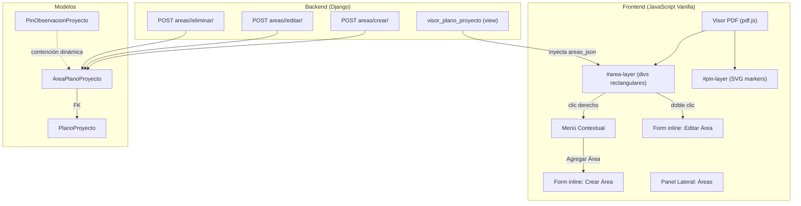
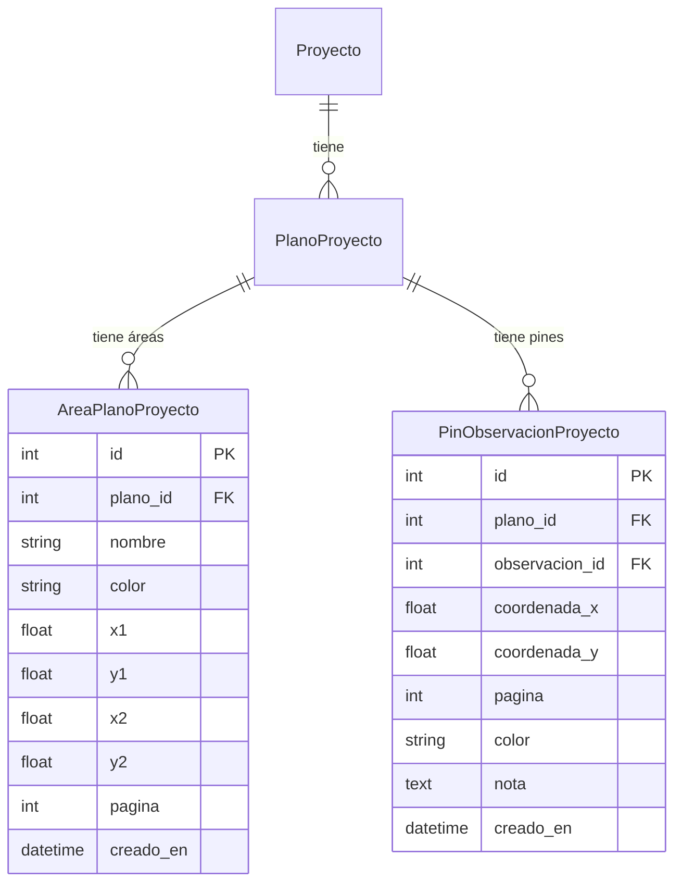

# Design Document: Áreas en Plano de Proyecto

## Overview

Este diseño implementa un sistema de áreas rectangulares sobre planos PDF de proyecto. Las áreas permiten demarcar zonas con nombre y color, y los pines de observación se asocian dinámicamente a un área según contención geométrica (sin FK). El sistema extiende el visor existente (`visor_plano_proyecto`) con una nueva capa `#area-layer` dentro de `#stage`, por debajo de `#pin-layer` para que los pines queden encima.

La arquitectura sigue el patrón Django + JavaScript vanilla del proyecto: backend con `JsonResponse`, frontend con manipulación directa del DOM, y datos iniciales inyectados como JSON en el template.

## Architecture



### Decisiones de Diseño

1. **Capa separada `#area-layer`**: Se renderiza como un div dentro de `#stage` que hereda la transformación de zoom/pan (igual que `#pin-layer`). Se posiciona debajo de `#pin-layer` en z-index para que los pines sean interactuables por encima de las áreas.

2. **Contención dinámica (sin FK)**: La relación pin-área se computa en tiempo real comparando coordenadas. Esto evita mantener una FK que se invalide al mover pines o redimensionar áreas, y simplifica el borrado de áreas sin afectar pines.

3. **Coordenadas normalizadas al persistir**: Al guardar, el backend siempre almacena con x1 ≤ x2 e y1 ≤ y2, independientemente de la dirección del arrastre del usuario.

4. **Inyección JSON en template**: Las áreas se inyectan como `areas_json` en el contexto del template (igual que `pines_json`), evitando una request AJAX extra al cargar.

5. **Áreas como divs con CSS**: Cada área se renderiza como un `<div>` con `position: absolute`, `background-color` con opacidad 0.15, y `border` con opacidad 0.7. Esto es más simple que SVG para rectángulos y permite fácilmente añadir event listeners.

## Components and Interfaces

### Backend Components

#### Modelo: `AreaPlanoProyecto`

```python
from colorfield.fields import ColorField

class AreaPlanoProyecto(models.Model):
    plano = models.ForeignKey(
        PlanoProyecto,
        on_delete=models.CASCADE,
        related_name='areas'
    )
    nombre = models.CharField(max_length=100)
    color = ColorField(default='#3B82F6')
    x1 = models.FloatField(help_text="Coordenada X esquina superior izquierda (viewport base)")
    y1 = models.FloatField(help_text="Coordenada Y esquina superior izquierda (viewport base)")
    x2 = models.FloatField(help_text="Coordenada X esquina inferior derecha (viewport base)")
    y2 = models.FloatField(help_text="Coordenada Y esquina inferior derecha (viewport base)")
    pagina = models.PositiveIntegerField(default=1)
    creado_en = models.DateTimeField(auto_now_add=True)

    class Meta:
        ordering = ['creado_en']
        verbose_name = "Área de Plano de Proyecto"
        verbose_name_plural = "Áreas de Plano de Proyecto"

    def __str__(self):
        return f"{self.nombre} - {self.plano.titulo} (p.{self.pagina})"

    def contiene_punto(self, px, py):
        """Retorna True si el punto (px, py) está dentro del rectángulo del área."""
        return self.x1 <= px <= self.x2 and self.y1 <= py <= self.y2

    def obtener_pines(self):
        """Retorna los pines de observación contenidos en esta área (misma página)."""
        from proyectos.models import PinObservacionProyecto
        return PinObservacionProyecto.objects.filter(
            plano=self.plano,
            pagina=self.pagina,
            coordenada_x__gte=self.x1,
            coordenada_x__lte=self.x2,
            coordenada_y__gte=self.y1,
            coordenada_y__lte=self.y2,
        )
```

#### Vista: `visor_plano_proyecto` (extendida)

Se extiende el contexto del template para inyectar `areas_json`:

```python
# En visor_plano_proyecto view, agregar al contexto:
areas = AreaPlanoProyecto.objects.filter(plano=plano)
areas_data = []
for area in areas:
    areas_data.append({
        'id': area.id,
        'nombre': area.nombre,
        'color': area.color,
        'x1': area.x1,
        'y1': area.y1,
        'x2': area.x2,
        'y2': area.y2,
        'pagina': area.pagina,
    })

# Agregar al return render context:
'areas_json': json.dumps(areas_data, ensure_ascii=False),
```

#### Endpoints API

| Endpoint | Método | Descripción |
|----------|--------|-------------|
| `proyecto/<pk>/planos/<plano_id>/areas/crear/` | POST | Crea área con coordenadas normalizadas |
| `proyecto/<pk>/planos/<plano_id>/areas/<area_id>/editar/` | POST | Actualiza nombre y color |
| `proyecto/<pk>/planos/<plano_id>/areas/<area_id>/eliminar/` | POST | Elimina área |

### Frontend Components

#### Capa de Áreas (`#area-layer`)

Div posicionado absolutamente dentro de `#stage`, con `pointer-events: none` en el contenedor pero `pointer-events: auto` en cada área individual. Se posiciona antes de `#pin-layer` en el DOM para que los pines queden encima.

```html
<div id="stage">
  <canvas id="pdf-canvas"></canvas>
  <div id="area-layer"></div>  <!-- NUEVO: debajo de pin-layer -->
  <div id="pin-layer"></div>
</div>
```

Cada área se renderiza como:

```html
<div class="area-rect" data-area-id="5"
     style="position:absolute; left:100px; top:50px; width:200px; height:150px;
            background-color: rgba(59,130,246,0.15);
            border: 2px solid rgba(59,130,246,0.7);"
     title="Zona Norte">
</div>
```

#### Modo de Creación de Área

Al seleccionar "Agregar Área" del menú contextual:
1. Se activa `areaCreationMode = true`
2. Cursor cambia a `crosshair`
3. Al hacer mousedown se registra el punto inicial (en coordenadas viewport base)
4. Al mover el mouse se dibuja un rectángulo preview con borde punteado
5. Al hacer mouseup se muestra el formulario de creación (modal inline)
6. Escape cancela y vuelve al modo normal

#### Panel Lateral de Áreas

Nuevo panel `#areas-panel` en la sidebar (junto al panel de pines), mostrando:
- Lista de áreas de la página actual
- Cada item: indicador de color (círculo), nombre, conteo de pines
- Click centra el visor en el área

```html
<div id="areas-panel" class="hidden">
  <div class="panel-header">
    <span class="panel-title">▢ Áreas</span>
    <span class="panel-count" id="areas-count">0</span>
  </div>
  <div id="areas-list"></div>
</div>
```

#### Función de Contención Dinámica (Frontend)

```javascript
function getPinesEnArea(area) {
  return PINES_DATA.filter(function(pin) {
    return pin.pagina === area.pagina &&
           pin.x >= area.x1 && pin.x <= area.x2 &&
           pin.y >= area.y1 && pin.y <= area.y2;
  });
}
```

### Interface Contracts

**POST `/areas/crear/`**
```json
// Request
{
  "x1": 100.5,
  "y1": 50.0,
  "x2": 300.0,
  "y2": 200.5,
  "pagina": 1,
  "nombre": "Zona Norte",
  "color": "#3B82F6"
}

// Response 200
{
  "status": "success",
  "area": {
    "id": 3,
    "nombre": "Zona Norte",
    "color": "#3B82F6",
    "x1": 100.5,
    "y1": 50.0,
    "x2": 300.0,
    "y2": 200.5,
    "pagina": 1
  }
}

// Response 400 (área muy pequeña)
{
  "status": "error",
  "message": "El área es demasiado pequeña (mínimo 10x10 píxeles)."
}
```

**POST `/areas/<area_id>/editar/`**
```json
// Request
{
  "nombre": "Zona Norte Actualizada",
  "color": "#EF4444"
}

// Response 200
{
  "status": "success",
  "area": {
    "id": 3,
    "nombre": "Zona Norte Actualizada",
    "color": "#EF4444",
    "x1": 100.5,
    "y1": 50.0,
    "x2": 300.0,
    "y2": 200.5,
    "pagina": 1
  }
}

// Response 400 (nombre vacío)
{
  "status": "error",
  "message": "El nombre del área es obligatorio."
}
```

**POST `/areas/<area_id>/eliminar/`**
```json
// Response 200
{ "status": "success" }

// Response 404
{ "status": "error", "message": "Área no encontrada." }
```

## Data Models



### Restricciones de Integridad

- `on_delete=CASCADE` en FK a `PlanoProyecto`: si se elimina el plano, se eliminan todas sus áreas.
- Coordenadas normalizadas al crear: `x1 <= x2`, `y1 <= y2` (se normalizan en el endpoint).
- Tamaño mínimo: `(x2 - x1) >= 10` y `(y2 - y1) >= 10` en viewport base.
- Nombre no vacío (validación en endpoint).
- No hay FK entre `PinObservacionProyecto` y `AreaPlanoProyecto` — la relación es computada.

## Correctness Properties

*A property is a characteristic or behavior that should hold true across all valid executions of a system—essentially, a formal statement about what the system should do. Properties serve as the bridge between human-readable specifications and machine-verifiable correctness guarantees.*

### Property 1: Coordinate normalization on creation

*For any* pair of points (xa, ya) and (xb, yb) submitted to the area creation endpoint where the resulting rectangle width and height are both >= 10 pixels, the persisted area SHALL have x1 = min(xa, xb), y1 = min(ya, yb), x2 = max(xa, xb), y2 = max(ya, yb), guaranteeing x1 <= x2 and y1 <= y2.

**Validates: Requirements 1.5, 1.7**

### Property 2: Page filtering consistency

*For any* plano containing areas distributed across multiple pages, and *for any* target page number, the set of areas displayed in both the visor layer and the areas panel SHALL be exactly the subset of areas whose `pagina` field equals the target page — no areas from other pages included, no areas from the target page excluded.

**Validates: Requirements 2.1, 2.5, 6.5, 9.1**

### Property 3: Area position invariance under zoom/pan

*For any* area with stored coordinates (x1, y1, x2, y2) and *for any* valid viewer transform state (scale, translateX, translateY), the computed screen position and size SHALL be: screenLeft = x1 * scale + translateX, screenTop = y1 * scale + translateY, screenWidth = (x2 - x1) * scale, screenHeight = (y2 - y1) * scale.

**Validates: Requirements 2.3**

### Property 4: Area update persists and validates name

*For any* existing area and *for any* valid non-empty name and valid color submitted to the update endpoint, the persisted area SHALL reflect the new name and color. Conversely, *for any* empty or whitespace-only string submitted as name, the update SHALL be rejected with an error and the area SHALL remain unchanged.

**Validates: Requirements 3.3, 3.4**

### Property 5: Area deletion preserves all pins

*For any* area that is deleted, all `PinObservacionProyecto` records that existed before the deletion SHALL remain in the database with all fields unchanged (coordinates, observacion FK, page, color, nota).

**Validates: Requirements 4.4, 4.6**

### Property 6: Dynamic pin-area containment

*For any* pin with coordinates (px, py) on page P, and *for any* area with rectangle (x1, y1, x2, y2) on page Q, the pin belongs to the area if and only if P == Q AND x1 <= px <= x2 AND y1 <= py <= y2. A pin MAY belong to multiple overlapping areas simultaneously. Moving a pin to new coordinates SHALL immediately recompute its area memberships based on the new position.

**Validates: Requirements 5.1, 5.2, 5.3, 5.4, 9.2**

### Property 7: Ownership validation across endpoints

*For any* area API request (create, update, delete), if the plano referenced in the URL does not belong to the project referenced in the URL, OR if the area being modified does not belong to the plano in the URL, the endpoint SHALL reject with HTTP 400/404. No cross-project or cross-plano mutations are possible.

**Validates: Requirements 7.3, 7.4, 7.5**

### Property 8: Authentication enforcement

*For any* area endpoint (crear, editar, eliminar) and *for any* unauthenticated request, the system SHALL respond with HTTP 302 redirect to the login page.

**Validates: Requirements 8.1, 8.2**

### Property 9: HTTP method validation

*For any* area endpoint (crear, editar, eliminar) and *for any* HTTP method other than POST (GET, PUT, DELETE, PATCH), the system SHALL respond with HTTP 405 Method Not Allowed.

**Validates: Requirements 8.3**

## Error Handling

| Escenario | Comportamiento |
|-----------|---------------|
| Área demasiado pequeña (< 10x10 px) | HTTP 400: `"El área es demasiado pequeña (mínimo 10x10 píxeles)."` |
| Nombre vacío o solo espacios | HTTP 400: `"El nombre del área es obligatorio."` |
| Plano no pertenece al proyecto | HTTP 400: `"El plano no pertenece a este proyecto."` |
| Área no pertenece al plano de la URL | HTTP 404: `"Área no encontrada."` |
| Área no encontrada (ID inválido) | HTTP 404 |
| Usuario no autenticado | HTTP 302 redirect a login (`@staff_member_required`) |
| Método HTTP no permitido | HTTP 405: `"Método no permitido."` |
| Error inesperado del servidor | HTTP 500: `{"status": "error", "message": "<detalle>"}` |
| Pérdida de conexión durante AJAX | Frontend muestra notificación de error temporal |

### Frontend Error Handling

- Si la creación falla, el formulario permanece visible con mensaje de error.
- Si la edición falla, el formulario muestra el error sin cerrar.
- Si la eliminación falla, se muestra notificación temporal y el área permanece visible.
- Escape en cualquier formulario/modo cancela sin enviar request.

## Testing Strategy

### Unit Tests (example-based)

- Cascade deletion: eliminar PlanoProyecto elimina áreas asociadas.
- Vista inyecta `areas_json` en el contexto del template.
- Modo creación se activa/cancela correctamente con Escape.
- Doble clic en área abre formulario con datos pre-poblados.
- Panel de áreas se actualiza al crear/editar/eliminar.
- Hover sobre área destaca pines contenidos.
- Estilo del área: opacidad fill 0.15, border 0.7.
- Tooltip muestra nombre del área al hover.

### Property-Based Tests (Hypothesis)

Se usará **Hypothesis** (Python) para los tests de backend y lógica de contención.

Cada property test se ejecutará con mínimo 100 iteraciones.

**Configuración:**
```python
from hypothesis import given, settings, strategies as st

@settings(max_examples=100)
```

**Tag format:** Cada test incluirá un comentario referenciando la propiedad:
```python
# Feature: areas-plano-proyecto, Property 1: Coordinate normalization on creation
```

**Properties implementadas:**
1. Normalización de coordenadas al crear (Property 1)
2. Filtrado por página (Property 2)
3. Posición invariante bajo zoom/pan (Property 3)
4. Update valida y persiste (Property 4)
5. Delete preserva pines (Property 5)
6. Contención dinámica pin-área (Property 6)
7. Validación de ownership (Property 7)
8. Autenticación requerida (Property 8)
9. Validación de método HTTP (Property 9)

### Integration Tests

- Flujo completo: crear área → verificar en visor → editar nombre/color → verificar actualización → eliminar → verificar remoción.
- Visor carga con áreas existentes inyectadas en template.
- Crear pin dentro de área y verificar contención dinámica en panel.
- Mover pin fuera de área y verificar actualización de conteo.
- Navegación de páginas muestra/oculta áreas correctas.
