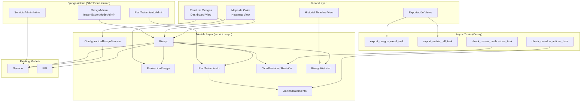
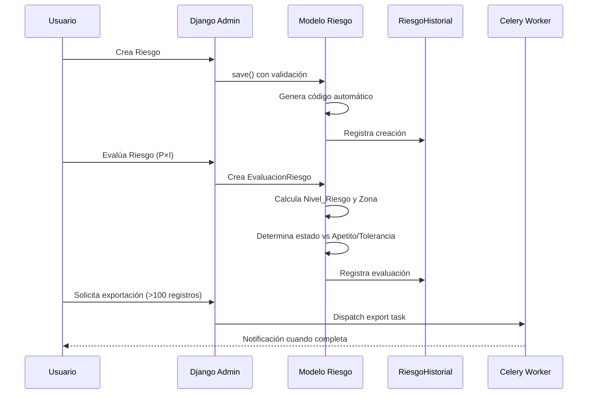
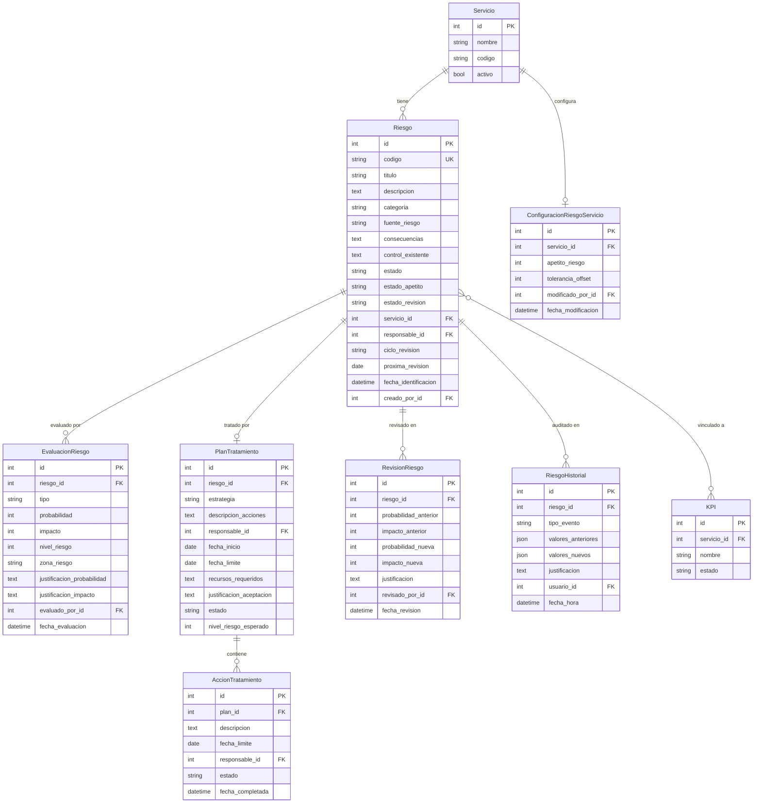

# Design Document: Business Risk Analysis

## Overview

Este módulo implementa un sistema completo de Análisis de Riesgos de Negocio dentro de la app `servicios` existente, siguiendo las metodologías ISO 31000:2018, ISO 31010 y COSO ERM. El sistema permite la identificación, evaluación, tratamiento, monitoreo y revisión continua de riesgos empresariales vinculados a cada Servicio.

### Decisiones de Diseño Clave

1. **Módulo dentro de `servicios`**: Los modelos de riesgos se crean dentro de la app `servicios` existente (no una app separada) para mantener la cohesión con `Servicio` y `KPI`. Se usa un prefijo `Riesgo` para todos los modelos nuevos.

2. **Permisos como proxy model**: Se implementan permisos personalizados en `Meta.permissions` del modelo `Riesgo` en lugar de crear un modelo de permisos separado.

3. **Historial inmutable**: Se usa un modelo `RiesgoHistorial` con restricción de eliminación a nivel de modelo (override de `delete()`) y permisos restrictivos en admin.

4. **Cálculos en el modelo**: La lógica de `Nivel_Riesgo = Probabilidad × Impacto` y la clasificación por zonas se implementa como métodos del modelo para garantizar consistencia.

5. **Celery para exportaciones pesadas**: Exportaciones con >100 registros se procesan asincrónicamente reutilizando la infraestructura Celery existente.

6. **SAP Fiori Horizon**: Se reutiliza el sistema de tokens CSS existente (`core/fiori_tokens.html`) y los patrones de admin ya establecidos (`ImportExportModelAdmin`, `change_list_template`, enlace "Editar Fiori").

## Architecture



### Flujo de Datos Principal



## Components and Interfaces

### 1. Models (servicios/models_riesgos.py)

Se crea un archivo separado `models_riesgos.py` dentro de la app `servicios` para mantener la organización, importado desde `models/__init__.py` o referenciado en `models.py`.

| Modelo | Responsabilidad |
|--------|----------------|
| `Riesgo` | Entidad principal: registro del riesgo con código, categoría, estado |
| `EvaluacionRiesgo` | Evaluación P×I inherente y residual con justificación |
| `ConfiguracionRiesgoServicio` | Apetito y tolerancia por Servicio |
| `PlanTratamiento` | Plan de tratamiento con estrategia y estado |
| `AccionTratamiento` | Acciones individuales dentro de un plan |
| `RevisionRiesgo` | Registro de cada revisión periódica completada |
| `RiesgoHistorial` | Registro inmutable de todos los cambios (audit trail) |
| `RiesgoKPI` | Tabla intermedia para relación M2M Riesgo↔KPI con validación |

### 2. Admin (servicios/admin_riesgos.py)

| Clase | Base | Funcionalidad |
|-------|------|---------------|
| `RiesgoAdmin` | `ImportExportModelAdmin` | CRUD completo, acciones masivas, filtros |
| `PlanTratamientoAdmin` | `ImportExportModelAdmin` | Gestión de planes con inline de acciones |
| `RiesgoInline` | `TabularInline` | Resumen en ServicioAdmin (solo lectura) |
| `EvaluacionInline` | `StackedInline` | Evaluaciones dentro del detalle de Riesgo |

### 3. Views (servicios/views_riesgos.py)

| View | URL Pattern | Funcionalidad |
|------|-------------|---------------|
| `panel_riesgos_view` | `/servicios/riesgos/panel/` | Dashboard consolidado |
| `mapa_calor_view` | `/servicios/riesgos/mapa-calor/<servicio_id>/` | Heatmap interactivo |
| `mapa_calor_consolidado_view` | `/servicios/riesgos/mapa-calor/` | Heatmap global |
| `historial_riesgo_view` | `/servicios/riesgos/<riesgo_id>/historial/` | Timeline + gráfico tendencia |
| `export_riesgos_excel_view` | `/servicios/riesgos/export/excel/` | Trigger exportación Excel |
| `export_matriz_pdf_view` | `/servicios/riesgos/export/pdf/<servicio_id>/` | Trigger exportación PDF |

### 4. Tasks (servicios/tasks_riesgos.py)

| Task | Trigger | Función |
|------|---------|---------|
| `export_riesgos_excel_task` | Vista de exportación (>100 registros) | Genera XLSX async |
| `export_matriz_pdf_task` | Vista de exportación PDF | Genera PDF con mapa calor |
| `check_review_notifications` | Celery Beat (diario) | Notifica revisiones próximas/vencidas |
| `check_overdue_actions` | Celery Beat (diario) | Notifica acciones vencidas |
| `recalculate_risk_states` | Cambio de apetito/tolerancia | Recalcula estados de riesgos |

### 5. Resources (servicios/resources_riesgos.py)

| Resource | Modelo | Uso |
|----------|--------|-----|
| `RiesgoResource` | `Riesgo` | Import/Export via django-import-export |
| `PlanTratamientoResource` | `PlanTratamiento` | Export de planes |

### 6. Templates

| Template | Propósito |
|----------|-----------|
| `servicios/riesgos/panel_riesgos.html` | Dashboard ejecutivo |
| `servicios/riesgos/mapa_calor.html` | Heatmap 5×5 interactivo (Canvas/SVG) |
| `servicios/riesgos/historial.html` | Timeline + gráfico Chart.js |
| `servicios/riesgos/export_pdf.html` | Template para render PDF |

## Data Models

### Diagrama Entidad-Relación



### Definición Detallada de Modelos

#### Riesgo

```python
class Riesgo(models.Model):
    CATEGORIA_CHOICES = [
        ('OPERACIONAL', 'Operacional'),
        ('FINANCIERO', 'Financiero'),
        ('ESTRATEGICO', 'Estratégico'),
        ('CUMPLIMIENTO', 'Cumplimiento'),
        ('REPUTACIONAL', 'Reputacional'),
    ]
    ESTADO_CHOICES = [
        ('ACTIVO', 'Activo'),
        ('CERRADO', 'Cerrado'),
    ]
    ESTADO_APETITO_CHOICES = [
        ('ACEPTABLE', 'Aceptable'),
        ('EN_VIGILANCIA', 'En Vigilancia'),
        ('REQUIERE_ACCION', 'Requiere Acción Inmediata'),
    ]
    ESTADO_REVISION_CHOICES = [
        ('AL_DIA', 'Al día'),
        ('PROXIMA', 'Próxima revisión'),
        ('VENCIDA', 'Revisión vencida'),
    ]
    CICLO_CHOICES = [
        ('MENSUAL', 'Mensual (30 días)'),
        ('BIMESTRAL', 'Bimestral (60 días)'),
        ('TRIMESTRAL', 'Trimestral (90 días)'),
        ('SEMESTRAL', 'Semestral (180 días)'),
        ('ANUAL', 'Anual (365 días)'),
    ]
    
    codigo = models.CharField(max_length=20, unique=True, editable=False)
    titulo = models.CharField(max_length=200)
    descripcion = models.TextField(max_length=2000)
    categoria = models.CharField(max_length=20, choices=CATEGORIA_CHOICES)
    fuente_riesgo = models.CharField(max_length=500)
    consecuencias = models.TextField(max_length=1000)
    control_existente = models.TextField(max_length=1000, blank=True, default='')
    
    estado = models.CharField(max_length=10, choices=ESTADO_CHOICES, default='ACTIVO')
    estado_apetito = models.CharField(max_length=20, choices=ESTADO_APETITO_CHOICES, default='ACEPTABLE')
    estado_revision = models.CharField(max_length=10, choices=ESTADO_REVISION_CHOICES, default='AL_DIA')
    
    servicio = models.ForeignKey('Servicio', on_delete=models.CASCADE, related_name='riesgos')
    responsable = models.ForeignKey('auth.User', on_delete=models.SET_NULL, null=True, related_name='riesgos_asignados')
    kpis = models.ManyToManyField('KPI', blank=True, related_name='riesgos_asociados')
    
    ciclo_revision = models.CharField(max_length=15, choices=CICLO_CHOICES, default='TRIMESTRAL')
    proxima_revision = models.DateField(null=True, blank=True)
    
    fecha_identificacion = models.DateTimeField(auto_now_add=True)
    creado_por = models.ForeignKey('auth.User', on_delete=models.SET_NULL, null=True, related_name='riesgos_creados')
    fecha_actualizacion = models.DateTimeField(auto_now=True)
    
    class Meta:
        verbose_name = "Riesgo"
        verbose_name_plural = "Riesgos"
        ordering = ['-nivel_riesgo_residual']  # via annotation
        permissions = [
            ('approve_plantratamiento', 'Puede aprobar planes de tratamiento'),
            ('configure_apetito', 'Puede configurar apetito y tolerancia'),
        ]
```

#### EvaluacionRiesgo

```python
class EvaluacionRiesgo(models.Model):
    TIPO_CHOICES = [
        ('INHERENTE', 'Riesgo Inherente'),
        ('RESIDUAL', 'Riesgo Residual'),
    ]
    
    riesgo = models.ForeignKey(Riesgo, on_delete=models.CASCADE, related_name='evaluaciones')
    tipo = models.CharField(max_length=10, choices=TIPO_CHOICES)
    probabilidad = models.IntegerField(validators=[MinValueValidator(1), MaxValueValidator(5)])
    impacto = models.IntegerField(validators=[MinValueValidator(1), MaxValueValidator(5)])
    nivel_riesgo = models.IntegerField(editable=False)  # Auto-calculado
    zona_riesgo = models.CharField(max_length=10, editable=False)  # Auto-calculado
    justificacion_probabilidad = models.TextField(validators=[MinLengthValidator(10)], max_length=1000)
    justificacion_impacto = models.TextField(validators=[MinLengthValidator(10)], max_length=1000)
    
    evaluado_por = models.ForeignKey('auth.User', on_delete=models.SET_NULL, null=True)
    fecha_evaluacion = models.DateTimeField(auto_now_add=True)
    
    def save(self, *args, **kwargs):
        self.nivel_riesgo = self.probabilidad * self.impacto
        self.zona_riesgo = self.calcular_zona()
        super().save(*args, **kwargs)
    
    def calcular_zona(self):
        nr = self.probabilidad * self.impacto
        if nr <= 4: return 'BAJO'
        elif nr <= 9: return 'MEDIO'
        elif nr <= 16: return 'ALTO'
        else: return 'CRITICO'
```

#### ConfiguracionRiesgoServicio

```python
class ConfiguracionRiesgoServicio(models.Model):
    servicio = models.OneToOneField('Servicio', on_delete=models.CASCADE, related_name='config_riesgo')
    apetito_riesgo = models.IntegerField(
        default=9,
        validators=[MinValueValidator(1), MaxValueValidator(25)]
    )
    tolerancia_offset = models.IntegerField(
        default=3,
        validators=[MinValueValidator(1), MaxValueValidator(10)]
    )
    modificado_por = models.ForeignKey('auth.User', on_delete=models.SET_NULL, null=True)
    fecha_modificacion = models.DateTimeField(auto_now=True)
    
    def clean(self):
        if self.apetito_riesgo + self.tolerancia_offset > 25:
            raise ValidationError(
                'El umbral de tolerancia (apetito + offset) no puede superar 25.'
            )
    
    @property
    def umbral_tolerancia(self):
        return min(self.apetito_riesgo + self.tolerancia_offset, 25)
```

#### PlanTratamiento y AccionTratamiento

```python
class PlanTratamiento(models.Model):
    ESTRATEGIA_CHOICES = [
        ('MITIGAR', 'Mitigar'),
        ('TRANSFERIR', 'Transferir'),
        ('EVITAR', 'Evitar'),
        ('ACEPTAR', 'Aceptar'),
    ]
    ESTADO_CHOICES = [
        ('BORRADOR', 'Borrador'),
        ('APROBADO', 'Aprobado'),
        ('EN_EJECUCION', 'En Ejecución'),
        ('IMPLEMENTADO', 'Implementado'),
        ('CANCELADO', 'Cancelado'),
    ]
    
    riesgo = models.OneToOneField(Riesgo, on_delete=models.CASCADE, related_name='plan_tratamiento')
    estrategia = models.CharField(max_length=15, choices=ESTRATEGIA_CHOICES)
    descripcion_acciones = models.TextField(max_length=2000)
    responsable = models.ForeignKey('auth.User', on_delete=models.SET_NULL, null=True)
    fecha_inicio = models.DateField()
    fecha_limite = models.DateField()
    recursos_requeridos = models.TextField(max_length=1000)
    justificacion_aceptacion = models.TextField(max_length=2000, blank=True, default='')
    estado = models.CharField(max_length=15, choices=ESTADO_CHOICES, default='BORRADOR')
    nivel_riesgo_esperado = models.IntegerField(
        null=True, blank=True,
        validators=[MinValueValidator(1), MaxValueValidator(25)]
    )
    
    def clean(self):
        if self.fecha_limite and self.fecha_inicio and self.fecha_limite <= self.fecha_inicio:
            raise ValidationError('La fecha límite debe ser posterior a la fecha de inicio.')


class AccionTratamiento(models.Model):
    ESTADO_CHOICES = [
        ('PENDIENTE', 'Pendiente'),
        ('EN_PROGRESO', 'En Progreso'),
        ('COMPLETADA', 'Completada'),
        ('CANCELADA', 'Cancelada'),
    ]
    
    plan = models.ForeignKey(PlanTratamiento, on_delete=models.CASCADE, related_name='acciones')
    descripcion = models.CharField(max_length=500)
    fecha_limite = models.DateField()
    responsable = models.ForeignKey('auth.User', on_delete=models.SET_NULL, null=True)
    estado = models.CharField(max_length=15, choices=ESTADO_CHOICES, default='PENDIENTE')
    fecha_completada = models.DateTimeField(null=True, blank=True)
```

#### RiesgoHistorial

```python
class RiesgoHistorial(models.Model):
    TIPO_EVENTO_CHOICES = [
        ('CREACION', 'Creación'),
        ('EVALUACION', 'Evaluación'),
        ('TRATAMIENTO', 'Cambio de tratamiento'),
        ('REVISION', 'Revisión periódica'),
        ('ESTADO', 'Cambio de estado'),
        ('KPI_VINCULADO', 'KPI vinculado'),
        ('KPI_DESVINCULADO', 'KPI desvinculado'),
    ]
    
    riesgo = models.ForeignKey(Riesgo, on_delete=models.CASCADE, related_name='historial')
    tipo_evento = models.CharField(max_length=20, choices=TIPO_EVENTO_CHOICES)
    valores_anteriores = models.JSONField(default=dict, blank=True)
    valores_nuevos = models.JSONField(default=dict, blank=True)
    justificacion = models.TextField(blank=True, default='')
    usuario = models.ForeignKey('auth.User', on_delete=models.SET_NULL, null=True)
    fecha_hora = models.DateTimeField(auto_now_add=True)
    
    class Meta:
        ordering = ['-fecha_hora']
    
    def delete(self, *args, **kwargs):
        raise PermissionError("Los registros de historial no pueden ser eliminados.")
    
    def save(self, *args, **kwargs):
        if self.pk:  # Impedir modificación
            raise PermissionError("Los registros de historial no pueden ser modificados.")
        super().save(*args, **kwargs)
```

#### RevisionRiesgo

```python
class RevisionRiesgo(models.Model):
    riesgo = models.ForeignKey(Riesgo, on_delete=models.CASCADE, related_name='revisiones')
    probabilidad_anterior = models.IntegerField()
    impacto_anterior = models.IntegerField()
    probabilidad_nueva = models.IntegerField(validators=[MinValueValidator(1), MaxValueValidator(5)])
    impacto_nueva = models.IntegerField(validators=[MinValueValidator(1), MaxValueValidator(5)])
    justificacion = models.TextField(validators=[MinLengthValidator(10)], max_length=500)
    revisado_por = models.ForeignKey('auth.User', on_delete=models.SET_NULL, null=True)
    fecha_revision = models.DateTimeField(auto_now_add=True)
```


## Correctness Properties

*A property is a characteristic or behavior that should hold true across all valid executions of a system—essentially, a formal statement about what the system should do. Properties serve as the bridge between human-readable specifications and machine-verifiable correctness guarantees.*

### Property 1: Risk Creation Validation

*For any* set of input data for risk creation, the system SHALL accept the creation if and only if all required fields (título, descripción, categoría, fuente_riesgo, consecuencias) are present AND título ≤ 200 characters AND descripción ≤ 2000 characters AND fuente_riesgo ≤ 500 characters AND consecuencias ≤ 1000 characters; otherwise it SHALL reject with appropriate error messages and preserve the input data.

**Validates: Requirements 1.1, 1.7, 1.8**

### Property 2: Risk Code Generation Uniqueness and Format

*For any* sequence of N risks created within a single Servicio with código "SVC", the generated codes SHALL follow the format "SVC-R-XXXX" where XXXX is zero-padded sequential from 0001 to N, each code is unique, and codes across different Servicios are independently sequenced.

**Validates: Requirements 1.5**

### Property 3: Risk Level Calculation and Zone Classification

*For any* probabilidad P in [1,5] and impacto I in [1,5], the nivel_riesgo SHALL equal P × I, and the zona_riesgo SHALL be: "Bajo" if P×I ∈ [1,4], "Medio" if P×I ∈ [5,9], "Alto" if P×I ∈ [10,16], "Crítico" if P×I ∈ [17,25].

**Validates: Requirements 2.3, 2.4, 8.2**

### Property 4: Risk State Classification by Appetite and Tolerance

*For any* riesgo with riesgo_residual R, and its associated Servicio configured with apetito A and tolerancia offset T (where A+T ≤ 25), the estado_apetito SHALL be: "Aceptable" if R ≤ A, "En Vigilancia" if A < R ≤ A+T, "Requiere Acción Inmediata" if R > A+T.

**Validates: Requirements 3.3, 3.4, 3.5**

### Property 5: Appetite/Tolerance Configuration Validation

*For any* configuration attempt with apetito A in [1,25] and tolerancia_offset T in [1,10], the system SHALL accept the configuration if and only if A + T ≤ 25; if A + T > 25 the system SHALL reject it with an error message.

**Validates: Requirements 3.1, 3.2, 3.8**

### Property 6: Batch Recalculation on Appetite/Tolerance Change

*For any* Servicio with N active risks (N ≤ 200) and any new appetite/tolerance configuration, after recalculation ALL active risks of that Servicio SHALL have their estado_apetito correctly reflect the new thresholds as defined in Property 4.

**Validates: Requirements 3.7**

### Property 7: KPI Linking Same-Service Constraint

*For any* Riesgo belonging to Servicio S and any KPI, the linking SHALL succeed if and only if the KPI also belongs to Servicio S AND the total linked KPIs for that Riesgo does not exceed 20.

**Validates: Requirements 1.4, 7.1, 7.2**

### Property 8: Treatment Plan Strategy-Conditional Validation

*For any* PlanTratamiento with estrategia E: if E ∈ {Mitigar, Transferir, Evitar} then the plan SHALL require at least one AccionTratamiento before saving; if E = "Aceptar" then the plan SHALL require a non-empty justificacion_aceptacion and NOT require actions.

**Validates: Requirements 4.2, 4.3**

### Property 9: Plan Auto-Implementation on Action Completion

*For any* PlanTratamiento with a set of AccionTratamiento where all non-cancelled actions have estado "Completada" AND at least one action has estado "Completada", the PlanTratamiento estado SHALL transition to "Implementado".

**Validates: Requirements 4.6**

### Property 10: Review Cycle Next-Date Calculation

*For any* revision completion on date D for a Riesgo with ciclo_revision C (where C maps to days: Mensual=30, Bimestral=60, Trimestral=90, Semestral=180, Anual=365), the próxima_revisión SHALL equal D + C days.

**Validates: Requirements 5.4**

### Property 11: Review Status Classification

*For any* Riesgo with próxima_revisión date R and current date Today, the estado_revision SHALL be: "Al día" if (R - Today) > 7 days, "Próxima revisión" if 1 ≤ (R - Today) ≤ 7 days, "Revisión vencida" if (R - Today) ≤ 0 days.

**Validates: Requirements 5.5**

### Property 12: Audit Trail Creation on Modifications

*For any* modification to a Riesgo's evaluation (probabilidad, impacto, control_existente), or any state change in AccionTratamiento, or any completed RevisionRiesgo, the system SHALL create exactly one RiesgoHistorial record containing the previous values, new values, timestamp, user, and event type.

**Validates: Requirements 6.1, 6.2**

### Property 13: History Record Immutability

*For any* existing RiesgoHistorial record, any attempt to delete or modify it SHALL be rejected (raise PermissionError), regardless of the user's role or permissions.

**Validates: Requirements 6.4**

### Property 14: Filter Results Correctness

*For any* combination of filters (servicio, categoría, zona_riesgo, estado) applied to the risk list, ALL returned results SHALL match every active filter criterion, and the results SHALL be ordered by nivel_riesgo descending by default. Additionally, the Matriz_Riesgos SHALL display only risks with estado "Activo".

**Validates: Requirements 1.6, 2.5**

### Property 15: Dashboard Statistics Calculation

*For any* set of active risks, the Panel_Riesgos SHALL display: total_activos = count of active risks, distribución_zona[Z] = count of risks in zone Z / total_activos × 100 for each Z, distribución_categoría[C] = count of risks in category C / total_activos × 100 for each C, and porcentaje_implementados = count of plans with estado "Implementado" / total plans × 100.

**Validates: Requirements 9.1**

## Error Handling

### Validation Errors

| Scenario | Behavior |
|----------|----------|
| Campos obligatorios faltantes en Riesgo | Rechazar con lista de campos faltantes, preservar datos del formulario |
| Título/descripción excede límite de caracteres | Rechazar indicando campo y límite |
| Evaluación incompleta (P, I, justificación) | Impedir guardado con mensaje específico |
| Justificación < 10 caracteres | Rechazar indicando mínimo requerido |
| KPI de diferente Servicio | Rechazar con mensaje "Solo KPIs del mismo Servicio" |
| Tolerancia resultante > 25 | Rechazar con mensaje explícito |
| Fecha límite ≤ fecha inicio en Plan | Rechazar con mensaje de validación |
| Acción masiva sin usuario seleccionado | Cancelar sin modificar registros |
| Permiso insuficiente para aprobar plan | Rechazar sin modificar estado |

### Async Export Errors

| Scenario | Behavior |
|----------|----------|
| Export task timeout (>300s) | Marcar tarea como fallida, notificar usuario, mantener filtros para reintento |
| Export task exception | Capturar excepción, notificar usuario con mensaje genérico, log detallado |
| Redis/Celery no disponible | Fallback a exportación síncrona (CELERY_TASK_ALWAYS_EAGER en local) |
| Archivo de exportación generado | Disponible para descarga 72 horas, cleanup automático |

### Notification Errors

| Scenario | Behavior |
|----------|----------|
| Celery Beat task falla al verificar revisiones | Retry automático (max 3 intentos), log de error |
| Usuario responsable no tiene sesión activa | Almacenar notificación para próximo acceso |
| Escalamiento (>15 días vencido) | Notificar al responsable del Servicio |

### Data Integrity

| Scenario | Behavior |
|----------|----------|
| Intento de eliminar RiesgoHistorial | Raise `PermissionError`, operación cancelada |
| Intento de modificar RiesgoHistorial existente | Raise `PermissionError`, operación cancelada |
| Eliminación de KPI vinculado | `on_delete` signal captura el evento, crea historial, elimina vinculación |
| Eliminación de Servicio con riesgos | CASCADE elimina riesgos asociados (comportamiento Django estándar) |

## Testing Strategy

### Enfoque Dual de Testing

Este módulo emplea tanto **tests unitarios** (escenarios específicos y edge cases) como **tests basados en propiedades** (verificación universal de correctitud) para cobertura integral.

### Property-Based Testing

**Librería**: [Hypothesis](https://hypothesis.readthedocs.io/) (Python)

**Configuración**:
- Mínimo 100 iteraciones por property test
- Cada test referencia su propiedad del documento de diseño
- Tag format: `Feature: business-risk-analysis, Property {N}: {título}`

**Properties a implementar** (15 property tests):

| # | Property | Tipo de generador |
|---|----------|-------------------|
| 1 | Risk Creation Validation | Random field sets con longitudes variadas |
| 2 | Risk Code Generation | Secuencias aleatorias de creación por servicio |
| 3 | Risk Level + Zone | Enteros P∈[1,5], I∈[1,5] |
| 4 | State by Appetite/Tolerance | Tuplas (residual, apetito, offset) |
| 5 | Config Validation | Pares (apetito, offset) aleatorios |
| 6 | Batch Recalculation | Conjuntos de riesgos + nueva configuración |
| 7 | KPI Linking Constraint | Combinaciones riesgo-KPI-servicio |
| 8 | Strategy Conditional Validation | Plans con estrategia y acciones aleatorias |
| 9 | Plan Auto-Implementation | Sets de acciones con estados mezclados |
| 10 | Review Next-Date | Fechas y ciclos aleatorios |
| 11 | Review Status Classification | Fechas próxima_revisión vs today |
| 12 | Audit Trail Creation | Cambios aleatorios en evaluaciones |
| 13 | History Immutability | Registros + operaciones delete/update |
| 14 | Filter Results | Conjuntos de riesgos + filtros aleatorios |
| 15 | Dashboard Stats | Conjuntos de riesgos con atributos variados |

### Unit Tests (Example-Based)

| Área | Tests |
|------|-------|
| Modelo Riesgo | Creación correcta, estado inicial, str representation |
| Evaluación | Cálculo P×I correcto para casos conocidos, dual evaluación |
| Plan Tratamiento | Transiciones de estado válidas, fecha validación |
| Admin | Permisos, acciones masivas, inline rendering |
| Exportación | Columnas Excel correctas, estructura PDF |
| Panel | Datos consolidados con dataset conocido |
| Mapa Calor | Grid 5×5 correcto, conteo por celda |

### Integration Tests

| Área | Tests |
|------|-------|
| Celery Tasks | Export async >100 registros, notificaciones revisión |
| Signals | KPI deletion → historial, KPI state change → alerta |
| Admin Views | Dashboard load <3s con 500 registros |
| PDF Generation | Render completo con datos reales |

### Test Organization

```
servicios/
├── tests/
│   ├── __init__.py
│   ├── test_riesgos_models.py          # Unit tests modelos
│   ├── test_riesgos_properties.py      # Property-based tests (Hypothesis)
│   ├── test_riesgos_admin.py           # Admin integration tests
│   ├── test_riesgos_views.py           # Views/dashboard tests
│   ├── test_riesgos_tasks.py           # Celery task tests
│   └── test_riesgos_export.py          # Export functionality tests
```
