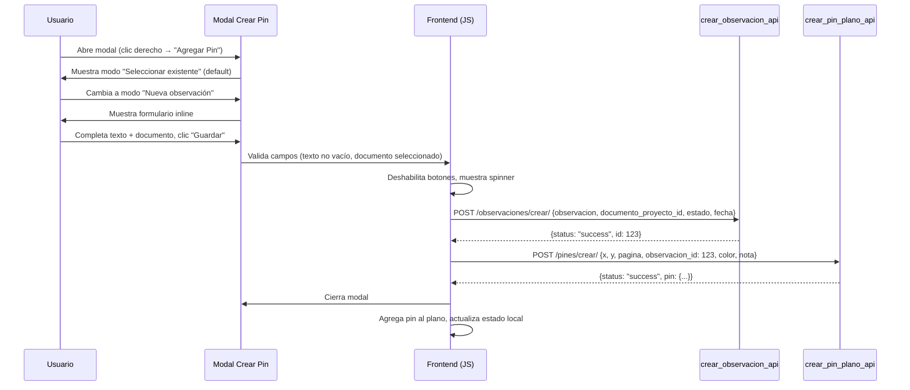
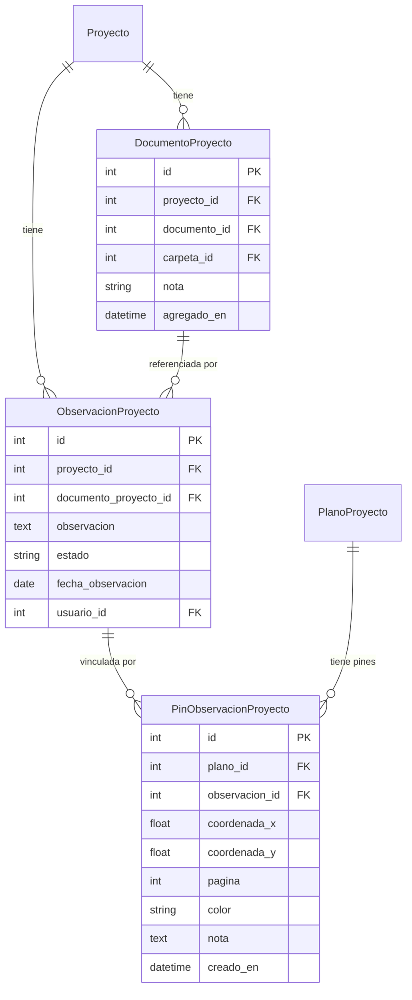
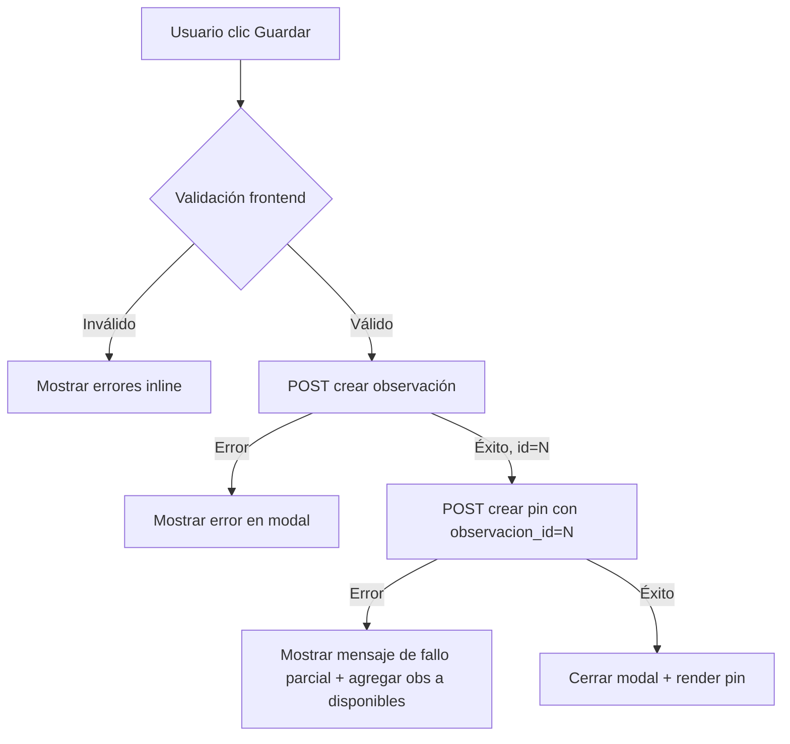

# Design Document: Crear Observación desde Pin

## Overview

Este diseño extiende el modal de creación de pin existente en el visor de planos PDF (`visor_plano_proyecto.html`) para permitir crear una nueva observación de forma inline sin salir del visor. La implementación agrega un mecanismo de toggle entre dos modos ("Seleccionar existente" y "Nueva observación") dentro del mismo modal, y un formulario inline que encadena la creación de la observación con la posterior creación del pin en una operación de dos pasos desde la perspectiva del usuario (un solo clic en "Guardar").

La arquitectura reutiliza completamente la infraestructura existente:
- El endpoint `crear_observacion_api` ya existente para crear observaciones.
- El endpoint `crear_pin_plano_api` ya existente para crear pines.
- El patrón de inyección de datos JSON en el template (ya usado para `PINES_DATA` y `OBSERVACIONES_DISPONIBLES`).

No se crean nuevos modelos, endpoints ni vistas Django. Los cambios se limitan a:
1. Extender la vista `visor_plano_proyecto` para inyectar la lista de `DocumentoProyecto` como JSON.
2. Modificar el HTML del modal de creación para incluir el toggle y el formulario inline.
3. Extender el JavaScript del frontend para gestionar modos, validación y la creación encadenada AJAX.

## Architecture



### Decisiones de Diseño

1. **Reutilización de endpoints existentes**: En lugar de crear un endpoint combinado "crear observación + pin", se encadenan dos llamadas AJAX secuenciales. Razón: mantiene la cohesión de cada endpoint, evita duplicar lógica de validación, y simplifica el manejo de errores parciales (la observación puede existir sin pin).

2. **Inyección estática de DocumentoProyecto**: Los documentos del proyecto se inyectan como JSON en el template (`DOCUMENTOS_PROYECTO`), siguiendo el mismo patrón que `OBSERVACIONES_DISPONIBLES`. Razón: evita una solicitud AJAX adicional al abrir el modal y mantiene consistencia con el patrón existente.

3. **Toggle en lugar de tabs o wizard**: Se usa un toggle de dos opciones (radio buttons estilizados) en lugar de un wizard multi-paso. Razón: ambas acciones comparten los mismos campos de color y nota, y el toggle mantiene el modal compacto sin scroll.

4. **Manejo de fallo parcial**: Si la observación se crea exitosamente pero el pin falla, la observación queda creada. El usuario recibe un mensaje indicando que puede vincularla desde "Seleccionar existente". No se implementa rollback. Razón: la observación es un recurso válido por sí mismo y eliminarla silenciosamente podría causar pérdida de datos.

5. **Campos por defecto ocultos**: Estado "ABIERTA" y fecha de hoy no se muestran como campos editables. Razón: simplifica la UX para el caso de uso principal (anotar hallazgos rápidamente durante inspección visual) sin sacrificar funcionalidad (el usuario puede editar la observación desde su vista completa después).

## Components and Interfaces

### Backend Changes

#### Vista `visor_plano_proyecto` (modificación)

Se agrega al contexto del template un nuevo JSON `documentos_proyecto_json`:

```python
# En la vista visor_plano_proyecto, agregar antes del return:
documentos_proyecto_qs = DocumentoProyecto.objects.filter(
    proyecto=proyecto
).select_related('documento')

documentos_proyecto_data = []
for doc_proy in documentos_proyecto_qs:
    documentos_proyecto_data.append({
        'id': doc_proy.id,
        'texto': f"{doc_proy.documento.codigo} - {doc_proy.documento.titulo}",
    })

# Agregar al contexto:
'documentos_proyecto_json': json.dumps(documentos_proyecto_data, ensure_ascii=False),
```

#### Endpoint `crear_observacion_api` (sin cambios)

Se reutiliza tal cual. Payload esperado:
```json
{
  "observacion": "Texto de la observación",
  "documento_proyecto_id": 5,
  "estado": "ABIERTA",
  "fecha_observacion": "2025-07-21"
}
```

Respuesta exitosa: `{"status": "success", "id": 123}`

#### URL de creación de observación (inyección en template)

Se agrega una variable JavaScript con la URL del endpoint:
```html
<script>
  var CREAR_OBSERVACION_URL = "";
  var DOCUMENTOS_PROYECTO = {{ documentos_proyecto_json|safe }};
</script>
```

### Frontend Changes

#### HTML: Toggle de modo en el modal

Se inserta un grupo de radio buttons estilizados justo debajo del título `<h3>` del modal:

```html
<div class="mode-toggle" id="mode-toggle">
  <label class="mode-option selected">
    <input type="radio" name="pin-mode" value="existing" checked>
    <span>Seleccionar existente</span>
  </label>
  <label class="mode-option">
    <input type="radio" name="pin-mode" value="new">
    <span>Nueva observación</span>
  </label>
</div>
```

#### HTML: Sección "Seleccionar existente" (ya existente, se envuelve)

```html
<div id="section-existing" class="mode-section">
  <!-- Contenido existente: select-observacion -->
</div>
```

#### HTML: Sección "Nueva observación" (nuevo)

```html
<div id="section-new" class="mode-section" style="display:none;">
  <label for="new-obs-texto">Texto de la observación *</label>
  <textarea id="new-obs-texto" placeholder="Describa la observación..." rows="3" required></textarea>
  <div class="field-error" id="error-obs-texto" style="display:none;"></div>

  <label for="select-documento">Documento vinculado *</label>
  <select id="select-documento">
    <option value="">— Seleccionar documento —</option>
  </select>
  <div class="field-error" id="error-documento" style="display:none;"></div>
</div>
```

#### JavaScript: Gestión de modos

```javascript
var currentMode = 'existing'; // 'existing' | 'new'

// Toggle handler
document.querySelectorAll('[name="pin-mode"]').forEach(function(radio) {
  radio.addEventListener('change', function() {
    currentMode = this.value;
    document.getElementById('section-existing').style.display =
      currentMode === 'existing' ? 'block' : 'none';
    document.getElementById('section-new').style.display =
      currentMode === 'new' ? 'block' : 'none';
    if (currentMode === 'new') {
      document.getElementById('new-obs-texto').focus();
    }
  });
});
```

#### JavaScript: Validación del formulario inline

```javascript
function validateNewObsForm() {
  var valid = true;
  var texto = document.getElementById('new-obs-texto').value.trim();
  var docId = document.getElementById('select-documento').value;

  if (!texto) {
    showFieldError('error-obs-texto', 'El texto de la observación es obligatorio.');
    valid = false;
  }
  if (!docId) {
    showFieldError('error-documento', 'Debe seleccionar un documento.');
    valid = false;
  }
  return valid;
}
```

#### JavaScript: Creación encadenada

```javascript
function saveNewObservationAndPin() {
  if (!validateNewObsForm()) return;

  setButtonsLoading(true);

  var obsPayload = {
    observacion: document.getElementById('new-obs-texto').value.trim(),
    documento_proyecto_id: parseInt(document.getElementById('select-documento').value),
    estado: 'ABIERTA',
    fecha_observacion: new Date().toISOString().split('T')[0]
  };

  fetch(CREAR_OBSERVACION_URL, {
    method: 'POST',
    headers: { 'X-CSRFToken': CSRF_TOKEN, 'Content-Type': 'application/json' },
    body: JSON.stringify(obsPayload)
  })
  .then(function(res) { return res.json().then(function(d) { return {ok: res.ok, data: d}; }); })
  .then(function(result) {
    if (!result.ok || result.data.error) {
      throw new Error(result.data.error || 'Error al crear la observación.');
    }
    // Crear el pin con la observación recién creada
    var pinPayload = {
      x: ctxX, y: ctxY, pagina: curPage,
      observacion_id: result.data.id,
      color: selectedColor,
      nota: pinNota.value.trim()
    };
    return fetch(PIN_CREATE_URL, {
      method: 'POST',
      headers: { 'X-CSRFToken': CSRF_TOKEN, 'Content-Type': 'application/json' },
      body: JSON.stringify(pinPayload)
    }).then(function(res2) { return res2.json().then(function(d) { return {ok: res2.ok, data: d, obsId: result.data.id}; }); });
  })
  .then(function(result) {
    if (!result.ok || !(result.data.status === 'success' || result.data.pin)) {
      showModalError('La observación fue creada pero el pin no pudo vincularse. '
        + 'Selecciónela desde "Seleccionar existente".');
      // Agregar observación a disponibles para que pueda seleccionarse
      OBSERVACIONES_DISPONIBLES.push({
        id: result.obsId,
        texto: obsPayload.observacion.substring(0, 100),
        estado: 'ABIERTA'
      });
      return;
    }
    // Éxito completo
    PINES_DATA.push(result.data.pin);
    renderizarPines(curPage);
    modalCrear.classList.remove('show');
  })
  .catch(function(err) {
    showModalError(err.message || 'Error de conexión.');
  })
  .finally(function() {
    setButtonsLoading(false);
  });
}
```

### Interface Contracts

**Flujo "Nueva observación" — Paso 1: Crear observación**

```
POST /proyecto/<pk>/observaciones/crear/
Content-Type: application/json
X-CSRFToken: <token>

{
  "observacion": "Fisura de 3mm detectada en viga V-12",
  "documento_proyecto_id": 5,
  "estado": "ABIERTA",
  "fecha_observacion": "2025-07-21"
}

→ 200 OK: {"status": "success", "id": 123}
→ 400 Bad Request: {"error": "Detalle del error"}
```

**Flujo "Nueva observación" — Paso 2: Crear pin (mismo que flujo existente)**

```
POST /proyecto/<pk>/planos/<plano_id>/pines/crear/
Content-Type: application/json
X-CSRFToken: <token>

{
  "x": 245.5,
  "y": 180.3,
  "pagina": 1,
  "observacion_id": 123,
  "color": "#EF4444",
  "nota": "Nota adicional del pin"
}

→ 200 OK: {"status": "success", "pin": {...}}
→ 400 Bad Request: {"status": "error", "message": "..."}
```

## Data Models

No se crean nuevos modelos. Se reutilizan los existentes:



### Datos inyectados en el template

| Variable JS | Fuente | Descripción |
|---|---|---|
| `PINES_DATA` | (existente) | Pines del plano actual |
| `OBSERVACIONES_DISPONIBLES` | (existente) | Observaciones no vinculadas |
| `PIN_CREATE_URL` | (existente) | URL del endpoint crear pin |
| `CSRF_TOKEN` | (existente) | Token CSRF |
| `CREAR_OBSERVACION_URL` | **(nuevo)** | URL del endpoint crear observación |
| `DOCUMENTOS_PROYECTO` | **(nuevo)** | Lista de {id, texto} de documentos del proyecto |

## Correctness Properties

*A property is a characteristic or behavior that should hold true across all valid executions of a system—essentially, a formal statement about what the system should do. Properties serve as the bridge between human-readable specifications and machine-verifiable correctness guarantees.*

### Property 1: Mode toggle preserves form values

*For any* set of values entered in both form sections (text in "new observation" textarea, selected document, selected observation in dropdown), toggling between modes any number of times SHALL preserve all previously entered values in each section.

**Validates: Requirements 1.4**

### Property 2: DocumentoProyecto serialization

*For any* project with a set of DocumentoProyecto instances, each having a related documento with código and título, the view SHALL inject a JSON list where each entry has `id` equal to the DocumentoProyecto's primary key and `texto` equal to the concatenation of `documento.codigo + " - " + documento.titulo`.

**Validates: Requirements 2.6, 6.1**

### Property 3: Whitespace-only text rejected

*For any* string composed entirely of whitespace characters (spaces, tabs, newlines, or empty), the validation function SHALL reject it and display an error message, preventing form submission.

**Validates: Requirements 3.1**

### Property 4: Invalid form state prevents AJAX

*For any* combination of form fields where at least one required field is invalid (empty text, no document selected, or both), attempting to save SHALL NOT trigger any network request to the backend.

**Validates: Requirements 3.3**

### Property 5: Error message cleared on field modification

*For any* field currently displaying a validation error, when the user modifies the content of that field (any input event), the error message associated with that field SHALL be hidden.

**Validates: Requirements 3.4**

### Property 6: Observation ID forwarded in chained creation

*For any* successful response from the observation creation endpoint returning an `id` value, the subsequent pin creation request SHALL include that exact `id` as the `observacion_id` field in its payload.

**Validates: Requirements 4.2**

### Property 7: API error messages displayed in modal

*For any* error response from either the observation creation or pin creation endpoint containing an error message string, that message SHALL be displayed in the modal's error area without closing the modal.

**Validates: Requirements 4.5**

### Property 8: Buttons restored after any outcome

*For any* outcome of the save operation (success, observation API error, pin API error, or network failure), after the operation completes the "Guardar" and "Cancelar" buttons SHALL be re-enabled and the loading indicator removed.

**Validates: Requirements 5.3**

## Error Handling

| Escenario | Comportamiento Frontend | Comportamiento Backend |
|---|---|---|
| Texto de observación vacío/whitespace | Error inline: "El texto de la observación es obligatorio." No se envía request. | N/A (no llega al backend) |
| Documento no seleccionado | Error inline: "Debe seleccionar un documento." No se envía request. | N/A |
| Proyecto sin documentos | Formulario inline deshabilitado. Mensaje: "No hay documentos disponibles para este proyecto." | Vista inyecta lista vacía `[]` |
| Error en `crear_observacion_api` (400) | Modal permanece abierto. Muestra el mensaje de error del API en zona de error del modal. | Retorna `{"error": "<detalle>"}` con status 400 |
| Error en `crear_pin_plano_api` (400) después de observación creada | Modal permanece abierto. Mensaje: "La observación fue creada pero el pin no pudo vincularse. Selecciónela desde 'Seleccionar existente'." Agrega la observación a `OBSERVACIONES_DISPONIBLES`. | Retorna `{"status": "error", "message": "<detalle>"}` con status 400 |
| Error de red (fetch rechazado) | Modal permanece abierto. Mensaje: "Error de conexión: <detalle>" | N/A (no llega) |
| Usuario no autenticado | Redirect a login (manejado por `@staff_member_required` del endpoint) | HTTP 302 redirect |
| Documento no pertenece al proyecto | Error desde API. Modal muestra el mensaje. | `get_object_or_404` lanza 404 → capturado como 400 con error |

### Flujo de errores parciales



## Testing Strategy

### Unit Tests (example-based)

| Test | Valida |
|---|---|
| Modal abre con modo "Seleccionar existente" por defecto | Req 1.5 |
| Toggle a "Nueva observación" muestra formulario y oculta dropdown | Req 1.3 |
| Toggle a "Seleccionar existente" muestra dropdown y oculta formulario | Req 1.2 |
| Cambio a modo "new" enfoca textarea automáticamente | Req 2.5 |
| Payload incluye estado "ABIERTA" por defecto | Req 2.3 |
| Payload incluye fecha de hoy como fecha_observacion | Req 2.4 |
| Documento no seleccionado muestra error en selector | Req 3.2 |
| Creación exitosa cierra modal y agrega pin al DOM | Req 4.3 |
| Creación exitosa remueve observación de OBSERVACIONES_DISPONIBLES | Req 4.4 |
| Fallo parcial (obs OK, pin error) muestra mensaje específico | Req 4.6 |
| Botones deshabilitados durante request | Req 5.1, 5.2 |
| Proyecto sin documentos muestra mensaje y deshabilita creación nueva | Req 6.3 |
| Vista incluye `documentos_proyecto_json` en contexto con select_related | Req 6.2 |

### Property-Based Tests (Hypothesis para backend, fast-check para frontend)

Se usará **Hypothesis** para los tests de backend (Python/Django) y **fast-check** para los tests de frontend (JavaScript).

Cada property test se ejecutará con mínimo 100 iteraciones.

**Configuración Hypothesis (backend):**
```python
from hypothesis import given, settings, strategies as st

@settings(max_examples=100)
```

**Configuración fast-check (frontend):**
```javascript
const fc = require('fast-check');
// Cada test usa fc.assert con numRuns: 100
```

**Tag format:** Cada test incluirá un comentario referenciando la propiedad:
```python
# Feature: crear-observacion-desde-pin, Property 2: DocumentoProyecto serialization
```

**Properties implementadas:**
1. Mode toggle preserves form values (Property 1) — fast-check
2. DocumentoProyecto serialization (Property 2) — Hypothesis
3. Whitespace-only text rejected (Property 3) — fast-check
4. Invalid form state prevents AJAX (Property 4) — fast-check
5. Error message cleared on field modification (Property 5) — fast-check
6. Observation ID forwarded in chained creation (Property 6) — fast-check
7. API error messages displayed in modal (Property 7) — fast-check
8. Buttons restored after any outcome (Property 8) — fast-check

### Integration Tests

| Test | Descripción |
|---|---|
| Flujo completo "nueva observación" | Abrir modal → modo nuevo → llenar form → guardar → verificar pin en plano |
| Flujo completo "seleccionar existente" | Verificar que el flujo existente sigue funcionando sin regresión |
| Cambio de modo preserva datos | Llenar datos en modo nuevo → cambiar a existente → volver → datos intactos |
| Vista con y sin documentos | Renderizar página con proyecto que tiene documentos y sin documentos |

