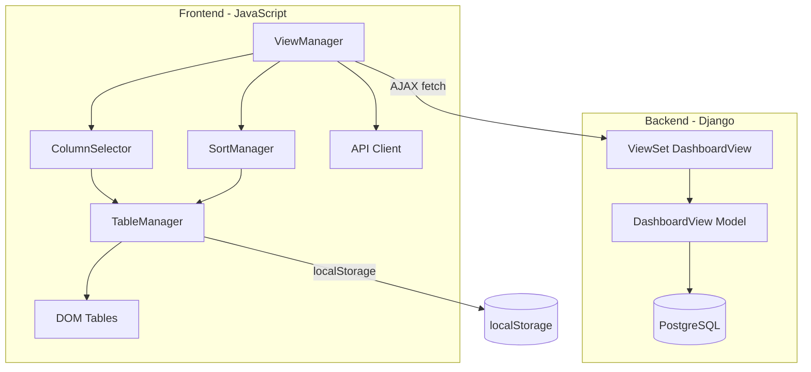

# Documento de Diseño: Vistas Personalizadas del Dashboard

## Overview

Esta funcionalidad extiende el Dashboard de Requisiciones (`/presupuestos/requisiciones/dashboard/`) para permitir a los usuarios personalizar la tabla de datos. Se implementa como una combinación de:
- **Frontend (JavaScript)**: Manejo de columnas visibles, ordenamiento en cliente, UI del selector y persistencia temporal en `localStorage`.
- **Backend (Django)**: Modelo para almacenar vistas personalizadas en base de datos, API REST para CRUD de vistas, y registro de última vista utilizada.

El ordenamiento se realiza en el cliente sobre las filas ya renderizadas (máx. ~20 filas visibles), evitando llamadas al servidor para reordenar.

## Architecture



**Decisión arquitectónica**: El ordenamiento se hace 100% en cliente porque el dashboard ya carga un máximo de 20 filas (truncado en la vista Django). Esto permite reordenamiento instantáneo sin roundtrip al servidor y simplifica la implementación.

## Components and Interfaces

### 1. Modelo Django: `DashboardView`

```python
# presupuestos/models.py

class DashboardView(models.Model):
    """Vista personalizada del dashboard de requisiciones."""
    user = models.ForeignKey(
        User, on_delete=models.CASCADE,
        related_name='dashboard_views'
    )
    name = models.CharField(max_length=100, verbose_name="Nombre de la vista")
    columns = models.JSONField(
        default=list,
        verbose_name="Columnas visibles",
        help_text="Lista ordenada de IDs de columnas visibles"
    )
    sort_column = models.CharField(
        max_length=50, null=True, blank=True,
        verbose_name="Columna de ordenamiento"
    )
    sort_direction = models.CharField(
        max_length=4, null=True, blank=True,
        choices=[('asc', 'Ascendente'), ('desc', 'Descendente')],
        verbose_name="Dirección de ordenamiento"
    )
    is_last_used = models.BooleanField(
        default=False,
        verbose_name="Es la última vista utilizada"
    )
    created_at = models.DateTimeField(auto_now_add=True)
    updated_at = models.DateTimeField(auto_now=True)

    class Meta:
        unique_together = ['user', 'name']
        ordering = ['name']
        verbose_name = "Vista del Dashboard"
        verbose_name_plural = "Vistas del Dashboard"

    def __str__(self):
        return f"{self.user.username} - {self.name}"
```

### 2. API Views (Django)

```python
# presupuestos/views_dashboard_api.py

# POST   /presupuestos/requisiciones/dashboard/api/views/         → crear vista
# GET    /presupuestos/requisiciones/dashboard/api/views/         → listar vistas del usuario
# DELETE /presupuestos/requisiciones/dashboard/api/views/<pk>/    → eliminar vista
# POST   /presupuestos/requisiciones/dashboard/api/views/<pk>/apply/ → marcar como última usada
# POST   /presupuestos/requisiciones/dashboard/api/views/reset/   → restablecer (limpiar última usada)
```

Todas las respuestas usan `JsonResponse`. Se requiere `@login_required` y verificación de pertenencia del recurso al usuario autenticado.

### 3. Frontend: Módulo JavaScript `DashboardCustomizer`

```javascript
// Estructura del módulo principal (inline en template o archivo estático)

const DashboardCustomizer = {
    // Configuración
    COLUMNS_ORDER: [
        'requisicion', 'fecha', 'asunto', 'prioridad', 
        'estado', 'total', 'oc', 'tipo', 'solicitante', 
        'aprobador', 'motivo', 'partida', 'proveedor', 'acciones'
    ],
    DEFAULT_COLUMNS: ['requisicion', 'fecha', 'asunto', 'prioridad', 'estado', 'total', 'oc', 'acciones'],
    SORTABLE_COLUMNS: ['requisicion', 'fecha', 'asunto', 'prioridad', 'estado', 'total'],
    NON_REMOVABLE: ['acciones'],

    // Sub-módulos
    ColumnSelector: { /* toggle panel, checkbox handlers */ },
    SortManager: { /* 3-state cycle, comparators por tipo */ },
    ViewManager: { /* CRUD de vistas via API */ },
    TableManager: { /* manipulación DOM de ambas tablas */ },
    Persistence: { /* localStorage para estado temporal */ },
};
```

### 4. Componente UI: Selector de Columnas

El selector se renderiza como un panel dropdown anclado al botón "Columnas" ubicado en el `surface-header` de cada tabla. Contiene:
- 14 checkboxes (uno por columna disponible)
- La casilla de "Acciones" está marcada y deshabilitada (`disabled`)
- Se cierra al hacer clic fuera o presionar `Escape`

### 5. Componente UI: Barra de Vistas

Se ubica sobre las tabs, conteniendo:
- Selector dropdown de vistas guardadas (ordenadas alfabéticamente)
- Botón "Guardar Vista" (habilitado solo cuando hay cambios vs. default)
- Botón "Restablecer Vista" (aplica defaults y limpia última usada)

## Data Models

### Tabla: `presupuestos_dashboardview`

| Campo          | Tipo           | Restricción                        |
|----------------|----------------|------------------------------------|
| id             | AutoField (PK) |                                    |
| user_id        | FK → auth_user | CASCADE                            |
| name           | VARCHAR(100)   | UNIQUE con user_id                 |
| columns        | JSONField      | Lista de strings (IDs de columna)  |
| sort_column    | VARCHAR(50)    | Nullable                           |
| sort_direction | VARCHAR(4)     | 'asc' o 'desc', nullable          |
| is_last_used   | BooleanField   | Default False                      |
| created_at     | DateTimeField  | auto_now_add                       |
| updated_at     | DateTimeField  | auto_now                           |

**Restricción de negocio**: Máximo 10 registros por `user_id` (validado en la vista API, no en DB).

### localStorage Keys

| Key                              | Valor                                    |
|----------------------------------|------------------------------------------|
| `dashboard_columns`              | JSON array de IDs de columnas visibles   |
| `dashboard_sort_col`             | String: ID de columna ordenada           |
| `dashboard_sort_dir`             | String: 'asc', 'desc', o null            |

El `localStorage` sirve como persistencia temporal para cambios ad-hoc (sin guardar como vista). Cuando se aplica una vista guardada, el `localStorage` se sincroniza con la configuración de la vista.

### Definición de columnas con metadatos de ordenamiento

```javascript
const COLUMN_DEFS = {
    requisicion:  { label: 'N° Requisición', sortType: 'alphanumeric' },
    fecha:        { label: 'Fecha',          sortType: 'date' },
    asunto:       { label: 'Asunto',         sortType: 'alpha' },
    prioridad:    { label: 'Prioridad',      sortType: 'severity', order: ['Normal','Alta','Urgencia','Emerencia'] },
    estado:       { label: 'Estado',         sortType: 'alpha' },
    total:        { label: 'Total',          sortType: 'numeric' },
    oc:           { label: 'O/C',            sortType: null },  // no ordenable
    tipo:         { label: 'Tipo',           sortType: 'alpha' },
    solicitante:  { label: 'Solicitante',    sortType: 'alpha' },
    aprobador:    { label: 'Aprobador',      sortType: 'alpha' },
    motivo:       { label: 'Motivo',         sortType: 'alpha' },
    partida:      { label: 'Partida Presup.',sortType: 'alpha' },
    proveedor:    { label: 'Proveedor',      sortType: 'alpha' },
    acciones:     { label: 'Acciones',       sortType: null },  // no ordenable
};
```

## Correctness Properties

*Una propiedad es una característica o comportamiento que debe mantenerse verdadero en todas las ejecuciones válidas de un sistema — esencialmente, una declaración formal sobre lo que el sistema debe hacer. Las propiedades sirven como puente entre especificaciones legibles por humanos y garantías de correctitud verificables por máquina.*

### Property 1: Activación de columna inserta en posición correcta

*Para cualquier* subconjunto de columnas activas y cualquier columna inactiva que se active, la columna activada debe aparecer en la posición que le corresponde según el orden fijo definido en `COLUMNS_ORDER`, sin alterar el orden relativo de las demás columnas.

**Validates: Requirements 1.3**

### Property 2: Desactivación de columna preserva datos restantes

*Para cualquier* conjunto de columnas visibles con más de una columna de datos, al desactivar una columna, las filas de la tabla deben conservar intactos los valores de las columnas restantes sin ninguna alteración.

**Validates: Requirements 1.4**

### Property 3: Invariante de columna Acciones

*Para cualquier* secuencia de operaciones de toggle de columnas, la columna "Acciones" siempre debe permanecer visible en la tabla y su casilla debe estar deshabilitada en el selector.

**Validates: Requirements 1.5**

### Property 4: Invariante de mínimo una columna de datos

*Para cualquier* estado de la tabla donde solo queda una columna de datos visible (además de Acciones), intentar desactivar esa última columna debe ser rechazado y el estado de la tabla no debe cambiar.

**Validates: Requirements 1.7**

### Property 5: Persistencia round-trip en localStorage

*Para cualquier* configuración válida de columnas (subconjunto de las 14 disponibles que incluya Acciones y al menos una columna de datos), serializar al localStorage y deserializar debe producir la misma configuración de columnas.

**Validates: Requirements 1.9**

### Property 6: Ordenamiento produce orden correcto por tipo de dato

*Para cualquier* conjunto de filas y cualquier columna ordenable, al aplicar orden ascendente los valores deben estar en orden no-decreciente según las reglas del tipo de dato (alfanumérico, cronológico, numérico, o severidad), y al aplicar orden descendente deben estar en orden no-creciente.

**Validates: Requirements 2.1, 2.2**

### Property 7: Estabilidad del sort — duplicados sub-ordenados por Fecha descendente

*Para cualquier* conjunto de filas con valores duplicados en la columna de ordenamiento, esas filas con valores iguales deben mantener entre sí un sub-orden por Fecha descendente (más reciente primero).

**Validates: Requirements 2.8**

### Property 8: Botón Guardar habilitado si y solo si configuración difiere del default

*Para cualquier* configuración de columnas y ordenamiento, el botón "Guardar Vista" debe estar habilitado si y solo si la configuración actual difiere de las Columnas_Default con orden por Fecha descendente.

**Validates: Requirements 3.1**

### Property 9: Round-trip de guardar/cargar vista

*Para cualquier* vista personalizada con nombre válido (no vacío, no solo espacios, ≤100 caracteres, único por usuario), al guardarla y luego seleccionarla del listado, la tabla debe mostrar exactamente las mismas columnas y el mismo criterio de ordenamiento que se guardaron.

**Validates: Requirements 3.3, 3.5**

### Property 10: Vistas listadas en orden alfabético

*Para cualquier* conjunto de vistas guardadas por un usuario, el selector de vistas debe listarlas en orden alfabético por nombre sin importar el orden de creación.

**Validates: Requirements 3.4**

### Property 11: Nombres de vista de solo espacios rechazados

*Para cualquier* string compuesto enteramente de caracteres de espacio en blanco (incluido el vacío), al intentar guardar una vista con ese nombre el sistema debe rechazar la operación sin crear la vista.

**Validates: Requirements 3.8**

### Property 12: Nombres de vista duplicados rechazados

*Para cualquier* nombre de vista que ya existe para un usuario dado, al intentar guardar otra vista con el mismo nombre exacto, el sistema debe rechazar la operación.

**Validates: Requirements 3.10**

### Property 13: Round-trip de última vista utilizada

*Para cualquier* vista personalizada guardada que el usuario aplica, al recargar el dashboard, esa misma vista debe cargarse automáticamente con su configuración completa de columnas y ordenamiento.

**Validates: Requirements 4.1, 4.2**

### Property 14: Cambios ad-hoc no actualizan última vista utilizada

*Para cualquier* modificación de columnas o criterio de ordenamiento realizada sin guardar como vista con nombre, el registro de última vista utilizada del usuario no debe cambiar.

**Validates: Requirements 4.5**

### Property 15: Configuración de columnas se aplica a ambas pestañas

*Para cualquier* cambio en la selección de columnas (ya sea por aplicar una vista o por usar el selector manual), ambas tablas (Resumen General y Mis Requisiciones) deben mostrar exactamente el mismo conjunto de columnas visibles.

**Validates: Requirements 5.1, 5.5**

### Property 16: Ordenamiento manual aislado a la pestaña activa

*Para cualquier* cambio de ordenamiento manual en una pestaña, al cambiar a la otra pestaña, esa otra pestaña debe conservar su propio criterio de ordenamiento sin ser afectada por el cambio.

**Validates: Requirements 5.3**

## Error Handling

| Escenario | Comportamiento |
|-----------|---------------|
| Fallo en API al guardar vista | Mostrar toast de error, preservar estado actual de la tabla sin cambios |
| Fallo en API al eliminar vista | Mostrar toast de error, la vista permanece en el listado |
| Fallo en API al listar vistas | Ocultar selector de vistas, mostrar alerta discreta |
| localStorage no disponible | Funcionalidad de columnas ad-hoc degradada (sin persistencia entre recargas), vistas guardadas siguen funcionando vía DB |
| Vista referenciada como última_usada fue eliminada | Dashboard carga con Columnas_Default |
| JSON inválido en localStorage | Reset a Columnas_Default, limpiar keys corruptas |
| Respuesta API con formato inesperado | Log en consola, mostrar estado default sin interrupción |
| Columna en vista guardada ya no existe en el sistema | Ignorar columna inexistente, mostrar las restantes |

Todas las llamadas a la API usan `fetch` con manejo de errores mediante `.catch()` y verificación de `response.ok`. Los errores se presentan al usuario con notificaciones toast temporales (usando SweetAlert2 ya presente en el template).

## Testing Strategy

### Tests Unitarios (Python - pytest/Django TestCase)

- **Modelo `DashboardView`**: Validación de constraints (unique_together, max 10 por usuario)
- **API Views**: Test de cada endpoint (crear, listar, eliminar, apply, reset) con autenticación
- **Validaciones**: Nombre vacío, duplicado, límite de 10, permisos (no acceder a vistas de otro usuario)
- **Edge cases**: Vista eliminada como última usada, columnas inválidas en JSON

### Tests Unitarios (JavaScript - vitest)

- **SortManager**: Comparadores por tipo de dato, ciclo de 3 estados, estabilidad del sort
- **ColumnSelector**: Toggle de columnas, posición correcta, invariantes (Acciones, mínimo 1)
- **ViewManager**: Serialización/deserialización de configuración, validación de nombre
- **Persistence**: Round-trip de localStorage

### Tests de Propiedad (JavaScript - fast-check + vitest)

Librería seleccionada: **fast-check** con vitest como runner.
Configuración: mínimo 100 iteraciones por propiedad.

Cada property test referencia su propiedad del documento de diseño:
- **Feature: custom-dashboard-views, Property 1**: Inserción de columna en posición correcta
- **Feature: custom-dashboard-views, Property 2**: Preservación de datos al desactivar columna
- **Feature: custom-dashboard-views, Property 3**: Invariante de Acciones
- **Feature: custom-dashboard-views, Property 4**: Invariante de mínimo una columna de datos
- **Feature: custom-dashboard-views, Property 5**: Round-trip localStorage
- **Feature: custom-dashboard-views, Property 6**: Correctitud del ordenamiento por tipo
- **Feature: custom-dashboard-views, Property 7**: Estabilidad del sort con duplicados
- **Feature: custom-dashboard-views, Property 8**: Estado del botón Guardar
- **Feature: custom-dashboard-views, Property 9**: Round-trip guardar/cargar vista
- **Feature: custom-dashboard-views, Property 10**: Orden alfabético de vistas
- **Feature: custom-dashboard-views, Property 11**: Rechazo de nombres en blanco
- **Feature: custom-dashboard-views, Property 12**: Rechazo de nombres duplicados
- **Feature: custom-dashboard-views, Property 13**: Round-trip última vista
- **Feature: custom-dashboard-views, Property 14**: Ad-hoc no actualiza última vista
- **Feature: custom-dashboard-views, Property 15**: Columnas aplicadas a ambas pestañas
- **Feature: custom-dashboard-views, Property 16**: Aislamiento de sort por pestaña

### Tests de Integración (Django)

- Flujo completo: crear vista → aplicar → recargar → verificar que se carga
- Flujo de eliminación con vista activa como última usada
- Verificación de contexto del template con vista activa
- Test de performance: ordenamiento de 20 filas < 1 segundo (smoke test en browser)

### Testing de API

Los endpoints se testean con `django.test.Client` verificando:
- Status codes correctos (200, 201, 400, 404)
- JSON responses con estructura esperada
- Aislamiento entre usuarios (no acceder a vistas ajenas)
- CSRF protection (middleware de Django)
