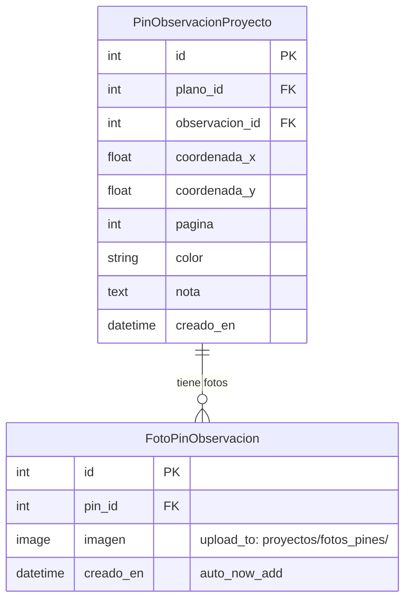

# Design Document: Fotos Pin Observación

## Overview

Este diseño implementa la funcionalidad de adjuntar, visualizar y eliminar fotografías en los pines de observación del visor de planos PDF de proyecto. Se crea un nuevo modelo `FotoPinObservacion` siguiendo el patrón existente de `FotoAviso` en mantenimiento, con compresión automática vía `compress_image`. El frontend extiende el modal de detalle existente (`#modal-detalle-pin`) con una grilla de miniaturas, un lightbox para visualización completa, y botones de gestión. Las fotos se incluyen en el JSON inyectado `PINES_DATA` para evitar requests adicionales en la carga inicial.

## Architecture

```mermaid
graph TB
    subgraph Frontend["Frontend (JavaScript Vanilla)"]
        ModalDetalle["Modal Detalle Pin (#modal-detalle-pin)"]
        ModalCrear["Modal Crear Pin (#modal-crear-pin)"]
        GrillaMini["Grilla Miniaturas"]
        Lightbox["Lightbox Overlay"]
        FileInput["Input File (multipart)"]
    end

    subgraph Backend["Backend (Django)"]
        ViewVisor["visor_plano_proyecto (view)"]
        APIUpload["POST pines/<pin_id>/fotos/subir/"]
        APIDelete["POST pines/<pin_id>/fotos/<foto_id>/eliminar/"]
    end

    subgraph Models["Modelos"]
        FotoPin["FotoPinObservacion"]
        PinObs["PinObservacionProyecto"]
    end

    subgraph Utils["Utilidades"]
        Compress["core.image_utils.compress_image"]
    end

    ModalDetalle --> GrillaMini
    GrillaMini -->|clic miniatura| Lightbox
    ModalDetalle --> FileInput
    ModalCrear --> FileInput
    FileInput -->|AJAX multipart POST| APIUpload
    GrillaMini -->|AJAX POST eliminar| APIDelete
    APIUpload --> FotoPin
    APIDelete --> FotoPin
    FotoPin -->|FK| PinObs
    FotoPin -->|save()| Compress
    ViewVisor -->|inyecta fotos en pines_json| GrillaMini
```

### Decisiones de Diseño

1. **Modelo separado `FotoPinObservacion`**: Sigue el patrón de `FotoAviso` — modelo simple con FK al padre, ImageField, y `compress_image` en `save()`. No se reutiliza `FotoAviso` porque pertenece a otra app y otro dominio.

2. **Fotos inyectadas en `pines_json`**: Cada pin en el JSON inicial incluye un array `fotos` con `{id, url}`. Esto evita un AJAX extra por pin y permite renderizar las miniaturas inmediatamente al abrir el modal de detalle.

3. **Endpoint multipart/form-data**: La subida de fotos usa `multipart/form-data` (no JSON) porque los archivos binarios lo requieren. Se envía con `fetch()` y `FormData`, incluyendo el CSRF token como campo del form.

4. **Límite de 5 fotos**: Se valida tanto en frontend (deshabilitar input) como en backend (rechazar con 400). El backend es la fuente de verdad.

5. **Lightbox simple**: Overlay con `position: fixed`, fondo semitransparente, imagen centrada, y navegación con flechas. Sin librerías externas — consistente con el enfoque vanilla JS del proyecto.

6. **Compresión en `save()`**: Igual que `FotoAviso`, la compresión se ejecuta en el método `save()` del modelo, asegurando que toda imagen almacenada pase por `compress_image` independientemente de cómo se creó.

## Components and Interfaces

### Backend Components

#### Modelo: `FotoPinObservacion`

```python
from django.db import models
from core.image_utils import compress_image
from proyectos.models import PinObservacionProyecto


class FotoPinObservacion(models.Model):
    pin = models.ForeignKey(
        PinObservacionProyecto,
        on_delete=models.CASCADE,
        related_name='fotos'
    )
    imagen = models.ImageField(upload_to='proyectos/fotos_pines/')
    creado_en = models.DateTimeField(auto_now_add=True)

    class Meta:
        verbose_name = "Foto de Pin de Observación"
        verbose_name_plural = "Fotos de Pin de Observación"
        ordering = ['creado_en']

    def save(self, *args, **kwargs):
        if self.imagen:
            self.imagen = compress_image(self.imagen)
        super().save(*args, **kwargs)

    def __str__(self):
        return f"Foto {self.id} - Pin {self.pin_id}"
```

#### Vista: `visor_plano_proyecto` (modificada)

Se extiende la serialización de `pines_data` para incluir las fotos de cada pin:

```python
# En la construcción de pines_data, agregar:
fotos_data = []
for foto in pin.fotos.all():
    fotos_data.append({
        'id': foto.id,
        'url': foto.imagen.url,
    })
# Agregar al dict del pin:
pin_dict['fotos'] = fotos_data
```

#### Endpoint: Subir fotos a un pin

```python
@csrf_exempt
@staff_member_required
def subir_fotos_pin_api(request, pk, plano_id, pin_id):
    """
    POST multipart/form-data: Sube una o más fotos a un pin existente.
    Campo de archivos: 'fotos' (múltiple)
    """
    if request.method != 'POST':
        return JsonResponse({'status': 'error', 'message': 'Método no permitido'}, status=405)

    proyecto = get_object_or_404(Proyecto, pk=pk)
    plano = get_object_or_404(PlanoProyecto, pk=plano_id, proyecto_id=proyecto.id)
    pin = get_object_or_404(PinObservacionProyecto, pk=pin_id, plano=plano)

    archivos = request.FILES.getlist('fotos')
    if not archivos:
        return JsonResponse({'status': 'error', 'message': 'No se enviaron archivos.'}, status=400)

    # Validar límite
    fotos_actuales = pin.fotos.count()
    disponibles = 5 - fotos_actuales
    if len(archivos) > disponibles:
        return JsonResponse({
            'status': 'error',
            'message': f'Solo puede agregar {disponibles} foto(s) más. El pin ya tiene {fotos_actuales}.'
        }, status=400)

    # Validar MIME de cada archivo
    MIMES_VALIDOS = {'image/jpeg', 'image/png'}
    for archivo in archivos:
        if archivo.content_type not in MIMES_VALIDOS:
            return JsonResponse({
                'status': 'error',
                'message': 'Solo se permiten archivos JPG o PNG.'
            }, status=400)

    # Guardar fotos
    fotos_creadas = []
    for archivo in archivos:
        foto = FotoPinObservacion(pin=pin, imagen=archivo)
        foto.save()
        fotos_creadas.append({'id': foto.id, 'url': foto.imagen.url})

    return JsonResponse({'status': 'success', 'fotos': fotos_creadas})
```

#### Endpoint: Eliminar foto de un pin

```python
@csrf_exempt
@staff_member_required
def eliminar_foto_pin_api(request, pk, plano_id, pin_id, foto_id):
    """
    POST: Elimina una foto específica de un pin.
    """
    if request.method != 'POST':
        return JsonResponse({'status': 'error', 'message': 'Método no permitido'}, status=405)

    proyecto = get_object_or_404(Proyecto, pk=pk)
    plano = get_object_or_404(PlanoProyecto, pk=plano_id, proyecto_id=proyecto.id)
    pin = get_object_or_404(PinObservacionProyecto, pk=pin_id, plano=plano)
    foto = get_object_or_404(FotoPinObservacion, pk=foto_id, pin=pin)

    foto.delete()
    return JsonResponse({'status': 'success'})
```

### Frontend Components

#### Grilla de Miniaturas (dentro de `#modal-detalle-pin`)

Se inyecta una sección entre la nota del pin y los botones de acción:

```html
<!-- Sección de fotos en modal detalle -->
<div id="detail-fotos-section" style="display:none;">
  <div class="field-label">Fotos</div>
  <div id="detail-fotos-grid" class="fotos-grid"></div>
  <div id="fotos-limit-msg" style="display:none;" class="fotos-limit-indicator">
    Máximo de 5 fotos alcanzado
  </div>
  <button id="btn-agregar-fotos" class="tb-btn" style="margin-top:8px;">
    &#128247; Agregar Fotos
  </button>
  <input type="file" id="input-fotos-detalle" multiple accept="image/jpeg,image/png"
         style="display:none;">
</div>
```

#### CSS de la Grilla

```css
.fotos-grid {
  display: grid;
  grid-template-columns: repeat(3, 1fr);
  gap: 6px;
  margin-top: 8px;
}
.fotos-grid .foto-thumb {
  position: relative;
  aspect-ratio: 1;
  border-radius: 6px;
  overflow: hidden;
  cursor: pointer;
}
.fotos-grid .foto-thumb img {
  width: 100%;
  height: 100%;
  object-fit: cover;
}
.fotos-grid .foto-thumb .btn-delete-foto {
  position: absolute;
  top: 4px;
  right: 4px;
  background: rgba(0,0,0,0.6);
  color: #f87171;
  border: none;
  border-radius: 50%;
  width: 22px;
  height: 22px;
  font-size: 14px;
  cursor: pointer;
  display: flex;
  align-items: center;
  justify-content: center;
  opacity: 0;
  transition: opacity .15s;
}
.fotos-grid .foto-thumb:hover .btn-delete-foto {
  opacity: 1;
}
```

#### Lightbox

```html
<div id="lightbox-overlay" class="lightbox-overlay" style="display:none;">
  <button id="lightbox-close" class="lightbox-close">&times;</button>
  <button id="lightbox-prev" class="lightbox-nav lightbox-prev-btn">&#10094;</button>
  
  <button id="lightbox-next" class="lightbox-nav lightbox-next-btn">&#10095;</button>
</div>
```

```css
.lightbox-overlay {
  position: fixed;
  inset: 0;
  background: rgba(0, 0, 0, 0.85);
  display: flex;
  align-items: center;
  justify-content: center;
  z-index: 10000;
}
.lightbox-overlay img {
  max-width: 90vw;
  max-height: 90vh;
  object-fit: contain;
  border-radius: 4px;
}
.lightbox-close {
  position: absolute;
  top: 16px;
  right: 20px;
  background: none;
  border: none;
  color: #fff;
  font-size: 36px;
  cursor: pointer;
  z-index: 10001;
}
.lightbox-nav {
  position: absolute;
  top: 50%;
  transform: translateY(-50%);
  background: rgba(255,255,255,0.15);
  border: none;
  color: #fff;
  font-size: 28px;
  padding: 12px 16px;
  cursor: pointer;
  border-radius: 4px;
}
.lightbox-prev-btn { left: 16px; }
.lightbox-next-btn { right: 16px; }
```

#### Campo de fotos en Modal de Creación

Se agrega un campo de file input en el modal de creación (`#modal-crear-pin`):

```html
<div class="detail-field" id="crear-fotos-section">
  <div class="field-label">Fotos (opcional, máx. 5)</div>
  <input type="file" id="input-fotos-crear" multiple accept="image/jpeg,image/png">
  <div id="crear-fotos-preview" class="fotos-grid" style="margin-top:8px;"></div>
  <div id="crear-fotos-error" style="display:none;color:#f87171;font-size:12px;margin-top:4px;"></div>
</div>
```

### Interface Contracts

**POST `proyecto/<pk>/planos/<plano_id>/pines/<pin_id>/fotos/subir/`**

Request: `multipart/form-data`
- Campo `fotos`: uno o más archivos de imagen (JPG/PNG)

```json
// Response 200 (éxito)
{
  "status": "success",
  "fotos": [
    {"id": 12, "url": "/media/proyectos/fotos_pines/foto_abc.jpg"},
    {"id": 13, "url": "/media/proyectos/fotos_pines/foto_def.jpg"}
  ]
}

// Response 400 (límite excedido)
{
  "status": "error",
  "message": "Solo puede agregar 2 foto(s) más. El pin ya tiene 3."
}

// Response 400 (formato inválido)
{
  "status": "error",
  "message": "Solo se permiten archivos JPG o PNG."
}
```

**POST `proyecto/<pk>/planos/<plano_id>/pines/<pin_id>/fotos/<foto_id>/eliminar/`**

```json
// Response 200
{"status": "success"}

// Response 404
// (Django default 404 via get_object_or_404)
```

**Estructura de `pines_json` (modificada)**

Cada pin en el array `PINES_DATA` ahora incluye:

```json
{
  "id": 7,
  "x": 245.5,
  "y": 180.3,
  "pagina": 1,
  "color": "#EF4444",
  "nota": "Fisura visible",
  "observacion_id": 42,
  "observacion_texto": "Se detectó fisura...",
  "observacion_estado": "ABIERTA",
  "observacion_usuario": "Juan Pérez",
  "observacion_fecha": "2025-01-15",
  "fotos": [
    {"id": 12, "url": "/media/proyectos/fotos_pines/foto_abc.jpg"},
    {"id": 13, "url": "/media/proyectos/fotos_pines/foto_def.jpg"}
  ]
}
```

### URL Configuration

```python
# En proyectos/urls.py, agregar después de las rutas de pines existentes:
path('proyecto/<int:pk>/planos/<int:plano_id>/pines/<int:pin_id>/fotos/subir/',
     views.subir_fotos_pin_api, name='subir_fotos_pin_api'),
path('proyecto/<int:pk>/planos/<int:plano_id>/pines/<int:pin_id>/fotos/<int:foto_id>/eliminar/',
     views.eliminar_foto_pin_api, name='eliminar_foto_pin_api'),
```

## Data Models



### Restricciones de Integridad

- `on_delete=CASCADE` en FK a `PinObservacionProyecto`: eliminar un pin elimina todas sus fotos.
- Máximo 5 fotos por pin: validado en el endpoint de subida (no en el modelo, para permitir flexibilidad en admin).
- `ordering = ['creado_en']` en Meta: las fotos siempre se devuelven en orden de creación ascendente.

## Error Handling

| Escenario | Comportamiento |
|-----------|---------------|
| Pin no encontrado o no pertenece al plano/proyecto | HTTP 404 via `get_object_or_404` |
| Foto no encontrada | HTTP 404 via `get_object_or_404` |
| Subida excede límite de 5 | HTTP 400 con mensaje indicando cuántas más se permiten |
| Archivo no es JPG ni PNG (MIME inválido) | HTTP 400 con mensaje de formatos válidos |
| No se enviaron archivos | HTTP 400 con mensaje "No se enviaron archivos" |
| Usuario no autenticado como staff | HTTP 302 redirect a login (vía `@staff_member_required`) |
| Error de compresión de imagen | `compress_image` retorna la imagen original sin comprimir (fallback silencioso existente) |
| Error de red durante AJAX (frontend) | Se muestra mensaje de error en el modal sin cerrarlo |
| Creación de pin con fotos falla en las fotos | Pin se crea sin fotos, se muestra aviso al usuario |

### Frontend Error Handling

- Errores en la subida se capturan en el `.catch()` del `fetch` y se muestran como texto rojo dentro del modal.
- Si la eliminación falla, se muestra error y la miniatura permanece visible.
- Validación de tipo de archivo en frontend previene envíos innecesarios (atributo `accept` + validación JS).
- Validación de cantidad en frontend: si ya hay 5 fotos, el botón de agregar se oculta.

## Correctness Properties

*A property is a characteristic or behavior that should hold true across all valid executions of a system—essentially, a formal statement about what the system should do. Properties serve as the bridge between human-readable specifications and machine-verifiable correctness guarantees.*

### Property 1: Photo upload round-trip

*For any* valid image file (JPG or PNG) uploaded to an existing pin, the upload endpoint SHALL return HTTP 200 with a JSON response containing an `id` and a `url`, and subsequently querying the pin's photos SHALL include an entry with that same `id` and a `url` pointing to a file stored under the path `proyectos/fotos_pines/`.

**Validates: Requirements 1.1, 1.2, 7.7**

### Property 2: Image compression invariant

*For any* image file of any width uploaded through `FotoPinObservacion`, after saving, the stored image SHALL have a width of at most 1024 pixels and SHALL be in JPEG format.

**Validates: Requirements 1.3**

### Property 3: Cascade deletion of photos

*For any* `PinObservacionProyecto` with N associated photos (where N >= 0), deleting that pin SHALL result in all N `FotoPinObservacion` records being removed from the database.

**Validates: Requirements 1.4**

### Property 4: Maximum 5 photos enforcement

*For any* pin with K existing photos (0 <= K <= 5) and an upload request containing N files, the system SHALL accept the upload if and only if K + N <= 5. When K + N > 5, the system SHALL reject the entire request with HTTP 400 and a message indicating that only (5 - K) additional photos are allowed.

**Validates: Requirements 1.5, 7.3, 3.3, 3.4, 6.5**

### Property 5: MIME type validation rejects non-image files

*For any* uploaded file whose actual content type is not `image/jpeg` or `image/png`, the upload endpoint SHALL reject the request with HTTP 400, regardless of the file extension.

**Validates: Requirements 7.4, 8.1, 8.4**

### Property 6: Authentication enforcement

*For any* request to the photo upload or photo delete endpoints made without staff authentication, the system SHALL respond with HTTP 302 redirecting to the login page.

**Validates: Requirements 7.5, 8.2**

### Property 7: Pin-project ownership validation

*For any* pin belonging to plano P of project A, attempting to upload or delete photos via a URL referencing a different project B (where A ≠ B) SHALL result in HTTP 404.

**Validates: Requirements 8.3**

### Property 8: Photo ordering by creation date

*For any* pin with multiple photos, the photos returned in `pines_json` and in the model's default queryset SHALL be ordered by `creado_en` ascending (oldest first), such that for any two consecutive photos in the list, the first photo's `creado_en` is less than or equal to the second's.

**Validates: Requirements 4.5**

## Testing Strategy

### Unit Tests (example-based)

- Modal de creación muestra campo de fotos con atributo `accept` correcto (2.1)
- Rechazo de archivos GIF/BMP en frontend con mensaje de error (2.3)
- Frontend impide seleccionar más de 5 archivos (2.4)
- Pin se crea sin fotos si la subida falla (2.6)
- Modal de detalle muestra botón de agregar fotos (3.1)
- Modal detalle muestra grilla cuando hay fotos, la oculta cuando no hay (4.1, 4.4)
- Lightbox se abre al hacer clic en miniatura (5.1)
- Lightbox se cierra con Escape y clic en fondo (5.4, 5.5)
- Flechas de navegación presentes con múltiples fotos (5.6)
- Confirmación antes de eliminar (6.2)
- Endpoint devuelve 404 para foto inexistente (7.6)

### Property-Based Tests (Hypothesis)

Se usará **Hypothesis** (Python) para los tests de backend.

Cada property test se ejecutará con mínimo 100 iteraciones.

**Configuración:**
```python
from hypothesis import given, settings, strategies as st

@settings(max_examples=100)
```

**Tag format:** Cada test incluirá un comentario referenciando la propiedad:
```python
# Feature: fotos-pin-observacion, Property 1: Photo upload round-trip
```

**Properties implementadas:**
1. Photo upload round-trip (Property 1)
2. Image compression invariant (Property 2)
3. Cascade deletion of photos (Property 3)
4. Maximum 5 photos enforcement (Property 4)
5. MIME type validation (Property 5)
6. Authentication enforcement (Property 6)
7. Pin-project ownership validation (Property 7)
8. Photo ordering by creation date (Property 8)

### Integration Tests

- Flujo completo: crear pin con fotos → verificar fotos en detalle → eliminar una foto → verificar actualización.
- Subida desde modal de detalle actualiza grilla sin recarga.
- Visor carga con fotos inyectadas en `pines_json`.
