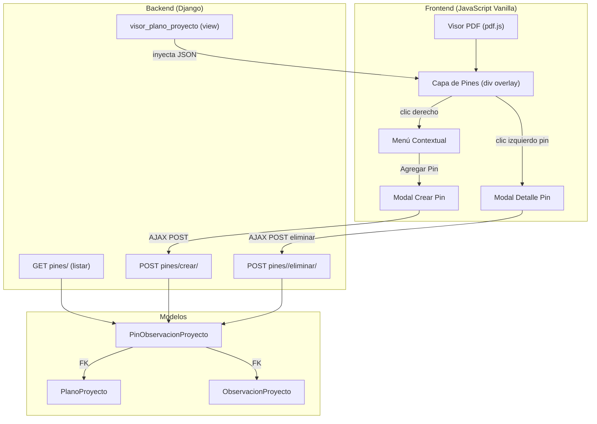
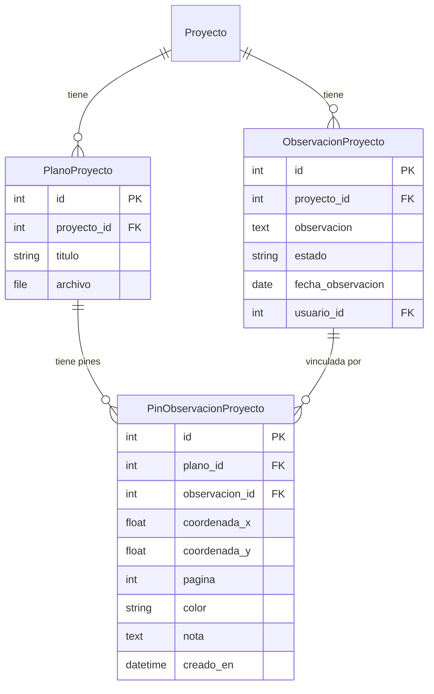

# Design Document: Plano PDF Pins

## Overview

Este diseño implementa un sistema de marcadores visuales (pines) sobre planos PDF de proyecto, vinculando cada pin a una observación existente del proyecto. El sistema extiende el visor de planos PDF existente (`visor_plano_proyecto`) con una capa de pines interactiva, siguiendo el patrón ya establecido en el módulo de activos (`PinPlano` en `activos.models.plano`).

La arquitectura sigue el patrón Django + JavaScript vanilla del proyecto: el backend expone endpoints REST-like con `JsonResponse`, y el frontend manipula el DOM directamente sin frameworks. Los datos iniciales se inyectan en el template para evitar una solicitud extra al cargar la página.

## Architecture



### Decisiones de Diseño

1. **Modelo separado vs extender PinPlano**: Se crea un modelo nuevo `PinObservacionProyecto` en la app `proyectos` en lugar de reutilizar `activos.PinPlano`. Razón: el modelo de activos es multi-propósito (activos, avisos, actividades, ubicaciones) y agregar observaciones lo complicaría innecesariamente. Además, el modelo de activos opera sobre `VisorPlano` mientras que este opera sobre `PlanoProyecto`.

2. **Inyección de datos en template**: Los pines y observaciones disponibles se inyectan como JSON en el template en la carga inicial (no AJAX), siguiendo el requisito 7. El AJAX solo se usa para crear/eliminar pines después de la carga.

3. **Coordenadas absolutas sobre el canvas PDF**: Las posiciones (x, y) se almacenan como coordenadas absolutas en píxeles del canvas PDF sin escalar (base viewport), independientes del zoom/pan. El frontend traduce estas coordenadas aplicando la transformación actual del visor.

4. **Campo `pagina`**: Almacena el número de página (1-indexed) donde el pin fue colocado, permitiendo filtrar pines por página en PDFs multipágina.

## Components and Interfaces

### Backend Components

#### Modelo: `PinObservacionProyecto`

```python
class PinObservacionProyecto(models.Model):
    plano = models.ForeignKey(PlanoProyecto, on_delete=models.CASCADE, related_name='pines_observacion')
    observacion = models.ForeignKey(ObservacionProyecto, on_delete=models.CASCADE, related_name='pines_plano')
    coordenada_x = models.FloatField(help_text="Posición X en píxeles absolutos del viewport base")
    coordenada_y = models.FloatField(help_text="Posición Y en píxeles absolutos del viewport base")
    pagina = models.PositiveIntegerField(default=1)
    color = ColorField(default='#EF4444')
    nota = models.TextField(blank=True)
    creado_en = models.DateTimeField(auto_now_add=True)

    class Meta:
        unique_together = ('plano', 'observacion')
        verbose_name = "Pin de Observación en Proyecto"
        verbose_name_plural = "Pines de Observación en Proyecto"
```

#### Vista: `visor_plano_proyecto` (modificada)

Se extiende la vista existente para inyectar:
- `pines_json`: Lista de pines del plano con datos de la observación vinculada.
- `observaciones_disponibles_json`: Observaciones del proyecto que no están vinculadas al plano actual.

#### Endpoints API

| Endpoint | Método | Descripción |
|----------|--------|-------------|
| `proyecto/<pk>/planos/<plano_id>/pines/` | GET | Lista pines del plano en JSON |
| `proyecto/<pk>/planos/<plano_id>/pines/crear/` | POST | Crea pin vinculando observación |
| `proyecto/<pk>/planos/<plano_id>/pines/<pin_id>/eliminar/` | POST | Elimina pin específico |

### Frontend Components

#### Capa de Pines (`#pin-layer`)

Div posicionado absolutamente dentro del `#stage`, con las mismas dimensiones que el canvas PDF. Los pines se renderizan como SVGs de marcador (gota) posicionados con `position: absolute` y `left/top` calculados a partir de las coordenadas almacenadas.

#### Menú Contextual

Div oculto que se muestra en la posición del cursor al hacer clic derecho sobre `#pin-layer`. Contiene la opción "Agregar Pin de Observación".

#### Modal de Creación

Modal con:
- Selector (`<select>`) de observaciones disponibles (filtradas: mismo proyecto, no vinculadas al plano).
- Paleta de colores predefinida (6-8 opciones).
- Campo de nota opcional (`<textarea>`).
- Botones "Guardar" y "Cancelar".

#### Modal de Detalle

Modal con:
- Texto de la observación.
- Badge de estado con color diferenciado.
- Fecha de observación.
- Usuario creador.
- Nota del pin.
- Botón "Eliminar Pin".

### Interface Contracts

**POST `/pines/crear/`**
```json
// Request
{
  "x": 245.5,
  "y": 180.3,
  "pagina": 1,
  "observacion_id": 42,
  "color": "#EF4444",
  "nota": "Fisura visible en muro norte"
}

// Response 200
{
  "status": "success",
  "pin": {
    "id": 7,
    "x": 245.5,
    "y": 180.3,
    "pagina": 1,
    "color": "#EF4444",
    "nota": "Fisura visible en muro norte",
    "observacion_id": 42,
    "observacion_texto": "Se detectó fisura de 2mm en muro norte...",
    "observacion_estado": "ABIERTA"
  }
}

// Response 400 (duplicado)
{
  "status": "error",
  "message": "Esta observación ya está vinculada a este plano."
}
```

**GET `/pines/`**
```json
{
  "status": "success",
  "pines": [
    {
      "id": 7,
      "x": 245.5,
      "y": 180.3,
      "pagina": 1,
      "color": "#EF4444",
      "nota": "Fisura visible en muro norte",
      "observacion_id": 42,
      "observacion_texto": "Se detectó fisura de 2mm en muro norte del sector B",
      "observacion_estado": "ABIERTA",
      "observacion_usuario": "Juan Pérez",
      "observacion_fecha": "2025-01-15"
    }
  ]
}
```

**POST `/pines/<pin_id>/eliminar/`**
```json
// Response 200
{ "status": "success" }
```

## Data Models



### Restricciones de Integridad

- `unique_together = ('plano', 'observacion')`: Impide vincular la misma observación dos veces al mismo plano.
- `on_delete=CASCADE` en FK a `PlanoProyecto`: Si se elimina el plano, se eliminan todos sus pines.
- `on_delete=CASCADE` en FK a `ObservacionProyecto`: Si se elimina la observación, se eliminan sus pines asociados.
- Validación en el endpoint de creación: `observacion.proyecto_id == plano.proyecto_id`.


## Correctness Properties

*A property is a characteristic or behavior that should hold true across all valid executions of a system—essentially, a formal statement about what the system should do. Properties serve as the bridge between human-readable specifications and machine-verifiable correctness guarantees.*

### Property 1: Pin data round-trip

*For any* valid pin creation payload (coordinates x/y, page number, observation_id, color, nota), after creating a pin via the POST endpoint, a subsequent GET request for that plano's pins SHALL return an entry with all fields matching the original payload.

**Validates: Requirements 1.1, 6.1**

### Property 2: Uniqueness enforcement

*For any* plano and observation pair where a pin already exists, attempting to create another pin with the same (plano, observacion) combination SHALL be rejected with an error response, and the total pin count SHALL remain unchanged.

**Validates: Requirements 1.4, 3.7**

### Property 3: Page filtering

*For any* plano containing pins across multiple pages, and *for any* target page number, filtering the pins by that page SHALL return exactly the subset of pins whose `pagina` field equals the target page, with no pins from other pages included.

**Validates: Requirements 2.1, 2.4**

### Property 4: Available observations filtering

*For any* project with a set of observations and *for any* plano of that project with some observations already linked via pins, the list of available observations SHALL equal the project's total observations minus those already linked to the plano.

**Validates: Requirements 3.2, 7.2**

### Property 5: Cross-project validation

*For any* plano belonging to project A and *for any* observation belonging to a different project B (where A ≠ B), attempting to create a pin linking them SHALL be rejected with HTTP 400.

**Validates: Requirements 3.6, 6.5**

### Property 6: Tooltip text truncation

*For any* observation text of any length, the tooltip display text SHALL be the first 80 characters of the observation text (or the full text if shorter than 80 characters).

**Validates: Requirements 2.5**

### Property 7: Pin position invariance under zoom/pan

*For any* pin with stored coordinates (x, y) and *for any* valid viewer state (scale, translateX, translateY), the computed screen position of the pin SHALL maintain its relative position on the PDF content, computed as `screenX = x * scale + translateX`, `screenY = y * scale + translateY`.

**Validates: Requirements 2.3**

### Property 8: Estado-to-color badge mapping

*For any* valid observation estado value, the badge color mapping SHALL be deterministic: ABIERTA → rojo (#EF4444), EN_PROCESO → amarillo (#F59E0B), RESUELTA → verde (#10B981), CERRADA → gris (#6B7280).

**Validates: Requirements 4.3**

### Property 9: Delete pin preserves observation

*For any* existing pin, after deleting that pin, the linked ObservacionProyecto SHALL still exist in the database with all its fields unchanged.

**Validates: Requirements 5.5**

### Property 10: Authentication enforcement

*For any* pin endpoint (GET list, POST create, POST delete) and *for any* unauthenticated request, the system SHALL return HTTP status code that redirects or denies access (302 redirect to login or 403 forbidden).

**Validates: Requirements 6.4**

## Error Handling

| Escenario | Comportamiento |
|-----------|---------------|
| Observación no pertenece al proyecto del plano | HTTP 400 con mensaje: "La observación no pertenece a este proyecto." |
| Observación ya vinculada al plano (duplicado) | HTTP 400 con mensaje: "Esta observación ya está vinculada a este plano." |
| Pin no encontrado al eliminar | HTTP 404 |
| Usuario no autenticado | HTTP 302 redirect a login (vía `@staff_member_required`) |
| Observación ID inválido o inexistente | HTTP 400 con mensaje: "Observación no encontrada." |
| Error inesperado del servidor | HTTP 500 con `{"status": "error", "message": "<detalle>"}` |
| PDF no disponible (archivo eliminado) | Visor muestra pantalla de error existente, pines no se cargan |
| Pérdida de conexión durante AJAX | Frontend muestra notificación de error al usuario |

### Frontend Error Handling

- Errores AJAX se capturan en el `catch` del `fetch` y se muestran como toast/notificación temporal.
- Si la creación falla, el modal permanece abierto con mensaje de error.
- Si la eliminación falla, el modal muestra el error y el pin permanece visible.

## Testing Strategy

### Unit Tests (example-based)

- Cascade deletion: eliminar PlanoProyecto elimina pines (1.2).
- Cascade deletion: eliminar ObservacionProyecto elimina pines (1.3).
- Contexto del template incluye pines JSON y observaciones disponibles (7.1, 7.3).
- Renderización de SVG con color correcto en template (2.2).
- UI: menú contextual aparece en clic derecho (3.1).
- UI: modal detalle muestra botón eliminar (5.1).

### Property-Based Tests (fast-check / Hypothesis)

Se usará **Hypothesis** (Python) para los tests de backend y la lógica de filtrado.

Cada property test se ejecutará con mínimo 100 iteraciones.

**Configuración:**
```python
from hypothesis import given, settings, strategies as st

@settings(max_examples=100)
```

**Tag format:** Cada test incluirá un comentario referenciando la propiedad:
```python
# Feature: plano-pdf-pins, Property 1: Pin data round-trip
```

**Properties implementadas:**
1. Round-trip de datos (Property 1)
2. Unicidad rechaza duplicados (Property 2)
3. Filtrado por página (Property 3)
4. Observaciones disponibles = total - vinculadas (Property 4)
5. Validación cross-project (Property 5)
6. Truncamiento tooltip a 80 chars (Property 6)
7. Posición invariante bajo zoom/pan (Property 7)
8. Mapeo estado→color determinista (Property 8)
9. Eliminar pin preserva observación (Property 9)
10. Autenticación requerida (Property 10)

### Integration Tests

- Flujo completo: crear pin → verificar en lista → eliminar → verificar removido.
- Visor carga con pines existentes inyectados en template.
- Navegación de páginas muestra/oculta pines correctos.
