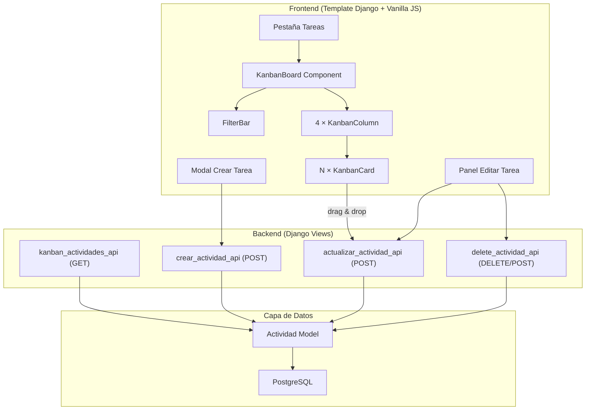
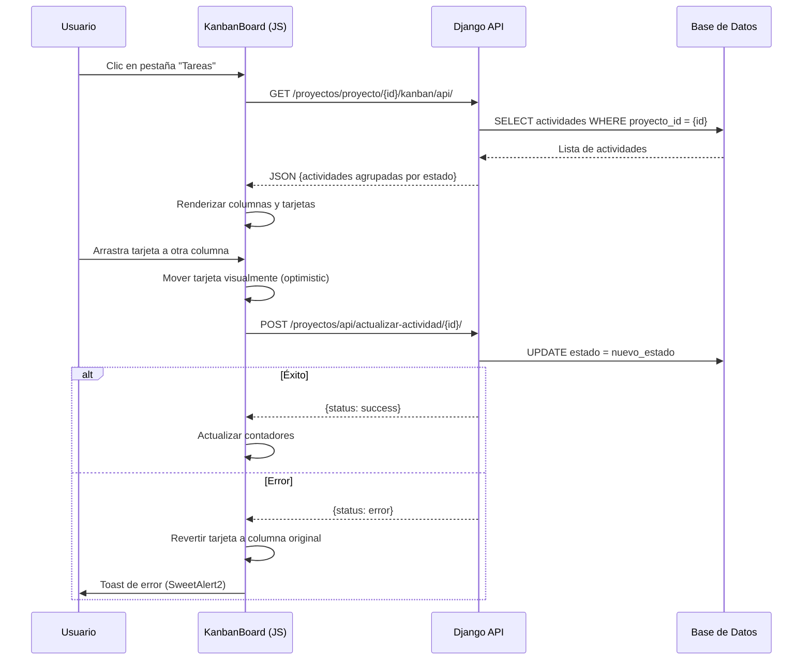

# Documento de Diseño: Tablero Kanban de Tareas del Proyecto

## Overview

Esta funcionalidad implementa un tablero Kanban al estilo Microsoft Planner dentro de la vista de detalle de proyecto existente (`proyecto_detalle_fiori.html`). Se añade una nueva pestaña "Tareas" que organiza visualmente las actividades del proyecto en cuatro columnas (Pendiente, En Progreso, Completada, Bloqueada) con soporte para drag & drop, creación/edición/eliminación inline, y filtrado por responsable y prioridad.

La implementación reutiliza al 100% el modelo `Actividad` existente y los endpoints API existentes (`crear_actividad_api`, `actualizar_actividad_api`, `delete_actividad_api`), sin requerir migraciones de base de datos. Todo el código nuevo es frontend (HTML/CSS/JS vanilla) integrado en el template existente, más un endpoint adicional para obtener actividades en formato JSON optimizado para el Kanban.

### Decisiones de diseño clave

1. **Sin nuevos modelos**: El tablero es una vista alternativa del mismo modelo `Actividad` que usa el cronograma/tabla.
2. **Frontend vanilla JS**: Consistente con el patrón existente del proyecto (no React, no frameworks JS).
3. **HTML5 Drag & Drop nativo**: Sin dependencias externas adicionales para arrastrar tarjetas.
4. **Un solo endpoint nuevo**: `kanban_actividades_api` para obtener actividades pre-agrupadas por estado.
5. **Optimistic UI**: Movimientos por drag & drop se muestran inmediatamente y se revierten si la API falla.

---

## Architecture



### Flujo de datos



---

## Components and Interfaces

### 1. Backend: Endpoint `kanban_actividades_api`

**Ruta**: `GET /proyectos/proyecto/<int:pk>/kanban/api/`

**Propósito**: Devolver todas las actividades del proyecto agrupadas por estado, con datos optimizados para renderizar las tarjetas.

```python
@staff_member_required
def kanban_actividades_api(request, pk):
    """
    GET: Retorna actividades del proyecto agrupadas por estado para el Kanban.
    """
    proyecto = get_object_or_404(Proyecto, pk=pk)
    actividades = proyecto.actividades.select_related('asignado_a').all()
    
    # Agrupar por estado
    grupos = {
        'PENDIENTE': [],
        'EN_PROGRESO': [],
        'COMPLETADA': [],
        'BLOQUEADA': [],
    }
    
    for act in actividades:
        grupos[act.estado].append({
            'id': act.id,
            'nombre': act.nombre,
            'estado': act.estado,
            'prioridad': act.prioridad,
            'porcentaje_avance': act.porcentaje_avance,
            'fecha_inicio': act.fecha_inicio.isoformat() if act.fecha_inicio else None,
            'fecha_fin': act.fecha_fin.isoformat() if act.fecha_fin else None,
            'asignado_a_id': act.asignado_a_id,
            'asignado_a_nombre': (act.asignado_a.get_full_name() or act.asignado_a.username) if act.asignado_a else None,
            'creado_en': act.creado_en.isoformat(),
        })
    
    # Ordenar cada grupo: prioridad desc, creado_en asc
    orden_prioridad = {'CRITICA': 0, 'ALTA': 1, 'MEDIA': 2, 'BAJA': 3}
    for estado, items in grupos.items():
        items.sort(key=lambda x: (orden_prioridad.get(x['prioridad'], 99), x['creado_en']))
    
    # Obtener usuarios miembros (que tienen actividades asignadas)
    from django.contrib.auth.models import User
    responsables_ids = actividades.values_list('asignado_a', flat=True).distinct()
    responsables = User.objects.filter(id__in=responsables_ids, is_active=True)
    
    return JsonResponse({
        'status': 'success',
        'actividades': grupos,
        'responsables': [
            {'id': u.id, 'nombre': u.get_full_name() or u.username}
            for u in responsables
        ]
    })
```

**Respuesta JSON**:
```json
{
  "status": "success",
  "actividades": {
    "PENDIENTE": [
      {
        "id": 1,
        "nombre": "Revisar planos eléctricos",
        "estado": "PENDIENTE",
        "prioridad": "ALTA",
        "porcentaje_avance": 0,
        "fecha_inicio": "2025-01-15",
        "fecha_fin": "2025-02-01",
        "asignado_a_id": 3,
        "asignado_a_nombre": "Juan Pérez",
        "creado_en": "2025-01-10T08:30:00Z"
      }
    ],
    "EN_PROGRESO": [],
    "COMPLETADA": [],
    "BLOQUEADA": []
  },
  "responsables": [
    {"id": 3, "nombre": "Juan Pérez"},
    {"id": 5, "nombre": "María López"}
  ]
}
```

### 2. Frontend: Módulo KanbanBoard (JavaScript)

El módulo se implementa como un objeto JavaScript auto-contenido dentro de un bloque `<script>` en el template, siguiendo el mismo patrón de los demás componentes del proyecto.

#### Interfaz pública

```javascript
const KanbanBoard = {
    // Estado interno
    state: {
        actividades: {},          // {PENDIENTE: [], EN_PROGRESO: [], ...}
        filtros: { responsable: null, prioridad: null },
        responsables: [],
        proyectoId: null,
    },
    
    // Métodos públicos
    init(proyectoId),             // Inicializa y carga datos
    loadActividades(),            // Fetch del endpoint kanban_actividades_api
    render(),                     // Renderiza todo el tablero
    renderColumn(estado, items),  // Renderiza una columna
    renderCard(actividad),        // Renderiza una tarjeta
    
    // Operaciones CRUD
    openCreateModal(estado),      // Abre modal de creación con estado pre-seleccionado
    submitCreate(formData),       // Envía formulario de creación
    openEditPanel(actividadId),   // Abre panel lateral de edición
    submitEdit(actividadId, data),// Envía actualización
    confirmDelete(actividadId),   // Muestra diálogo de confirmación
    
    // Drag & Drop
    handleDragStart(e, cardEl),
    handleDragOver(e, columnEl),
    handleDragLeave(e, columnEl),
    handleDrop(e, columnEl),
    handleDragEnd(e, cardEl),
    
    // Filtrado
    applyFilters(),
    clearFilters(),
    updateCounters(),
    
    // Utilidades
    getPriorityColor(prioridad),
    truncateName(nombre, maxLen),
    isOverdue(fechaFin, estado),
    sortActividades(items),
};
```

### 3. Estructura HTML del Kanban

```html
<!-- Dentro de la sección de la pestaña Tareas -->
<section id="tareas" class="sap-section">
  <!-- Barra de filtros -->
  <div class="kanban-filters">
    <select id="filtro-responsable">
      <option value="">Todos</option>
    </select>
    <select id="filtro-prioridad">
      <option value="">Todos</option>
      <option value="BAJA">Baja</option>
      <option value="MEDIA">Media</option>
      <option value="ALTA">Alta</option>
      <option value="CRITICA">Crítica</option>
    </select>
    <button id="btn-limpiar-filtros">Limpiar filtros</button>
  </div>
  
  <!-- Tablero Kanban -->
  <div class="kanban-board">
    <div class="kanban-column" data-estado="PENDIENTE">
      <div class="kanban-column-header">
        <span class="column-title">Pendiente</span>
        <span class="column-counter">0</span>
      </div>
      <div class="kanban-column-body">
        <!-- Tarjetas se insertan aquí dinámicamente -->
      </div>
      <button class="kanban-add-btn">+ Agregar Tarea</button>
    </div>
    <!-- Repetir para EN_PROGRESO, COMPLETADA, BLOQUEADA -->
  </div>
</section>
```

### 4. Estructura de una Tarjeta (KanbanCard)

```html
<div class="kanban-card" 
     draggable="true" 
     data-id="{id}" 
     data-prioridad="{prioridad}"
     data-responsable="{asignado_a_id}">
  <div class="card-priority-indicator" style="background: {color}"></div>
  <div class="card-content">
    <div class="card-title">{nombre truncado a 60 chars}</div>
    <div class="card-meta">
      <span class="card-assignee">
        <i class="fas fa-user"></i> {asignado_a_nombre || "Sin asignar"}
      </span>
      <span class="card-date {clase-overdue}">
        <i class="fas fa-calendar"></i> {fecha_fin}
      </span>
    </div>
    <div class="card-progress">
      <div class="progress-bar" style="width: {porcentaje_avance}%"></div>
    </div>
  </div>
</div>
```

---

## Data Models

No se crean nuevos modelos. Se reutiliza el modelo `Actividad` existente:

```python
class Actividad(models.Model):
    ESTADOS = (
        ('PENDIENTE', 'Pendiente'),
        ('EN_PROGRESO', 'En Progreso'),
        ('COMPLETADA', 'Completada'),
        ('BLOQUEADA', 'Bloqueada'),
    )
    PRIORIDADES = (
        ('BAJA', 'Baja'),
        ('MEDIA', 'Media'),
        ('ALTA', 'Alta'),
        ('CRITICA', 'Crítica'),
    )
    
    proyecto = ForeignKey(Proyecto, related_name='actividades')
    nombre = CharField(max_length=200)
    descripcion = TextField(blank=True)
    estado = CharField(max_length=20, choices=ESTADOS, default='PENDIENTE')
    prioridad = CharField(max_length=20, choices=PRIORIDADES, default='MEDIA')
    fecha_inicio = DateField(null=True, blank=True)
    fecha_fin = DateField(null=True, blank=True)
    porcentaje_avance = PositiveIntegerField(default=0)
    asignado_a = ForeignKey(User, null=True, blank=True)
    creado_en = DateTimeField(auto_now_add=True)
```

### Mapeo Estado ↔ Columna

| Columna Kanban | Valor `estado` | Orden visual |
|---|---|---|
| Pendiente | `PENDIENTE` | 1 (izquierda) |
| En Progreso | `EN_PROGRESO` | 2 |
| Completada | `COMPLETADA` | 3 |
| Bloqueada | `BLOQUEADA` | 4 (derecha) |

### Mapeo Prioridad → Color (Franja de tarjeta)

| Prioridad | Color | Orden de sort |
|---|---|---|
| Crítica | `#cc0000` (rojo) | 0 (primero) |
| Alta | `#e67700` (naranja) | 1 |
| Media | `#f0ab00` (amarillo) | 2 |
| Baja | `#0066cc` (azul) | 3 (último) |

### Estructura de datos en el endpoint de creación (modificación)

El endpoint `crear_actividad_api` existente acepta estos campos. Para el Kanban se enviarán:

```json
{
  "proyecto_id": 1,
  "nombre": "Nombre de la tarea",
  "descripcion": "Descripción opcional",
  "prioridad": "MEDIA",
  "estado": "PENDIENTE",
  "fecha_inicio": "2025-01-15",
  "fecha_fin": "2025-02-01",
  "asignado_id": 3
}
```

**Nota**: El endpoint existente no acepta `estado` ni `asignado_id` como campo personalizable. Se requiere una pequeña modificación al endpoint `crear_actividad_api` para aceptar `estado` (actualmente hardcodea `'PENDIENTE'`) y `asignado_id` (actualmente hardcodea `request.user`).

---

## Correctness Properties

*Una propiedad es una característica o comportamiento que debe mantenerse verdadero en todas las ejecuciones válidas de un sistema — esencialmente, una declaración formal sobre lo que el sistema debe hacer. Las propiedades sirven como puente entre especificaciones legibles por humanos y garantías de correctitud verificables por máquina.*

### Property 1: Distribución estado-columna

*Para cualquier* conjunto de actividades de un proyecto, cada actividad debe aparecer exclusivamente en la columna correspondiente a su campo `estado`, y la suma de tarjetas en todas las columnas debe ser igual al número total de actividades del proyecto.

**Validates: Requirements 1.2, 2.2, 4.3, 5.4, 7.3, 8.2, 8.3**

### Property 2: Ordenamiento por prioridad y fecha de creación

*Para cualquier* columna del tablero Kanban, las tarjetas deben estar ordenadas por prioridad descendente (Crítica > Alta > Media > Baja) y, dentro de la misma prioridad, por fecha de creación ascendente (la más antigua primero).

**Validates: Requirements 2.4**

### Property 3: Truncamiento de nombre

*Para cualquier* actividad cuyo nombre tenga más de 60 caracteres, la tarjeta debe mostrar los primeros 57 caracteres seguidos de "..." (60 chars totales). Para nombres de 60 caracteres o menos, se muestra el nombre completo sin modificar.

**Validates: Requirements 3.1**

### Property 4: Mapeo prioridad-color

*Para cualquier* actividad, el color de la franja lateral de su tarjeta debe corresponder exactamente al mapeo definido: BAJA→#0066cc, MEDIA→#f0ab00, ALTA→#e67700, CRITICA→#cc0000. No existe ningún otro color posible.

**Validates: Requirements 3.2**

### Property 5: Fecha de vencimiento con indicador de retraso

*Para cualquier* actividad cuya `fecha_fin` sea anterior a la fecha actual Y cuyo `estado` no sea "COMPLETADA", la fecha debe mostrarse en color rojo (#cc0000). En cualquier otro caso (fecha futura, sin fecha, o estado COMPLETADA), la fecha no se muestra en rojo.

**Validates: Requirements 3.4**

### Property 6: Validación de fechas en formulario

*Para cualquier* par de fechas donde `fecha_fin` es estrictamente anterior a `fecha_inicio`, el formulario de creación/edición debe rechazar el envío y mostrar un mensaje de validación. Cuando `fecha_fin` es posterior o igual a `fecha_inicio`, o cuando alguna fecha es nula, la validación de fechas debe pasar.

**Validates: Requirements 4.6**

### Property 7: Soltar en misma columna no genera llamada API

*Para cualquier* operación de drag & drop donde la columna de destino es la misma que la columna de origen, el sistema no debe realizar ninguna llamada HTTP al backend y la tarjeta debe permanecer en su posición sin cambios.

**Validates: Requirements 7.7**

### Property 8: Filtrado AND con actualización de contadores

*Para cualquier* combinación de filtros activos (responsable, prioridad) y cualquier conjunto de actividades, una tarjeta es visible si y solo si cumple TODOS los filtros activos simultáneamente. El contador de cada columna debe reflejar exactamente el número de tarjetas visibles en esa columna.

**Validates: Requirements 9.2, 9.4, 2.2**

### Property 9: Rollback en caso de error de API

*Para cualquier* operación (crear, actualizar estado via drag & drop, eliminar) que recibe una respuesta de error del servidor, el estado visual del tablero debe ser idéntico al estado previo a la operación: las tarjetas permanecen en su posición original, los contadores mantienen sus valores previos, y ningún dato se persiste.

**Validates: Requirements 7.5, 8.5, 4.7, 5.5, 6.4**

---

## Error Handling

### Errores de red / API

| Operación | Comportamiento en error |
|---|---|
| Cargar tablero (GET) | Mostrar mensaje "Error al cargar las tareas" con botón "Reintentar" |
| Crear tarea (POST) | Toast de error SweetAlert2, mantener modal abierto con datos |
| Actualizar tarea (POST) | Toast de error, revertir cambios en tarjeta |
| Drag & drop (POST) | Toast de error, devolver tarjeta a columna original con animación |
| Eliminar tarea (DELETE/POST) | Toast de error 5s, mantener tarjeta visible en posición original |

### Errores de validación del formulario

| Campo | Validación | Mensaje |
|---|---|---|
| `nombre` | Requerido, no vacío | "El nombre de la tarea es obligatorio" |
| `nombre` | Max 200 chars | "El nombre no puede exceder 200 caracteres" |
| `descripcion` | Max 2000 chars | "La descripción no puede exceder 2000 caracteres" |
| `fecha_fin` vs `fecha_inicio` | fin >= inicio | "La fecha de fin debe ser posterior a la fecha de inicio" |
| `porcentaje_avance` | 0-100 | "El porcentaje debe estar entre 0 y 100" |

### Patrón de toast de error (SweetAlert2)

```javascript
Swal.fire({
    toast: true,
    position: 'top-end',
    icon: 'error',
    title: mensaje,
    showConfirmButton: false,
    timer: 5000,
    timerProgressBar: true,
});
```

### Patrón de confirmación de eliminación

```javascript
Swal.fire({
    title: '¿Eliminar tarea?',
    html: `Se eliminará la tarea <strong>"${nombreTarea}"</strong>. Esta acción no se puede deshacer.`,
    icon: 'warning',
    showCancelButton: true,
    confirmButtonColor: '#bb0000',
    cancelButtonColor: '#6c757d',
    confirmButtonText: 'Sí, eliminar',
    cancelButtonText: 'Cancelar',
});
```

---

## Testing Strategy

### Testing unitario (example-based)

Tests específicos para escenarios concretos:

- **Tab rendering**: Verificar que la pestaña "Tareas" existe en el DOM después de la pestaña "Observaciones"
- **Empty state**: Verificar mensaje y botón "Crear primera tarea" cuando no hay actividades
- **Column structure**: Verificar exactamente 4 columnas en el orden correcto
- **Modal creation**: Verificar que el modal de creación contiene todos los campos requeridos
- **Responsive scroll**: Verificar CSS overflow-x en viewport < 768px
- **Drag visual feedback**: Verificar opacidad 0.5 durante arrastre y borde en columna destino
- **Delete dialog**: Verificar que el diálogo de SweetAlert2 muestra el nombre de la tarea

### Testing de propiedades (property-based)

Se utilizará una librería de PBT para JavaScript (por ejemplo, `fast-check`) para validar las propiedades de correctitud documentadas arriba. Cada test se ejecutará con un mínimo de 100 iteraciones.

**Propiedades a implementar como tests:**

1. **Distribución estado-columna** — Generar conjuntos aleatorios de actividades con estados variados y verificar la distribución correcta.
2. **Ordenamiento** — Generar actividades con prioridades y fechas aleatorias, verificar el orden correcto.
3. **Truncamiento de nombre** — Generar strings de longitud aleatoria, verificar truncamiento correcto.
4. **Mapeo prioridad-color** — Para cada prioridad generada, verificar el color correcto.
5. **Indicador de retraso** — Generar combinaciones de fecha/estado, verificar la lógica de color rojo.
6. **Validación de fechas** — Generar pares de fechas aleatorios, verificar la validación.
7. **No-op en misma columna** — Generar operaciones de drop en la misma columna, verificar que no se llama API.
8. **Filtrado AND** — Generar actividades y filtros aleatorios, verificar visibilidad correcta.
9. **Rollback** — Generar operaciones con respuesta de error simulada, verificar estado final igual al inicial.

**Configuración de tests:**
- Framework: `fast-check` (librería PBT para JavaScript)
- Runner: Vitest o Jest
- Mínimo 100 iteraciones por propiedad
- Tag: `Feature: project-kanban-tasks, Property {N}: {título}`

### Testing de integración

- Verificar que el endpoint `kanban_actividades_api` retorna datos correctos (Django TestCase)
- Verificar que crear/actualizar/eliminar actividad via los endpoints existentes funciona correctamente
- Verificar que el modificado `crear_actividad_api` acepta campo `estado` y `asignado_id`

### Testing manual

- Verificar estilo visual SAP Fiori consistente con las demás pestañas
- Verificar rendimiento (carga < 2s)
- Verificar drag & drop en diferentes navegadores (Chrome, Firefox, Edge)
- Verificar responsive en dispositivos móviles
