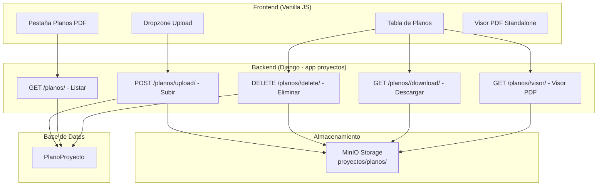

# Documento de Diseño: Planos PDF en Proyecto

## Overview

Esta funcionalidad agrega una pestaña "Planos PDF" en la vista de detalle del proyecto (`proyecto_detalle_fiori.html`) que permite cargar, listar, visualizar y eliminar planos PDF asociados a un proyecto. Se implementa un modelo de datos dedicado (`PlanoProyecto`), endpoints API REST con formato JSON consistente, y un visor de PDF standalone basado en PDF.js siguiendo el patrón existente en `activos/visor_pdf_plano.html`.

La arquitectura sigue el patrón ya establecido en la aplicación:
- Backend: Django views con decoradores `@csrf_exempt` + `@staff_member_required`, respuestas `JsonResponse`
- Almacenamiento: MinIO vía `core.storage.MinIOStorage`
- Frontend: Vanilla JS con estilo SAP Fiori (Bootstrap 5, Inter font), SweetAlert2 para confirmaciones/toasts

---

## Architecture



### Decisiones de Diseño

1. **Modelo independiente en `proyectos`**: Se crea `PlanoProyecto` en la app `proyectos` en lugar de reutilizar el modelo `Plano` de `activos`. Razón: el modelo de activos tiene campos específicos (disciplina, tipo_plano, visores, pines) que no aplican aquí. El nuevo modelo es más simple y específico.

2. **Visor standalone en nueva pestaña**: Consistente con el patrón existente de `/activos/visor-pdf/<id>/`. El visor se abre en una pestaña nueva del navegador para ofrecer pantalla completa sin restricciones del layout de la vista de detalle.

3. **Sin pines/anotaciones en el visor**: A diferencia del visor de activos, este visor es solo de lectura (visualización y navegación de páginas). Se puede extender en el futuro si es necesario.

4. **Paginación server-side**: 20 planos por página, ya que un proyecto puede acumular muchos planos a lo largo del tiempo.

---

## Components and Interfaces

### 1. Modelo Django: `PlanoProyecto`

```python
# proyectos/models.py

class PlanoProyecto(models.Model):
    proyecto = models.ForeignKey(Proyecto, on_delete=models.CASCADE, related_name='planos_pdf')
    titulo = models.CharField(max_length=200)
    descripcion = models.TextField(blank=True)
    archivo = models.FileField(upload_to='proyectos/planos/', storage=minio_storage, max_length=500)
    subido_por = models.ForeignKey(User, on_delete=models.SET_NULL, null=True)
    fecha_carga = models.DateTimeField(auto_now_add=True)

    class Meta:
        verbose_name = "Plano de Proyecto"
        verbose_name_plural = "Planos de Proyecto"
        ordering = ['-fecha_carga']

    def __str__(self):
        return f"{self.proyecto.codigo} - {self.titulo}"
```

### 2. Endpoints API

| Método | URL | Función | Descripción |
|--------|-----|---------|-------------|
| GET | `/proyecto/<pk>/planos/` | `listar_planos_api` | Lista paginada de planos JSON |
| POST | `/proyecto/<pk>/planos/upload/` | `upload_plano_api` | Sube un plano PDF (multipart) |
| DELETE | `/proyecto/<pk>/planos/<plano_id>/delete/` | `delete_plano_api` | Elimina un plano |
| GET | `/proyecto/<pk>/planos/<plano_id>/download/` | `download_plano` | Descarga el archivo PDF |
| GET | `/proyecto/<pk>/planos/<plano_id>/visor/` | `visor_plano_proyecto` | Renderiza el visor PDF |

### 3. Componentes Frontend

#### 3.1 Pestaña en `proyecto_detalle_fiori.html`

- Se agrega un `<div class="sap-tab" data-target="planos-pdf">Planos PDF</div>` en la barra de tabs, después de "Documentos vinculados" y antes de "Órdenes de Trabajo"
- Se agrega una `<section id="planos-pdf" class="sap-section">` con dropzone, tabla y empty state

#### 3.2 JavaScript de la Pestaña

- `PlanosManager`: Módulo JS que encapsula la lógica de:
  - `loadPlanos(page)`: Fetch GET a la API de listado, renderiza tabla
  - `uploadPlano(file, titulo, descripcion)`: Fetch POST multipart/form-data
  - `deletePlano(planoId, titulo)`: SweetAlert2 confirmación → Fetch DELETE
  - `renderTable(data)`: Genera filas HTML con acciones
  - `renderPagination(total, page, totalPages)`: Controles de paginación

#### 3.3 Visor PDF Standalone

- Template: `proyectos/templates/proyectos/visor_plano_proyecto.html`
- Basado en el patrón de `activos/visor_pdf_plano.html` pero simplificado (sin pines)
- Controles: zoom in/out (25%-400%), fit, 1:1, navegación de páginas, panel de miniaturas
- Carga PDF.js desde CDN (versión 3.11.174, misma que activos)

---

## Data Models

### PlanoProyecto

| Campo | Tipo | Restricciones | Descripción |
|-------|------|---------------|-------------|
| `id` | BigAutoField | PK | ID auto-generado |
| `proyecto` | ForeignKey(Proyecto) | on_delete=CASCADE | Proyecto al que pertenece |
| `titulo` | CharField(200) | max_length=200, required | Título del plano |
| `descripcion` | TextField | blank=True | Descripción opcional |
| `archivo` | FileField | storage=MinIOStorage, upload_to='proyectos/planos/' | Archivo PDF en MinIO |
| `subido_por` | ForeignKey(User) | on_delete=SET_NULL, null=True | Usuario que cargó el plano |
| `fecha_carga` | DateTimeField | auto_now_add=True | Fecha/hora de carga |

### Validaciones del Modelo

- `archivo`: Solo extensión `.pdf`, content-type `application/pdf`, tamaño máximo 50 MB
- `titulo`: Entre 1 y 200 caracteres (CharField con max_length=200, blank=False)
- `descripcion`: Máximo 500 caracteres (validado en la vista, no en el modelo para flexibilidad)

### Señal post_delete

Se conecta una señal `post_delete` en `PlanoProyecto` para eliminar el archivo de MinIO cuando se borra el registro (tanto eliminación directa como cascade).

### Formato de Respuesta API (JSON)

```json
{
  "status": "success" | "error",
  "message": "Descripción del resultado",
  "data": { ... }  // opcional, según endpoint
}
```

#### Respuesta de Listado GET

```json
{
  "status": "success",
  "data": {
    "planos": [
      {
        "id": 1,
        "titulo": "Plano Eléctrico Nivel 1",
        "descripcion": "Diagrama unifilar...",
        "fecha_carga": "2025-01-15T10:30:00Z",
        "usuario_nombre": "Juan Pérez",
        "url_archivo": "/proyectos/proyecto/5/planos/1/download/"
      }
    ],
    "total": 45,
    "page": 1,
    "total_pages": 3
  }
}
```

---

## Correctness Properties

*Una propiedad es una característica o comportamiento que debe ser verdadero en todas las ejecuciones válidas del sistema — esencialmente, una declaración formal sobre lo que el sistema debe hacer. Las propiedades sirven como puente entre especificaciones legibles por humanos y garantías de corrección verificables por máquina.*

### Property 1: Validación de tipo de archivo rechaza no-PDF

*Para cualquier* archivo cuyo content-type no sea `application/pdf` o cuya extensión no sea `.pdf`, el endpoint de upload SHALL rechazar la carga y retornar un error sin crear registro PlanoProyecto.

**Validates: Requirements 2.3, 6.4, 6.5**

### Property 2: Validación de campos de entrada

*Para cualquier* título con longitud fuera del rango [1, 200] caracteres, o cualquier descripción con longitud mayor a 500 caracteres, el endpoint de upload SHALL rechazar la solicitud y retornar un error sin crear registro.

**Validates: Requirements 2.6**

### Property 3: Round-trip de carga y listado

*Para cualquier* archivo PDF válido con título y descripción válidos, si se sube al endpoint de upload, entonces el endpoint de listado SHALL retornar ese plano con todos los campos requeridos (id, titulo, descripcion, fecha_carga, usuario_nombre, url_archivo).

**Validates: Requirements 2.2, 3.1, 7.2**

### Property 4: Orden descendente y paginación

*Para cualquier* conjunto de planos asociados a un proyecto, el endpoint de listado SHALL retornarlos ordenados por fecha de carga descendente (más recientes primero) y limitar a 20 resultados por página, incluyendo campos `total`, `page` y `total_pages` correctos.

**Validates: Requirements 3.3, 7.6**

### Property 5: Eliminación remueve del listado

*Para cualquier* PlanoProyecto existente, si se envía una solicitud DELETE al endpoint de eliminación, entonces el plano SHALL dejar de aparecer en el listado subsecuente y el registro SHALL ser eliminado de la base de datos.

**Validates: Requirements 5.3**

### Property 6: Eliminación en cascada al borrar proyecto

*Para cualquier* proyecto con N planos asociados (N >= 0), al eliminar el proyecto, todos los registros PlanoProyecto asociados SHALL ser eliminados junto con sus archivos en MinIO.

**Validates: Requirements 6.3**

### Property 7: Content-Disposition en descarga

*Para cualquier* PlanoProyecto con un título dado, el endpoint de descarga SHALL retornar el header `Content-Disposition: attachment; filename="{titulo}.pdf"` donde el nombre corresponde al título del plano.

**Validates: Requirements 4.3**

### Property 8: Formato JSON consistente

*Para cualquier* solicitud a los endpoints de planos (upload, list, delete), la respuesta SHALL contener al menos los campos `status` (con valor "success" o "error") y `message` en el JSON retornado.

**Validates: Requirements 7.5**

---

## Error Handling

| Escenario | Código HTTP | Respuesta |
|-----------|-------------|-----------|
| Archivo no es PDF (extensión o content-type) | 400 | `{"status": "error", "message": "Solo se aceptan archivos PDF"}` |
| Archivo excede 50 MB | 400 | `{"status": "error", "message": "El archivo excede el tamaño máximo permitido (50 MB)"}` |
| Título vacío o excede 200 caracteres | 400 | `{"status": "error", "message": "El título es obligatorio (máx. 200 caracteres)"}` |
| Descripción excede 500 caracteres | 400 | `{"status": "error", "message": "La descripción no puede exceder 500 caracteres"}` |
| Proyecto no encontrado | 404 | `{"status": "error", "message": "Proyecto no encontrado"}` |
| Plano no encontrado | 404 | `{"status": "error", "message": "Plano no encontrado"}` |
| Error en MinIO durante carga | 500 | `{"status": "error", "message": "Error al almacenar el archivo. Intente nuevamente."}` |
| Error en MinIO durante eliminación | 500 | `{"status": "error", "message": "Error al eliminar el archivo. El plano no fue modificado."}` |
| Archivo no existe en MinIO (descarga/visor) | 404 | `{"status": "error", "message": "El archivo no se encuentra disponible"}` |
| Usuario no autenticado | 302/403 | Redirección a login (comportamiento de `@staff_member_required`) |
| Método HTTP no permitido | 405 | `{"status": "error", "message": "Método no permitido"}` |

### Comportamiento del Frontend ante Errores

- **Errores de validación (400)**: SweetAlert2 toast tipo `error` con el mensaje del servidor
- **Errores de servidor (500)**: SweetAlert2 toast tipo `error` con mensaje genérico
- **Archivo no disponible en visor**: Pantalla de error con mensaje y botón "Volver al proyecto"
- **Error en eliminación**: Toast de error, el plano permanece visible en la tabla

---

## Testing Strategy

### Tests Unitarios (ejemplo-based)

- Verificar que el modelo `PlanoProyecto` se crea correctamente con todos los campos
- Verificar que la señal `post_delete` elimina el archivo de MinIO
- Verificar respuesta 403 para usuarios no autenticados
- Verificar empty state cuando no hay planos
- Verificar que el visor renderiza correctamente el template
- Verificar que el error se maneja cuando MinIO falla en upload

### Tests Property-Based (con `hypothesis`)

Se usa la librería **Hypothesis** (Python) para tests property-based.

Cada test property-based ejecuta un mínimo de **100 iteraciones**.

Cada test se etiqueta con un comentario de referencia al diseño:
- Formato: **Feature: project-pdf-blueprints, Property {N}: {texto}**

Propiedades a implementar:
1. Validación de tipo de archivo (genera archivos con extensiones/content-types aleatorios no-PDF)
2. Validación de campos de entrada (genera títulos y descripciones de longitudes aleatorias)
3. Round-trip carga-listado (genera datos válidos, sube, verifica presencia en listado)
4. Orden y paginación (genera conjuntos de planos con fechas aleatorias, verifica orden)
5. Eliminación remueve del listado (crea planos aleatorios, elimina uno, verifica ausencia)
6. Cascade delete (crea proyecto con N planos, elimina proyecto, verifica limpieza)
7. Content-Disposition (genera títulos aleatorios, verifica header de descarga)
8. Formato JSON consistente (genera solicitudes aleatorias válidas/inválidas, verifica formato)

### Tests de Integración

- Upload end-to-end con MinIO real (staging/test environment)
- Descarga end-to-end verificando integridad del archivo
- Visor carga correctamente un PDF real

### Configuración

```python
from hypothesis import given, settings, strategies as st

@settings(max_examples=100)
@given(...)
def test_property_N(...):
    # Feature: project-pdf-blueprints, Property N: ...
    ...
```
