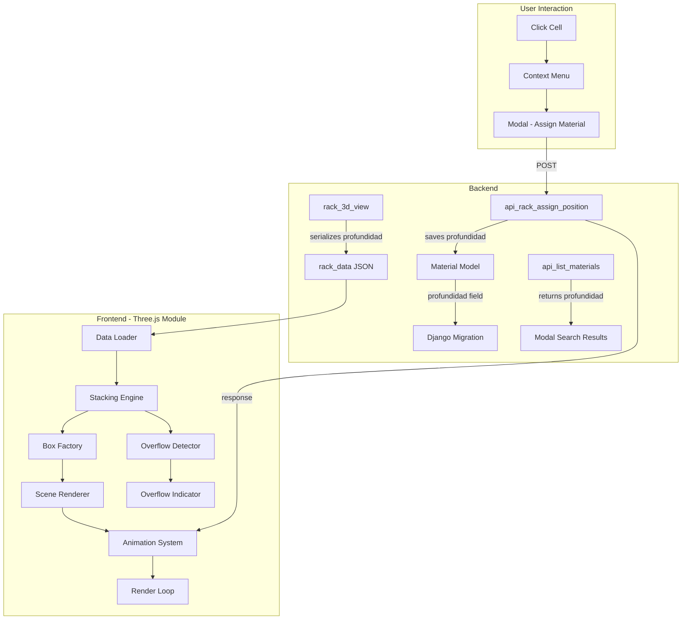

# Design Document: Rack 3D Material Stacking

## Overview

Este diseño transforma el renderizado de materiales en la vista 3D de racks para que representen sus dimensiones físicas reales (ancho, alto, profundidad) y se apilen verticalmente dentro de cada celda siguiendo el orden de inserción. El sistema actual utiliza un tamaño basado en la cantidad de stock (`sizeFrac = stock / 10`), distribuyendo materiales a lo largo del eje Z. El nuevo sistema los posiciona apilados de abajo hacia arriba usando las dimensiones del material como fuente de verdad para el tamaño del mesh.

**Decisiones clave:**
- Se añade el campo `profundidad` al modelo `Material` con migración Django.
- La conversión dimensional es directa: 1 cm del material = 1 unidad Three.js en el espacio del rack (el rack ya se define en cm).
- El stacking engine es un módulo JavaScript puro que calcula posiciones sin acoplarse a Three.js directamente.
- La detección de overflow usa clipping visual vía `localClippingEnabled` de Three.js.
- Las animaciones usan GSAP-like tweening manual basado en `requestAnimationFrame` dentro del render loop existente.

## Architecture



### Flujo de datos

1. **Carga inicial**: `rack_3d_view` serializa posiciones con dimensiones completas → JSON en template context → `DATA` variable en JS.
2. **Renderizado**: El Stacking Engine procesa cada celda, calcula posiciones Y de cada box, y el Box Factory crea meshes con geometría basada en dimensiones reales.
3. **Interacción**: Al asignar/quitar material via API, la respuesta incluye dimensiones completas. El Animation System interpola posiciones existentes al nuevo layout calculado por el Stacking Engine.

## Components and Interfaces

### 1. Backend: Modelo Material (cambio)

```python
# inventarios/models.py - Material model
profundidad = models.DecimalField(
    max_digits=8, decimal_places=2, null=True, blank=True,
    verbose_name="Profundidad (cm)",
    help_text="Profundidad del material en cm",
    validators=[MinValueValidator(Decimal('0.01'))]
)
```

### 2. Backend: Serialización en rack_3d_view

```python
# Dentro del dict de cada posición en rack_data
{
    ...
    'profundidad': float(p.material.profundidad) if p.material and p.material.profundidad else None,
    'tipo_material': p.material.tipo_material if p.material else None,
}
```

### 3. Backend: API assign_position (cambio)

```python
# Guardar profundidad si se envía
profundidad = data.get('profundidad')
if profundidad is not None and float(profundidad) > 0:
    material.profundidad = profundidad
    # incluir en save update_fields
```

La respuesta incluye `profundidad` y `tipo_material`.

### 4. Frontend: Stacking Engine (nuevo módulo inline)

```javascript
/**
 * Calcula el layout de materiales apilados en una celda.
 * @param {Array} positions - Lista de {ancho, alto, profundidad, cantidad, material_id, tipo_material}
 * @param {Object} cellDims - {width, height, depth} dimensiones de la celda
 * @returns {Array<StackedBox>} - Lista de {x, y, z, w, h, d, materialId, tipo, isOverflow}
 */
function computeStackLayout(positions, cellDims) { ... }
```

### 5. Frontend: Overflow Detector

```javascript
/**
 * Determina si una celda está desbordada.
 * @param {Array<StackedBox>} layout - Resultado de computeStackLayout
 * @param {number} cellHeight - Altura disponible de la celda
 * @returns {{overflow: boolean, percent: number}}
 */
function detectOverflow(layout, cellHeight) { ... }
```

### 6. Frontend: Animation System

```javascript
/**
 * Interpola posiciones de meshes entre estado actual y target.
 * @param {Array<{mesh, targetPos}>} transitions
 * @param {number} duration - ms (max 300)
 * @param {Function} onComplete - callback
 */
function animateTransition(transitions, duration, onComplete) { ... }
```

### 7. Frontend: Color Map por tipo_material

```javascript
const TIPO_COLOR_MAP = {
    'INSUMO':      0x3b82f6, // blue
    'REPUESTO':    0xf97316, // orange
    'CONSUMIBLE':  0x22c55e, // green
    'MEDICAMENTO': 0xa855f7, // purple
    'HERRAMIENTA': 0xeab308, // yellow
    'EPP':         0x06b6d4, // cyan
    'OTRO':        0x6b7280, // gray
};
```

## Data Models

### Material Model (actualizado)

| Campo | Tipo | Nuevo | Descripción |
|-------|------|-------|-------------|
| `profundidad` | `DecimalField(8,2)` | ✅ | Profundidad en cm, nullable, min 0.01 |
| `ancho` | `DecimalField(8,2)` | existente | Ancho en cm, nullable |
| `alto` | `DecimalField(8,2)` | existente | Alto en cm, nullable |
| `peso` | `DecimalField(8,2)` | existente | Peso en lb, nullable |
| `tipo_material` | `CharField(20)` | existente | INSUMO/REPUESTO/CONSUMIBLE/MEDICAMENTO/HERRAMIENTA/EPP/OTRO |

### rack_data JSON (serialización actualizada)

```json
{
  "posiciones": [
    {
      "id": 123,
      "nivel": 1,
      "seccion": 2,
      "codigo": "A01-1-2-1",
      "material_nombre": "Tornillo M6",
      "cantidad": 5.0,
      "peso": 0.5,
      "ancho": 8.0,
      "alto": 3.0,
      "profundidad": 8.0,
      "tipo_material": "REPUESTO"
    }
  ]
}
```

### StackedBox (estructura JS interna)

```typescript
interface StackedBox {
    x: number;          // posición X centro (siempre centrado en celda)
    y: number;          // posición Y centro (calculada por stacking)
    z: number;          // posición Z centro (siempre centrado en celda)
    w: number;          // ancho final (escalado si necesario)
    h: number;          // alto final (del material)
    d: number;          // profundidad final (escalada si necesario)
    materialId: number;
    positionId: number;
    tipo: string;       // tipo_material para color
    isOverflow: boolean;// true si esta box o parte de ella excede cellH
    instanceIndex: number; // 0..cantidad-1 para instancias del mismo RackPosition
}
```

### Constantes de dimensiones por defecto

```javascript
const DEFAULTS = {
    ANCHO: 10,        // cm
    ALTO: 10,         // cm
    PROFUNDIDAD: 10,  // cm
    GAP_DIFF_TYPE: 0.5, // cm separador entre tipos diferentes
};
```

### Algoritmo del Stacking Engine

```
function computeStackLayout(positions, cellDims):
    sortedPositions = positions.sortBy(pos => pos.id)  // orden por ID ascendente
    layout = []
    currentY = 0  // offset desde base de celda
    prevTipo = null

    for each pos in sortedPositions:
        ancho = pos.ancho ?? DEFAULTS.ANCHO
        alto = pos.alto ?? DEFAULTS.ALTO
        prof = pos.profundidad ?? DEFAULTS.PROFUNDIDAD

        // Escalar uniformemente si excede celda en X o Z
        scaleX = (cellDims.width * 0.95) / ancho
        scaleZ = (cellDims.depth * 0.95) / prof
        scale = 1.0
        if (scaleX < 1 || scaleZ < 1):
            scale = Math.min(scaleX, scaleZ)

        finalW = ancho * scale
        finalH = alto * scale
        finalD = prof * scale

        // Separador entre tipos diferentes
        if (prevTipo != null && prevTipo != pos.tipo_material):
            currentY += DEFAULTS.GAP_DIFF_TYPE * scale

        // Repetir por cantidad
        for i in range(pos.cantidad):
            boxY = currentY + finalH / 2  // centro de la box
            isOverflow = (currentY + finalH) > cellDims.height
            layout.push({ x: 0, y: boxY, z: 0, w: finalW, h: finalH, d: finalD,
                          materialId: pos.material_id, positionId: pos.id,
                          tipo: pos.tipo_material, isOverflow, instanceIndex: i })
            currentY += finalH
            // No gap entre instancias del mismo material

        prevTipo = pos.tipo_material

    return layout
```


## Correctness Properties

*A property is a characteristic or behavior that should hold true across all valid executions of a system—essentially, a formal statement about what the system should do. Properties serve as the bridge between human-readable specifications and machine-verifiable correctness guarantees.*

### Property 1: Profundidad validation accepts only positive values

*For any* decimal value V, the profundidad field/input SHALL accept V if and only if V > 0.01; values ≤ 0 or equal to 0.01 exactly at the boundary must be rejected by the MinValueValidator.

**Validates: Requirements 1.1, 7.5**

### Property 2: Dimension preservation when material fits within cell

*For any* material with dimensions (ancho, alto, profundidad) where ancho ≤ cellW × 0.95 AND profundidad ≤ cellD × 0.95, the resulting StackedBox SHALL have w = ancho, h = alto, d = profundidad without any scaling applied.

**Validates: Requirements 2.1, 2.3**

### Property 3: Uniform scaling preserves aspect ratio

*For any* material with dimensions (ancho, alto, profundidad) where ancho > cellW × 0.95 OR profundidad > cellD × 0.95, the resulting StackedBox dimensions SHALL satisfy: w/ancho == h/alto == d/profundidad (all three ratios are equal to the same scale factor), AND w ≤ cellW × 0.95, AND d ≤ cellD × 0.95.

**Validates: Requirements 2.2**

### Property 4: Centering invariant

*For any* material in any cell, the StackedBox SHALL have x = 0 and z = 0 (relative to cell center), regardless of the material's dimensions or scaling.

**Validates: Requirements 2.4**

### Property 5: Cumulative stacking positions

*For any* sequence of materials in a cell (ignoring type-change gaps), the base Y of box[n] SHALL equal the sum of heights of all boxes at indices 0..n-1. Equivalently, for the first box: baseY = 0, and for each subsequent box of the same type: baseY[i] = baseY[i-1] + height[i-1].

**Validates: Requirements 3.1, 3.2, 3.3, 3.7**

### Property 6: Quantity expansion produces correct instance count

*For any* RackPosition with cantidad = N (where N ≥ 1), the computeStackLayout function SHALL produce exactly N StackedBox entries for that position, each with instanceIndex from 0 to N-1.

**Validates: Requirements 3.4**

### Property 7: ID ordering determines vertical position

*For any* two RackPositions A and B in the same cell where A.id < B.id, all boxes belonging to A SHALL have lower Y center values than all boxes belonging to B.

**Validates: Requirements 3.5**

### Property 8: Completeness – all materials rendered regardless of overflow

*For any* set of materials in a cell, the computeStackLayout function SHALL return a StackedBox for every unit of every material, even when the total height exceeds the cell height. The count of output boxes SHALL equal the sum of all cantidades.

**Validates: Requirements 3.6**

### Property 9: Overflow percentage computation

*For any* layout where total stacked height > cellH, the overflow percentage SHALL equal Math.round(((totalHeight - cellH) / cellH) × 100). When totalHeight ≤ cellH, overflow SHALL be false and percent SHALL be 0.

**Validates: Requirements 4.4**

### Property 10: Deterministic color mapping

*For any* tipo_material value from the set {INSUMO, REPUESTO, CONSUMIBLE, MEDICAMENTO, HERRAMIENTA, EPP, OTRO}, the color mapping function SHALL always return the same color for the same input, and all 7 types SHALL map to distinct colors.

**Validates: Requirements 5.1**

### Property 11: Type-change gap logic

*For any* sequence of stacked materials, a gap of (0.5 × scale) SHALL be inserted between adjacent boxes if and only if their tipo_material values differ. Boxes of the same tipo_material (including multiple instances of the same RackPosition) SHALL have zero gap between them.

**Validates: Requirements 5.2**

### Property 12: Label truncation

*For any* material name string S, if S.length > 30, the label text SHALL be S.substring(0, 30) + "…". If S.length ≤ 30, the label text SHALL be S unchanged.

**Validates: Requirements 5.5**

### Property 13: Dimension format string

*For any* three positive numbers (ancho, alto, profundidad), the formatted dimension string SHALL equal `${ancho} × ${alto} × ${profundidad} cm`.

**Validates: Requirements 7.3**

## Error Handling

### Backend Errors

| Escenario | Respuesta | Código HTTP |
|-----------|-----------|-------------|
| Profundidad ≤ 0 en API assign | `{"error": "profundidad debe ser mayor a 0"}` | 400 |
| Material no encontrado | `{"error": "Not Found"}` | 404 |
| JSON inválido en body | `{"error": "JSON inválido"}` | 400 |
| Nivel/sección no proporcionados | `{"error": "nivel y seccion son requeridos"}` | 400 |

### Frontend Errors

| Escenario | Comportamiento |
|-----------|---------------|
| API assign/remove falla (network/500) | Mantener estado visual previo, mostrar notificación toast "Error: la operación no se completó" |
| Material sin dimensiones y usuario no las proporciona | Botón "Agregar" deshabilitado, mensaje "Debes ingresar dimensiones" |
| Datos de posición con campos null | Usar valores por defecto (10 cm para cada dimensión faltante) |
| Más de 5 operaciones encoladas | Ignorar operaciones adicionales hasta que la cola baje de 5 |

### Fallbacks de renderizado

- Si `tipo_material` no está en el mapa de colores → usar color de `OTRO` (gris `0x6b7280`)
- Si `cantidad` es 0 o negativa → no renderizar boxes para esa posición
- Si dimensiones resultantes tras escalado son < 0.1 → renderizar con mínimo de 0.1 unidades

## Testing Strategy

### Property-Based Tests (fast-check)

Se usará **fast-check** como librería de property-based testing para JavaScript/TypeScript.

Configuración:
- Mínimo 100 iteraciones por propiedad
- Cada test referencia su propiedad del design document con tag: `Feature: rack-3d-material-stacking, Property {N}: {texto}`

**Tests de propiedad** (cubren Properties 2-13):
- `computeStackLayout` es una función pura que recibe posiciones + dimensiones de celda → ideal para PBT
- Generadores: posiciones aleatorias con dimensiones entre 0.1 y 500 cm, cantidades entre 1 y 20, tipos aleatorios del enum
- Edge cases incluidos en generadores: dimensiones null (defaults), una sola posición, muchas posiciones, cantidades altas

**Property 1** (validación Django): se testea con pytest y parametrización sobre valores válidos/inválidos.

### Unit Tests (ejemplo)

- Serialización de `profundidad` en `rack_3d_view` (verifica campo presente en JSON context)
- API assign guarda profundidad en el modelo Material
- API assign retorna profundidad y tipo_material en respuesta
- Modal muestra/oculta campos según dimensiones existentes
- Overflow indicator aparece/desaparece según estado
- Animación se completa en ≤300ms (mock de requestAnimationFrame)
- Cola de operaciones respeta límite de 5

### Integration Tests

- Flujo completo: asignar material con profundidad → verificar renderizado actualizado
- Flujo quitar material → verificar re-stacking
- Migración Django: verificar campo profundidad creado correctamente

### Estructura de archivos de test

```
inventarios/
├── tests/
│   ├── test_material_profundidad.py      # Unit: validación campo
│   ├── test_rack_3d_view.py              # Unit: serialización
│   └── test_api_rack_position.py         # Integration: API assign/remove
└── templates/inventarios/
    └── tests/
        └── stacking-engine.test.js       # PBT: fast-check properties
```
