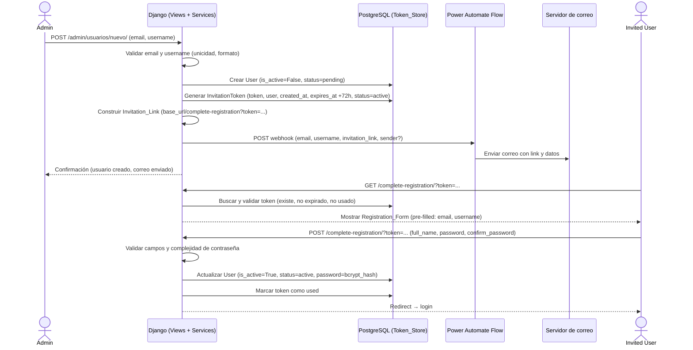
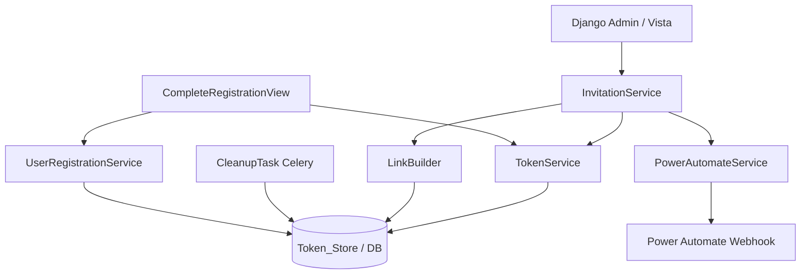
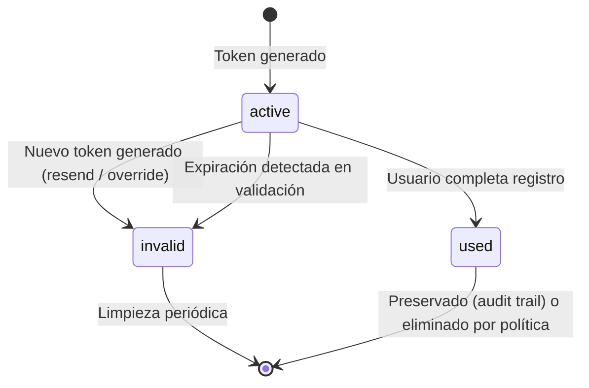
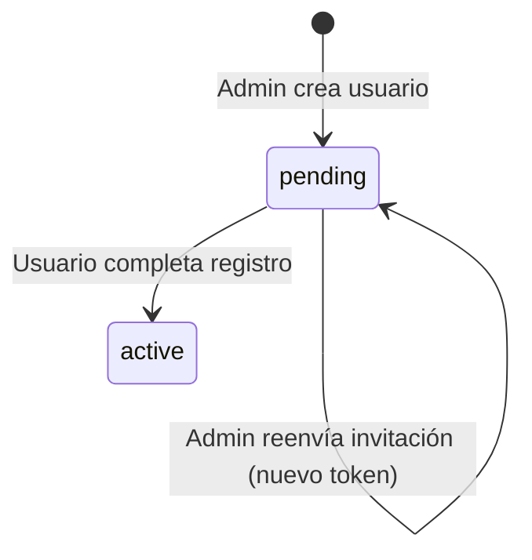

# Design Document: user-invitation-email

## Overview

Esta feature implementa un flujo completo de invitación por correo electrónico para nuevos usuarios del sistema. El diseño integra el stack existente del proyecto (Django + Celery + Power Automate) con los siguientes componentes nuevos:

- Modelo `InvitationToken` en una nueva app `invitaciones` (o en `core`)
- Servicio de creación de usuarios en estado `pending`
- Servicio de construcción y validación del token/enlace
- Integración con Power Automate para el envío del correo
- Vista de completado de registro (formulario público, autenticación por token)
- Tarea Celery periódica para limpieza de tokens expirados
- Acción de reenvío de invitación desde el admin de Django

El flujo principal es: **Admin crea usuario → sistema genera token → Power Automate envía correo → usuario completa registro**.

---

## Architecture



### Componentes principales



---

## Components and Interfaces

### 1. App `invitaciones`

Nueva app Django que concentra toda la lógica de invitación.

#### `invitaciones/models.py`

```python
class InvitationToken(models.Model):
    STATUS_CHOICES = [
        ('active', 'Active'),
        ('used',   'Used'),
        ('expired','Expired'),
        ('invalid','Invalid'),
    ]
    user        = models.OneToOneField(settings.AUTH_USER_MODEL, on_delete=models.CASCADE,
                                       related_name='invitation_token')
    token       = models.CharField(max_length=128, unique=True, db_index=True)
    created_at  = models.DateTimeField(auto_now_add=True)
    expires_at  = models.DateTimeField()
    status      = models.CharField(max_length=10, choices=STATUS_CHOICES, default='active')

    class Meta:
        verbose_name = "Invitation Token"
        verbose_name_plural = "Invitation Tokens"

    def is_valid(self) -> bool:
        """True si el token está active y no ha expirado."""
        return self.status == 'active' and self.expires_at > timezone.now()
```

> **Decisión de diseño:** Se usa `OneToOneField` para garantizar fácilmente que solo existe un token por usuario. La invalidación del anterior se hace actualizando su `status` antes de crear el nuevo (el campo `unique=True` en `token` protege contra colisiones de valor).

#### `invitaciones/services.py` — InvitationService

```python
class InvitationService:
    def create_and_invite(self, email: str, username: str, invited_by: User) -> User:
        """
        Crea el usuario, genera el token y dispara el envío del correo.
        Lanza excepciones tipadas en caso de error.
        """

    def resend(self, user: User, requested_by: User) -> None:
        """
        Invalida el token activo existente, genera uno nuevo y
        dispara el envío del correo. Solo para usuarios en estado pending.
        """
```

#### `invitaciones/services.py` — TokenService

```python
class TokenService:
    TOKEN_EXPIRY_HOURS = 72
    MAX_RETRIES = 3

    def generate_token(self, user: User) -> InvitationToken:
        """
        Invalida tokens activos previos del usuario, genera un token
        criptográficamente seguro (≥32 bytes, URL-safe base64), persiste
        con expires_at = now + 72h, status='active'.
        Reintentos automáticos ante colisión (máx 3).
        """

    def validate_token(self, raw_token: str) -> InvitationToken:
        """
        Busca el token en DB. Lanza TokenNotFound, TokenExpired o
        TokenAlreadyUsed según el estado. Retorna el token si es válido.
        """

    def consume_token(self, token: InvitationToken) -> None:
        """Marca el token como 'used'."""
```

#### `invitaciones/services.py` — LinkBuilder

```python
class LinkBuilder:
    def build(self, token_value: str) -> str:
        """
        Lee BASE_REGISTRATION_URL de settings/env.
        Valida que empiece con https://.
        Retorna: {base_url}/complete-registration?token={url_encoded_token}
        Lanza ConfigurationError si la URL base es inválida o el token está vacío.
        """
```

#### `invitaciones/services.py` — PowerAutomateInvitationService

```python
class PowerAutomateInvitationService:
    def dispatch(self, email: str, username: str, invitation_link: str) -> None:
        """
        Envía el payload al webhook de Power Automate.
        Parámetros opcionales: sender_email (desde settings).
        Reintentos: 3 intentos con intervalo de 60s (gestionado por Celery retry).
        Lanza PowerAutomateDispatchError si todos los reintentos fallan.
        """
```

### 2. Vista de completado de registro

**URL:** `GET|POST /complete-registration/` (app `invitaciones` o `core`)

```python
class CompleteRegistrationView(View):
    def get(self, request, *args, **kwargs):
        # Extrae token del query param, valida con TokenService,
        # muestra formulario pre-rellenado con email y username del User asociado.

    def post(self, request, *args, **kwargs):
        # Valida formulario (full_name, password, confirm_password),
        # aplica reglas de complejidad de contraseña,
        # actualiza User (is_active=True, status=active, password=bcrypt),
        # consume el token,
        # redirige a login.
```

**Formulario:** `CompleteRegistrationForm`
- `full_name`: requerido, no vacío
- `password`: requerido, 8–128 chars, ≥1 mayúscula, ≥1 minúscula, ≥1 dígito
- `confirm_password`: debe coincidir con `password`

### 3. Admin de Django

En `invitaciones/admin.py`:
- `UserAdmin` extendido (o `InlineAdmin`) con acción **"Resend Invitation"** disponible para usuarios en estado `pending`.
- `InvitationTokenAdmin` con listado de tokens, filtros por estado y fecha de expiración.

### 4. Tarea Celery de limpieza

```python
@shared_task
def cleanup_expired_tokens():
    """
    Elimina del Token_Store todos los InvitationToken cuyo expires_at
    haya pasado y cuyo status sea distinto de 'used'.
    Programada para ejecutarse diariamente (e.g., cada 6 horas).
    """
    deleted_count, _ = InvitationToken.objects.filter(
        expires_at__lt=timezone.now()
    ).exclude(status='used').delete()
    logger.info(f"Cleanup: {deleted_count} expired tokens removed.")
```

Configurar en `CELERY_BEAT_SCHEDULE`:
```python
'cleanup-expired-tokens': {
    'task': 'invitaciones.tasks.cleanup_expired_tokens',
    'schedule': crontab(hour='*/6'),
}
```

### 5. Extensión del modelo User

Se agrega un campo `invitation_status` al modelo `PerfilUsuario` existente (evitando modificar `auth.User`):

```python
class PerfilUsuario(models.Model):
    INVITATION_STATUS = [
        ('pending', 'Pending Invitation'),
        ('active',  'Active'),
    ]
    # ... campos existentes ...
    invitation_status = models.CharField(
        max_length=10,
        choices=INVITATION_STATUS,
        default='active',
        verbose_name="Estado de Invitación"
    )
```

> **Decisión de diseño:** Usar `PerfilUsuario` en lugar de un campo en `auth.User` mantiene la extensibilidad sin parchear el modelo de autenticación de Django. El campo `is_active=False` en `auth.User` se usa mientras el usuario está en estado `pending`, lo que previene el login hasta completar el registro.

---

## Data Models

### InvitationToken

| Campo        | Tipo                  | Restricciones                          |
|--------------|-----------------------|----------------------------------------|
| `id`         | AutoField (PK)        | —                                      |
| `user`       | OneToOneField → User  | `CASCADE`, `unique`                    |
| `token`      | CharField(128)        | `unique=True`, `db_index=True`         |
| `created_at` | DateTimeField         | `auto_now_add=True`                    |
| `expires_at` | DateTimeField         | `created_at + 72h`                     |
| `status`     | CharField(10)         | choices: `active`, `used`, `invalid`   |

### PerfilUsuario (extensión)

| Campo               | Tipo          | Restricciones               |
|---------------------|---------------|-----------------------------|
| `invitation_status` | CharField(10) | default=`active`            |

### Flujo de estado del token



### Flujo de estado del usuario (PerfilUsuario.invitation_status)



---

## Correctness Properties

*Una propiedad es una característica o comportamiento que debe mantenerse verdadera en todas las ejecuciones válidas del sistema — esencialmente, una afirmación formal sobre lo que el sistema debe hacer. Las propiedades sirven como puente entre las especificaciones legibles por humanos y las garantías de corrección verificables automáticamente.*

### Property 1: Unicidad de email — rechazo de duplicados

*Para cualquier* dirección de email válida, si ya existe un usuario registrado con ese email en el sistema, un intento de crear un nuevo usuario con ese mismo email DEBE ser rechazado con un error de validación.

**Validates: Requirements 1.2**

---

### Property 2: Unicidad de username — rechazo de duplicados

*Para cualquier* nombre de usuario válido, si ya existe un usuario registrado con ese username en el sistema, un intento de crear un nuevo usuario con ese mismo username DEBE ser rechazado con un error de validación.

**Validates: Requirements 1.3**

---

### Property 3: Rechazo de emails con formato inválido

*Para cualquier* string que no cumpla el formato RFC 5322, el sistema DEBE rechazarlo con un error de validación sin crear ningún registro de usuario.

**Validates: Requirements 1.4**

---

### Property 4: Rechazo de usernames con formato inválido

*Para cualquier* string que no cumpla el formato permitido (1–50 caracteres, solo letras/números/guiones/guiones-bajos) o que exceda el límite de longitud, el sistema DEBE rechazarlo con un error de validación.

**Validates: Requirements 1.5**

---

### Property 5: Formato y entropía del token generado

*Para cualquier* token generado por el sistema, su representación codificada DEBE decodificarse a un valor de al menos 32 bytes Y DEBE contener únicamente caracteres URL-safe (letras, dígitos, `-`, `_`).

**Validates: Requirements 2.1**

---

### Property 6: Expiración exacta a 72 horas

*Para cualquier* timestamp de creación de token `t`, el campo `expires_at` almacenado DEBE ser exactamente `t + timedelta(hours=72)`.

**Validates: Requirements 2.2, 8.4**

---

### Property 7: Unicidad de token activo por usuario

*Para cualquier* usuario en el sistema, después de cualquier operación de generación de token (creación o reenvío), el número de tokens con `status='active'` asociados a ese usuario DEBE ser exactamente 1.

**Validates: Requirements 2.3, 2.5**

---

### Property 8: Construcción del Invitation_Link con formato correcto

*Para cualquier* URL base válida (que comience con `https://`, sin barra final) y cualquier valor de token URL-safe, el `Invitation_Link` construido DEBE seguir exactamente el formato `{base_url}/complete-registration?token={encoded_token}`.

**Validates: Requirements 4.1, 4.3**

---

### Property 9: Rechazo de base URL sin HTTPS

*Para cualquier* URL base que NO comience con `https://` (e.g., `http://`, cadena arbitraria, vacía), la construcción del Invitation_Link DEBE retornar un error de configuración sin producir ninguna URL parcial.

**Validates: Requirements 4.2**

---

### Property 10: Token inexistente retorna enlace inválido

*Para cualquier* string que no corresponda a un token registrado en el Token_Store, el intento de validación DEBE retornar una respuesta de "enlace inválido".

**Validates: Requirements 5.2**

---

### Property 11: Token expirado retorna respuesta de expiración

*Para cualquier* token cuyo `expires_at` sea anterior al timestamp actual (sin importar su `status`), el intento de validación DEBE retornar una respuesta de "enlace expirado" que incluya la opción de solicitar una nueva invitación.

**Validates: Requirements 5.3, 8.1**

---

### Property 12: Token usado retorna respuesta de ya utilizado

*Para cualquier* token con `status='used'`, el intento de validación DEBE retornar una respuesta de "enlace ya utilizado".

**Validates: Requirements 5.4, 6.9**

---

### Property 13: Ausencia de campos requeridos en el formulario de registro

*Para cualquier* subconjunto no vacío de campos requeridos {full_name, password, confirm_password} que esté ausente o vacío en el envío del formulario, el sistema DEBE retornar un error específico identificando el campo faltante y DEBE preservar los demás campos enviados.

**Validates: Requirements 6.1**

---

### Property 14: Rechazo de contraseñas que no cumplen complejidad

*Para cualquier* string de contraseña que incumpla al menos una de las reglas (longitud 8–128, ≥1 mayúscula, ≥1 minúscula, ≥1 dígito), el sistema DEBE rechazarlo con el mensaje de error especificado.

**Validates: Requirements 6.2, 6.3**

---

### Property 15: Rechazo cuando las contraseñas no coinciden

*Para cualquier* par de strings distintos enviados como `password` y `confirm_password`, el sistema DEBE retornar el mensaje "Passwords do not match" y limpiar ambos campos de contraseña.

**Validates: Requirements 6.4**

---

### Property 16: Contraseña almacenada como hash bcrypt

*Para cualquier* contraseña válida enviada en el formulario de registro, el valor almacenado en la base de datos NO DEBE ser igual al texto plano, y DEBE ser verificable con el algoritmo bcrypt con el factor de costo original.

**Validates: Requirements 6.5**

---

### Property 17: Transición de estado del usuario al completar registro

*Para cualquier* usuario en estado `pending` que complete exitosamente el formulario de registro, el sistema DEBE actualizar su `invitation_status` a `active` Y marcar el token asociado como `used`, en la misma transacción atómica.

**Validates: Requirements 6.6, 6.7**

---

### Property 18: Resend invalida el token anterior y genera uno nuevo

*Para cualquier* usuario en estado `pending` que tenga un token activo, cuando el administrador solicita un reenvío, el token previo DEBE tener `status='invalid'` y DEBE existir exactamente un nuevo token con `status='active'`.

**Validates: Requirements 7.1, 7.2**

---

### Property 19: Rechazo de reenvío para usuarios no pendientes

*Para cualquier* usuario cuyo `invitation_status` NO sea `pending` (e.g., `active`), el sistema DEBE rechazar el reenvío de invitación retornando un error que indique el estado actual del usuario.

**Validates: Requirements 7.4**

---

### Property 20: Limpieza elimina exactamente los tokens expirados no usados

*Para cualquier* colección de tokens en el Token_Store con estados mixtos (expired/active, used/unused), la ejecución del proceso de limpieza DEBE eliminar exactamente aquellos tokens cuyo `expires_at < now()` AND `status != 'used'`, sin afectar a los demás.

**Validates: Requirements 8.2**

---

## Error Handling

### Jerarquía de excepciones

```python
# invitaciones/exceptions.py

class InvitationError(Exception):
    """Base para todos los errores de invitación."""

class TokenNotFound(InvitationError):
    """El token no existe en el Token_Store."""

class TokenExpired(InvitationError):
    """El token existe pero su expires_at ha pasado."""

class TokenAlreadyUsed(InvitationError):
    """El token ya fue consumido."""

class TokenCollisionError(InvitationError):
    """No se pudo generar un token único tras MAX_RETRIES intentos."""

class ConfigurationError(InvitationError):
    """La configuración del sistema es inválida (e.g., base URL sin HTTPS)."""

class PowerAutomateDispatchError(InvitationError):
    """El flujo de Power Automate falló tras todos los reintentos."""

class UserAlreadyExists(InvitationError):
    """Email o username ya registrado."""

class InvalidResendTarget(InvitationError):
    """El usuario no está en estado pending y no admite reenvío."""
```

### Tabla de manejo de errores

| Escenario                                    | Comportamiento                                                                                 | Código HTTP |
|----------------------------------------------|-----------------------------------------------------------------------------------------------|-------------|
| Email/username duplicado al crear usuario    | `400 Bad Request` + mensaje descriptivo, datos del formulario preservados                    | 400         |
| Email con formato inválido (RFC 5322)        | `400 Bad Request` + mensaje descriptivo, datos del formulario preservados                    | 400         |
| Token no encontrado                          | Renderizar `invitation_invalid.html`                                                          | 200/404     |
| Token expirado                               | Renderizar `invitation_expired.html` con botón de reenvío                                     | 200         |
| Token ya utilizado                           | Renderizar `invitation_used.html`                                                             | 200         |
| Contraseña sin complejidad                   | `400` + mensaje exacto especificado, campos de password limpios                              | 400         |
| Contraseñas no coinciden                     | `400` + "Passwords do not match", campos de password limpios                                 | 400         |
| Campos requeridos vacíos                     | `400` + error por campo, datos preservados                                                    | 400         |
| Colisión de token tras 3 reintentos          | Log error, abortar creación de usuario, `500` al admin con mensaje descriptivo               | 500         |
| Power Automate falla tras 3 intentos (60s)   | Log con user_id + error + timestamp, marcar intent como `failed`, notificar admin por email/admin notification | —     |
| Reenvío a usuario no-pending                 | `400` con mensaje indicando estado actual del usuario                                         | 400         |
| Base URL sin HTTPS                          | `ConfigurationError` loggeado, `500` al admin                                                 | 500         |

### Reintentos de Power Automate

La llamada a Power Automate se ejecuta como tarea Celery independiente para evitar bloquear la respuesta al administrador:

```python
@shared_task(bind=True, max_retries=3)
def dispatch_invitation_email(self, user_id: int, invitation_link: str):
    try:
        user = User.objects.get(pk=user_id)
        PowerAutomateInvitationService().dispatch(
            email=user.email,
            username=user.username,
            invitation_link=invitation_link,
        )
    except Exception as exc:
        logger.error(f"PA dispatch failed for user {user_id}: {exc}")
        raise self.retry(exc=exc, countdown=60)
    # Si falla el último reintento, notify_admin_of_failure se invoca en on_failure
```

---

## Testing Strategy

### Enfoque dual: tests de ejemplo + tests de propiedad

La estrategia combina tests de ejemplo (para flujos concretos e integraciones) con tests de propiedad (para invariantes universales). La librería de property-based testing seleccionada es **[Hypothesis](https://hypothesis.readthedocs.io/)**, que se integra nativamente con Django y pytest.

### Configuración de Hypothesis

```python
# conftest.py o settings de test
from hypothesis import settings, HealthCheck

settings.register_profile("ci", max_examples=100, suppress_health_check=[HealthCheck.too_slow])
settings.load_profile("ci")
```

### Tests de propiedad (Hypothesis)

Cada test de propiedad se corresponde con una propiedad del diseño. Mínimo 100 iteraciones por test.

```python
# invitaciones/tests/test_properties.py
from hypothesis import given, settings
from hypothesis import strategies as st
from django.test import TestCase

# Feature: user-invitation-email, Property 5: Formato y entropía del token
@given(st.nothing())  # No requiere input externo, genera internamente
def test_token_format_and_entropy():
    """Property 5: token ≥ 32 bytes, solo chars URL-safe"""
    ...

# Feature: user-invitation-email, Property 6: Expiración exacta a 72 horas
@given(st.datetimes())
def test_token_expiry_is_exactly_72_hours(creation_time):
    """Property 6: expires_at == created_at + 72h"""
    ...

# Feature: user-invitation-email, Property 3: Rechazo de emails inválidos
@given(st.text().filter(lambda s: not is_valid_rfc5322_email(s)))
def test_invalid_email_rejected(invalid_email):
    """Property 3: cualquier email inválido debe ser rechazado"""
    ...

# Feature: user-invitation-email, Property 8: Formato correcto del Invitation_Link
@given(
    st.from_regex(r'https://[a-zA-Z0-9\-\.]+\.[a-zA-Z]{2,}', fullmatch=True),
    st.from_regex(r'[A-Za-z0-9\-_]{43}', fullmatch=True)  # base64url sin padding
)
def test_invitation_link_format(base_url, token):
    """Property 8: link sigue el formato exacto especificado"""
    ...
```

### Tests de ejemplo (pytest-django)

```python
# invitaciones/tests/test_examples.py

def test_admin_creates_user_and_receives_confirmation(admin_client):
    """1.1: flujo happy-path de creación de usuario"""
    ...

def test_complete_registration_redirects_to_login(client, pending_user_with_valid_token):
    """6.8: redirección a login tras registro exitoso"""
    ...

def test_pa_dispatch_called_with_correct_payload(mocker, pending_user):
    """3.1: payload correcto enviado a Power Automate"""
    ...
```

### Tests de integración

- Verificar que la tarea Celery `dispatch_invitation_email` se encola tras la creación del usuario.
- Verificar que el admin de Django expone la acción "Resend Invitation".
- Verificar que la tarea `cleanup_expired_tokens` elimina solo los tokens correctos.

### Estructura de carpetas sugerida

```
invitaciones/
  tests/
    __init__.py
    test_properties.py     # Hypothesis — Properties 1-20
    test_examples.py       # Tests de ejemplo y edge cases
    test_integration.py    # Celery, admin actions, end-to-end
    factories.py           # factory_boy para User, InvitationToken
    conftest.py
```

### Coverage mínima esperada

| Componente            | Tipo de test         | Properties cubiertas |
|-----------------------|----------------------|----------------------|
| TokenService          | Property + Ejemplo   | 5, 6, 7, 10, 11, 12  |
| LinkBuilder           | Property             | 8, 9                 |
| UserValidator         | Property             | 1, 2, 3, 4           |
| CompleteRegistrationView | Property + Ejemplo | 13, 14, 15, 16, 17  |
| InvitationService     | Property + Ejemplo   | 7, 18, 19            |
| CleanupTask           | Property             | 20                   |
| PowerAutomateService  | Ejemplo/Integration  | —                    |
