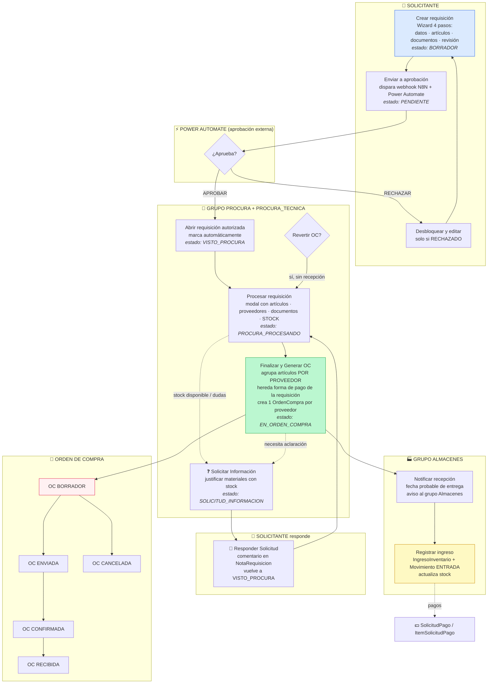

# Flujograma completo: Requisiciones → Materiales → Orden de Compra

Diagrama del flujo real implementado en el proyecto (app `presupuestos`, apoyada por `inventarios`, `almacen`, `mantenimiento`).

## Diagrama principal (Mermaid)



## Creación de materiales (5 vías)

> La vía 3 (`[NUEVO]`) está disponible para los grupos **Almacenes** y **Procura_Tecnica** (`almacenes_o_procura_tecnica_required`, `almacen/decorators.py`). Incluye verificación de duplicados por nombre/SKU en tiempo real y opción de vincular el artículo a un material existente.

```mermaid
flowchart LR
    subgraph M1["📦 CREAR MATERIAL"]
        V1[Admin Django<br/>MaterialAdmin]
        V2[Formulario web almacén<br/>crear_material]
        V3[Artículo sin material [NUEVO]<br/>materiales_pendientes + crear_material_desde_solicitud_ajax<br/>verifica duplicados<br/>crea/VINCULA al artículo]
        V4[API móvil<br/>api_create_material]
        V5[Pantalla Solicitud de Nuevos Materiales]
    end

    subgraph M2["⚙️ DATOS DEL MATERIAL"]
        C1[Catálogo CategoriaMaterial]
        C2[Catálogo UnidadMedida]
        C3[Catálogo Marca]
        C4[SKU único · precio estimado · stock mínimo]
    end

    V1 --> M2
    V2 --> M2
    V3 --> M2
    V4 --> M2
    V5 --> M2
    M2 --> FIN[🏷️ Material creado<br/>disponible en catálogo]
    FIN -.->|vinculación| V3
```

## Mapa de estados de la requisición

```
BORRADOR → PENDIENTE → AUTORIZADO → VISTO_PROCURA → PROCURA_PROCESANDO → EN_ORDEN_COMPRA
               │                                      │
               ├──────────→ RECHAZADO ──(desbloqueo)──→ BORRADOR
               └──────────→ CANCELADO
                                         └── SOLICITUD_INFORMACION ──(respuesta)──→ VISTO_PROCURA
```

## Paso a paso explicado

1. **BORRADOR** — El solicitante crea la requisición con el wizard de 4 pasos (`requisicion_upsert`, `presupuestos/views_import.py:164`). Se autogenera el número `REQ-{COD_DEPTO}-{correlativo}-{año}` (`presupuestos/models.py:650`).
2. **PENDIENTE** — Al finalizar el wizard se notifica al aprobador (auto-populado desde el `Departamento` del solicitante) y se dispara el webhook a N8N/Power Automate (`webhooks.py:notify_requisicion_finalizada`).
3. **AUTORIZADO / RECHAZADO** — Power Automate responde al webhook `requisicion_webhook_update` (`presupuestos/views_webhook.py:16`):
   - `APROBAR` → AUTORIZADO: genera el PDF aprobado, actualiza `precio_estimado` de los materiales y notifica al solicitante (`presupuestos/signals.py:152`).
   - `RECHAZAR` → RECHAZADO: el solicitante puede desbloquear y editar.
4. **VISTO_PROCURA** — Al abrir una requisición AUTORIZADO, si el usuario pertenece al grupo **Procura** o **Procura_Tecnica** se marca automáticamente (`views_import.py:229`).
5. **PROCURA_PROCESANDO** — Procura/Procura_Tecnica pulsa "📋 Procesar Requisición" (`procesar_requisicion`, `views_import.py:917`); el modal muestra artículos, proveedores sugeridos, documentos y **stock actual por material** (para verificar si hay stock disponible). También puede pulsar "❓ Solicitar Información".
6. **SOLICITUD_INFORMACION** — Procura/Procura_Tecnica devuelve la requisición a este estado pidiendo más información (ej. justificar compra de materiales con stock) vía el botón "❓ Solicitar Información" (`requisicion_solicitar_informacion`, `views_import.py:166`). El comentario se guarda como `NotaRequisicion` y se notifica al solicitante. El solicitante responde con el botón "📝 Responder Solicitud" (`requisicion_reenviar_informacion`, `views_import.py:218`), que reenvía la requisición a **VISTO_PROCURA**.
7. **EN_ORDEN_COMPRA** — Procura pulsa "Finalizar y Generar OC" (`finalizar_procesamiento`, `views_import.py:992`): agrupa los artículos **por proveedor** y crea **una OrdenCompra por proveedor** con sus líneas (`OrdenCompraArticulo`, vinculadas al `ArticuloRequisicion`). La OC hereda la **forma de pago** de la requisición (`requisicion.forma_pago`). Notifica al solicitante.
   - El ciclo de la OC es: **BORRADOR → ENVIADA → CONFIRMADA → RECIBIDA / CANCELADA** (`actualizar_orden_compra`, `views_import.py:1208`). Solo grupo Procura.
8. **Recepción** — Procura pulsa "📬 Notificar Recepción" (`notificar_recepcion`, `views_import.py:833`) → aviso al grupo **Almacenes**. El almacén registra la entrada (`api_ingreso_lote`, `inventarios/views.py:1588`) creando `IngresoInventario` (con `requisicion_origen`) y `MovimientoInventario` tipo ENTRADA, actualizando stock.
9. **Pagos** — Con la requisición en OC, se registran montos pagados vía `SolicitudPago` / `ItemSolicitudPago` (`views_pagos.py`).
10. **Revertir** — Procura puede revertir la OC a `PROCURA_PROCESANDO` solo si aún no se notificó recepción (`revertir_orden_compra`, `views_import.py:1099`).

## Permisos y roles

| Rol | Acciones |
|---|---|
| **Solicitante** | Crear/editar BORRADOR, enviar a aprobación, ver estados, responder solicitudes de información |
| **Aprobador** (Power Automate) | Aprobar/rechazar vía webhook |
| **Grupo Procura / PROCURA** | Procesar requisición, generar/revertir/actualizar OC, ver OCs, solicitar información |
| **Grupo Procura_Tecnica** | Ver requisiciones, procesar/verificar stock, solicitar información, procesar materiales `[NUEVO]` (crear, verificar duplicados, vincular existentes) |
| **Grupo Almacenes** | Registrar recepción/ingresos de inventario, procesar materiales `[NUEVO]` |
| **Solicitante (pagos)** | Registrar SolicitudPago contra la requisición |

## Referencias de código

| Pieza | Ubicación |
|---|---|
| Modelos `Requisicion`, `ArticuloRequisicion`, `OrdenCompra`, `OrdenCompraArticulo` | `presupuestos/models.py:492, 755, 1166, 1238` |
| Estados de requisición | `presupuestos/models.py:537-546` |
| Forma de pago de requisición/OC | `presupuestos/models.py:651-662, 1225-1236` |
| Wizard de creación | `presupuestos/views_import.py:164` |
| Aprobación (Power Automate) | `presupuestos/views_autorizar.py:13`, `views_webhook.py:16` |
| Procesar / Finalizar OC / Revertir | `presupuestos/views_import.py:917, 992, 1099` |
| Solicitar / Responder información | `presupuestos/views_import.py:166, 218` |
| Notificar recepción | `presupuestos/views_import.py:833` |
| Material (catálogo) | `inventarios/models.py:84` |
| Crear material desde artículo `[NUEVO]` | `almacen/views.py:462, 509` |
| Verificar/vincular materiales duplicados | `almacen/views.py:580-617` |
| Grupo Procura_Tecnica | `presupuestos/migrations/0076_crear_grupo_procura_tecnica.py` |
| Recepción de inventario | `inventarios/views.py:1588` |
| Notificaciones automáticas | `presupuestos/signals.py:18-149` |