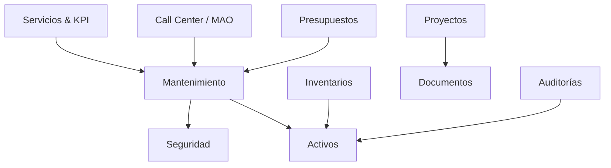

# Documentación Integral del Sistema Energy

Energy es un ecosistema industrial avanzado para la gestión de activos, mantenimiento, seguridad y finanzas operativas. Esta documentación detalla cada uno de los módulos que integran la plataforma.

## Mapa de Arquitectura
El sistema utiliza una arquitectura desacoplada basada en Django, donde cada aplicación maneja un dominio de negocio específico.

---

## 1. Gestión de Activos (`activos`)
Administra la estructura física y técnica de la planta.
- **Explorador Jerárquico**: Estructura de Sitios, Edificios, Áreas y Equipos.
- **Ficha del Activo**: Historial de mantenimiento, documentos asociados y especificaciones técnicas.
- **Visor de Planos**: Localización geoespacial de activos sobre planos técnicos.
- **Importación Dinámica**: Motor de sincronización masiva con validación de integridad.

## 2. Mantenimiento (`mantenimiento`)
El motor de ejecución operativa del sistema.
- **Rutinas**: Definición de tareas preventivas con frecuencias configurables.
- **Procedimientos**: Guías paso a paso para la ejecución técnica.
- **Órdenes de Trabajo (OT)**: Gestión de correctivos y preventivos con reporte de hallazgos.
- **Cronograma**: Visualizador anual/mensual interactivo para planificación de carga.
- **Importación/Exportación Asíncrona**: Sistema robusto con Celery para manejo de grandes volúmenes de datos.

## 3. Presupuestos y Finanzas (`presupuestos`)
Control financiero de la operación industrial.
- **Cost Sheet**: Monitoreo en tiempo real de presupuesto original vs. gasto real.
- **Control de Partidas**: Desglose por disciplina (Eléctrico, Mecánico, Civil).
- **Requisiciones**: Gestión de solicitudes de compra integradas con Dynamics 365.
- **Importación Background**: Importación masiva de requisiciones con validación de estado.

## 4. Seguridad y Salud Ocupacional (`seguridad`)
Gestión de riesgos y cumplimiento normativo.
- **Permisos de Trabajo**: Flujos de aprobación para trabajos de alto riesgo.
- **AST (Análisis de Seguridad)**: Identificación proactiva de peligros por actividad.
- **Inspecciones**: Checklists de seguridad con evidencia fotográfica.
- **EPP**: Control de asignación y vida útil de equipos de protección.

## 5. Inventarios y Almacén (`inventarios`, `almacen`)
Logística de materiales y refacciones.
- **Multi-Almacén**: Control de stock en diferentes bodegas físicas.
- **Movimientos**: Registro trazable de entradas, salidas y transferencias.
- **Liquidación de Materiales**: Proceso de validación de consumos en OTs.
- **Carrito de Técnico**: Interfaz móvil para solicitud de repuestos desde campo.

## 6. Proyectos y Obras (`proyectos`)
Seguimiento de CAPEX y mejoras capitales.
- **Hitos de Avance**: Control cronológico de ejecución.
- **Asignación de Costos**: Vinculación de requisiciones y materiales a proyectos específicos.
- **Registro Fotográfico**: Histórico visual del progreso de obra.

## 7. Gestión Documental (`documentos`)
Repositorio técnico de alto nivel.
- **Control de Versiones**: Gestión de revisiones de planos y manuales.
- **Integración EDMS**: Conexión nativa con gestores documentales como Mayan.
- **Transmittals**: Control de envío y recepción formal de información técnica.

## 8. Call Center / MAO (`callcenter`)
Interfaz de servicio al cliente interno.
- **Levantamiento de Tickets**: Registro rápido de fallas por usuarios finales.
- **Sincronización MAO**: Integración asíncrona con sistemas externos de atención.
- **Seguimiento de SLA**: Monitoreo de tiempos de respuesta y solución.

## 9. Servicios y KPIs (`servicios`)
Capa de analítica y medición de desempeño.
- **Indicadores (KPI)**: Tableros de control para disponibilidad, confiabilidad y costos.
- **Reporteo**: Generación de informes ejecutivos en PDF y Excel.

## 10. Auditorías (`auditorias`)
Verificación de integridad en campo.
- **Inventarios Ciegos**: Proceso de auditoría física de activos.
- **Escaneo QR/RFID**: Identificación rápida de equipos mediante dispositivos móviles.
- **Conciliación**: Sincronización automática tras resultados de auditoría.

---

## Capa Técnica y Core (`core`, `energia`)
- **Seguridad**: Autenticación basada en grupos y permisos granulares de Django.
- **Background Tasks**: Procesamiento distribuido mediante Celery y Redis.
- **UI/UX**: Interfaz personalizada con Jazzmin, SweetAlert2 y estilos visuales premium.
- **API**: Endpoints REST para integración con aplicaciones móviles y externas.
