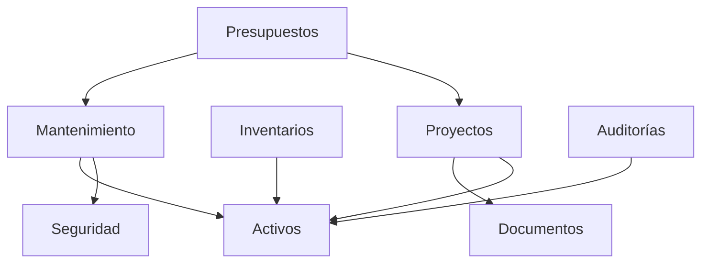

# Documentación del Sistema Energy

Energy es un ecosistema integral de gestión industrial diseñado para la administración de activos, mantenimiento preventivo y correctivo, seguridad ocupacional, control de inventarios y gestión de proyectos.

## Arquitectura por Módulos

El sistema está construido sobre Django y sigue una arquitectura modular donde cada aplicación se encarga de un dominio específico del negocio.

---

## 1. Mantenimiento (`mantenimiento`)
El corazón del sistema. Gestiona todo el ciclo de vida del mantenimiento.

### Funciones Principales:
*   **Gestión de Rutinas**: Definición de tareas periódicas con tiempos estimados y personal necesario.
*   **Procedimientos Estándar**: Editor dinámico de pasos con diferentes tipos de respuesta (Check, Numérico, Texto).
*   **Cronograma Interactivo**: Visualización anual y mensual de las órdenes de trabajo (OTs).
*   **Dashboard de Rutinas**: Interfaz premium para la gestión rápida de categorías y tareas.
*   **Órdenes de Trabajo (OT)**: Seguimiento de ejecución, vinculación con activos y registro de hallazgos.
*   **Importación Masiva**: Soporte para carga de rutinas desde Excel/CSV con validación de jerarquía.

### Modelos Clave:
*   `Rutina`: Tarea base vinculada a una frecuencia y categoría.
*   `Procedimiento`: Conjunto de pasos técnicos a seguir.
*   `OrdenTrabajo`: Instancia de ejecución de una rutina o correctivo.
*   `PuestoTrabajo`: Clasificación del personal técnico (Eléctrico, Mecánico, etc.).

---

## 2. Gestión de Activos (`activos`)
Administra la jerarquía física y técnica de la planta.

### Funciones Principales:
*   **Explorador Jerárquico**: Navegación por niveles (Sitio → Edificio → Piso → Área).
*   **Visor de Planos**: Interfaz interactiva para ubicar activos físicamente mediante "Pins".
*   **Ficha Técnica**: Historial detallado de cada activo, incluyendo sus OTs y documentos.
*   **Sincronización Industrial**: Motor de importación masiva compatible con grandes volúmenes de datos.

### Modelos Clave:
*   `Activo`: Entidad principal (Equipos, Herramientas, Infraestructura).
*   `Ubicacion`: Nodos del árbol de ubicación física.
*   `VisorPlano`: Mapas o planos donde se posicionan los activos.

---

## 3. Inventarios y Almacén (`inventarios`, `almacen`)
Control total sobre los materiales y repuestos.

### Funciones Principales:
*   **Control de Stock**: Gestión de existencias por almacén y ubicación específica (pasillo/estante).
*   **Movimientos**: Registro de entradas, salidas, traslados y ajustes.
*   **Liquidación**: Proceso de aprobación para validar el consumo real de materiales.
*   **Carrito de Pedidos**: Interfaz móvil para que los técnicos soliciten materiales desde el campo.
*   **Compatibilidad**: Vinculación de repuestos específicos con modelos de activos.

---

## 4. Seguridad y Salud Ocupacional (`seguridad`)
Garantiza el cumplimiento de normas de seguridad durante el trabajo.

### Funciones Principales:
*   **Permisos de Trabajo (PT)**: Generación dinámica de permisos según el riesgo (Caliente, Alturas, etc.).
*   **Análisis de Riesgos (AST)**: Identificación de peligros y medidas de control por actividad.
*   **Gestión de EPP**: Registro de entrega y renovación de Equipos de Protección Personal.
*   **Incidentes**: Reporte y seguimiento de condiciones inseguras o accidentes.
*   **Inspecciones**: Listas de verificación (Checklists) de seguridad con evidencia fotográfica.

---

## 5. Gestión Documental (`documentos`)
Repositorio centralizado de manuales, planos y certificados.

### Funciones Principales:
*   **Integración Mayan EDMS**: Conexión con un gestor documental externo para alta seguridad.
*   **Control de Versiones**: Historial de revisiones (Rev A, B, 0, 1...) con aprobación.
*   **Firmas Electrónicas**: Sistema de validación y flujo de firmas para aprobación de planos.
*   **Vinculación Genérica**: Los documentos se pueden asociar a activos, OTs o proyectos.

---

## 6. Proyectos (`proyectos`)
Planificación y seguimiento de obras o mejoras capitales.

### Funciones Principales:
*   **Planificación**: Definición de hitos, fechas y responsables.
*   **Actividades**: Desglose de tareas con estados y dependencias.
*   **Control Fotográfico**: Registro visual del avance de obra en planos.
*   **Consolidación de Gastos**: Seguimiento de costos asociados a cada proyecto.

---

## 7. Presupuestos (`presupuestos`)
Control financiero por disciplina y año fiscal.

### Funciones Principales:
*   **Cost Sheet**: Visibilidad en tiempo real del presupuesto original, cambios, compromisos y gasto real.
*   **Compromisos**: Registro de contratos y órdenes de compra que afectan el presupuesto.
*   **Transferencias**: Gestión de movimientos de presupuesto entre diferentes partidas.
*   **Dashboard Financiero**: Porcentaje de ejecución y saldo disponible por área.

---

## 8. Auditorías (`auditorias`)
Validación de integridad de datos y activos.

### Funciones Principales:
*   **Inventarios Físicos**: Auditorías por área para confirmar la existencia y ubicación de activos.
*   **Escaneo QR**: Interfaz móvil para validación rápida en campo.
*   **Conciliación**: Actualización automática de la ubicación de los activos tras la auditoría.

---

## 9. Comunicaciones (`comunicaciones`)
Gestión de RFI, Memorandos y comunicaciones oficiales.

### Funciones Principales:
*   **Transmittals**: Envío controlado de documentos con acuse de recibo.
*   **Flujos de RFI**: Solicitudes de información con seguimiento de respuestas.
*   **Notificaciones**: Sistema de alertas internas y por correo electrónico.

---

## 10. Core del Sistema (`core`)
Capa base de infraestructura y configuraciones generales.

### Funciones Principales:
*   **Gestión de Medidores**: Centralización de lecturas de energía, agua, etc.
*   **Configuración UI**: Personalización de colores y logotipos del sistema.
*   **Utilidades de Backup**: Herramientas para la exportación e importación de la base de datos completa.
