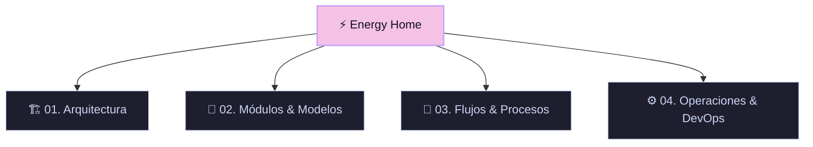

# ⚡ Ecosistema Industrial Energy - SoftCom-CCG

> [!NOTE]
> Bienvenido al **Wiki interactivo de Obsidian** para el sistema **Energy**. Este espacio consolida la arquitectura técnica, modelos de datos, flujos de trabajo asíncronos y guías operativas de la planta de energía.
>
> Usa el **Graph View** de Obsidian (Ctrl/Cmd + G) para navegar visualmente por las relaciones de los modelos y las integraciones del sistema.

---

## 🗺️ Mapa de Contenido (MOC)

### 🏗️ 01. Arquitectura del Sistema
- [[Arquitectura_General|📐 Arquitectura General e Infraestructura]]
- [[Base_de_Datos|🗄️ Base de Datos y Relaciones Core]]
- [[Servicios_y_Sistemas_Externos|☁️ Servicios y Sistemas Externos (MinIO, Celery, n8n, Dynamics)]]

### 📂 02. Módulos y Modelos de Datos (Django Apps)
Explora las notas individuales para cada módulo, que contienen la definición exacta de sus tablas, campos y relaciones:
- **Core / General**: [[Core|Núcleo del Sistema]] | [[Servicios_y_KPIs|Servicios & KPIs]]
- **Operaciones**: [[Activos|Gestión de Activos]] | [[Mantenimiento|Mantenimiento (CMMS)]] | [[Inventarios|Inventarios y Materiales]] | [[Almacen|Almacén]] | [[Auditorias|Auditorías]]
- **Seguridad**: [[Seguridad|Seguridad Industrial & Permisos]]
- **Finanzas**: [[Presupuestos|Presupuestos & Requisiciones]] | [[Proyectos|Gestión de Proyectos (CAPEX)]]
- **Soporte & Docs**: [[Documentos|Gestión Documental]] | [[Comunicaciones|Comunicaciones y Transmittals]] | [[CallCenter|Call Center / Tickets]]
- **Tecnología**: [[IoT|Mapeo IoT & Mediciones]]

### 🔄 03. Flujos y Procesos Complejos
Procedimientos paso a paso sobre el funcionamiento crítico del sistema:
- [[Conexion_DB_Remota|🔌 Conexión Remota a Base de Datos en VM]]
- [[Importacion_Asincrona_Celery|📥 Importaciones Masivas Asíncronas (Celery & Redis)]]
- [[Wizard_Seguridad_AST|🛡️ Wizard de Permisos de Trabajo & AST]]

### ⚙️ 04. Operaciones, Guía de Inicio y DevOps
- [[Instalacion_Local|💻 Instalación y Configuración Local]]
- [[Despliegue_Coolify|🚀 Especificaciones de Despliegue en Coolify / Docker]]

---
#django #industrial #cmms #obsidian #ecosistema
