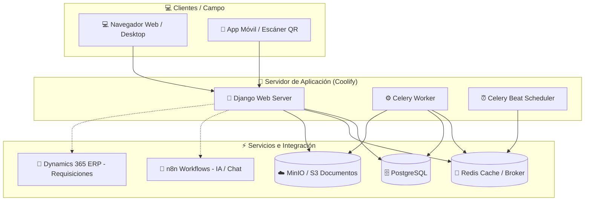

# 📐 Arquitectura General e Infraestructura

El sistema **Energy** está diseñado bajo una arquitectura de micro-servicios y tareas desacopladas, lo que permite alta concurrencia en la planta, procesamiento en segundo plano de importaciones masivas y generación de firmas electrónicas sin interrumpir la experiencia de usuario.

## 🗺️ Mapa de Infraestructura y Servicios

## 🛠️ Tecnologías Utilizadas

1. **Backend**: Python 3 con Django.
2. **Base de Datos**: PostgreSQL para almacenamiento relacional transaccional.
3. **Almacenamiento de Archivos (Object Storage)**: MinIO (compatible con AWS S3) para archivos PDF de manuales, planos, evidencias y firmas electrónicas.
4. **Broker / Caché**: Redis para comunicación de Celery y caché de consultas de rendimiento del dashboard.
5. **Tareas en Segundo Plano**: Celery para importación asíncrona de activos, ubicaciones, materiales y rutinas.
6. **Automatización e IA**: n8n para flujos inteligentes, vectorización y consultas en lenguaje natural a documentos técnicos.
7. **ERP Corporativo**: Microsoft Dynamics 365 para sincronización bidireccional de presupuestos y requisiciones.
8. **Orquestación**: Docker, Docker Compose y Coolify para despliegue continuo automatizado.

---
🔙 Volver a [[00_Inicio|Inicio]]
