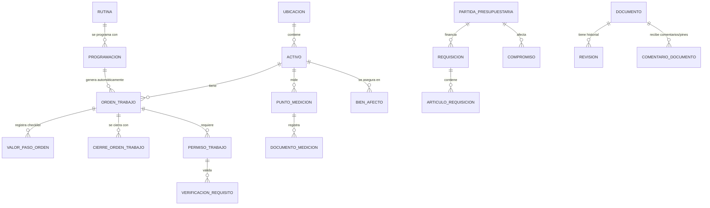

# 🗄️ Base de Datos y Relaciones Core

La base de datos de **Energy** es una base relacional robusta en PostgreSQL. Los modelos de datos se conectan entre sí para dar soporte completo a la operación industrial.

## 🗺️ Diagrama de Relaciones de Negocio (ERD Simplificado)

El siguiente diagrama ilustra cómo interactúan los diferentes módulos de negocio en la base de datos:

## 🔄 Integridad Referencial y Buenas Prácticas

1. **Índices y Desempeño**: Las consultas sobre el explorador jerárquico de activos y las ubicaciones utilizan anotaciones SQL optimizadas para evitar problemas de N+1 (consultas recursivas lentas).
2. **Soft Deletes**: Los modelos críticos implementan marcas de estado en lugar de eliminación física directa, lo que garantiza la trazabilidad histórica de las órdenes de trabajo y presupuestos.
3. **Auditoría**: Tablas clave tienen campos `creado_por`, `creado_en`, `modificado_por` y `modificado_en`.
4. **Integración Dynamics**: Las requisiciones importadas de Dynamics 365 mantienen su clave externa única (`folio`), lo que permite actualizaciones incrementales seguras.

---
🔙 Volver a [[00_Inicio|Inicio]]
