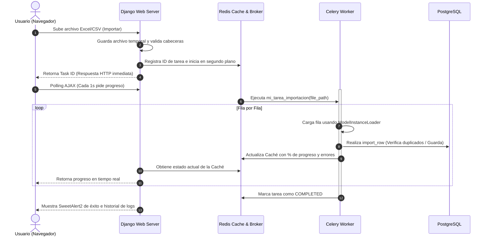

# 📥 Importaciones Masivas Asíncronas (Celery & Redis)

El sistema **Energy** maneja grandes catálogos (más de 80,000 activos y repuestos). Para evitar tiempos de espera y caídas por timeout en el servidor web HTTP, implementamos un flujo de importación asíncrono robusto.

## 🗺️ Diagrama del Flujo de Trabajo



## ⚙️ 1. Configuración del Worker (Windows)
En entornos de desarrollo en Windows, Celery requiere el pool de hilos `eventlet` o `gevent` para funcionar correctamente.
1. **Ejecutar comando del worker**:
   ```powershell
   celery -A energia worker -l info -P eventlet
   ```
2. **Configuración de Variables de Entorno (.env)**:
   - `CELERY_BROKER_URL = 'redis://localhost:6379/0'`
   - `CELERY_RESULT_BACKEND = 'django-db'`

## 📝 2. Patrón de Tareas (`tasks.py`)
Para mostrar progreso fluido en la interfaz gráfica (UI), la tarea procesa iterativamente utilizando el cargador compatible con django-import-export:

```python
from import_export.instance_loaders import ModelInstanceLoader
from celery import shared_task

@shared_task(bind=True)
def tarea_importar_activos(self, file_path, file_format, user_id=None):
    from django.core.files.storage import default_storage
    from .admin import ActivoResource
    
    resource = ActivoResource()
    with default_storage.open(file_path, 'rb') as f:
        # Cargar datos en dataset usando tablib...
        
    for i, row in enumerate(dataset.dict, start=1):
        # 1. Obtener cargador de instancias para evitar duplicados
        instance_loader = ModelInstanceLoader(resource, dataset)
        
        # 2. Importar fila individualmente con el número de fila obligatorio
        row_result = resource.import_row(row, instance_loader, row_number=i, dry_run=False)
        
        # 3. Notificar progreso a Celery y guardar estado en Redis
        self.update_state(state='PROGRESS', meta={
            'current': i,
            'total': total,
            'percent': int((i / total) * 100)
        })
```

## 🎨 3. Interfaz de Usuario y UX Premium
- **Glassmorphism**: La barra de progreso y el panel de logs usan estilos premium (`backdrop-filter: blur(12px)`) para integrarse al diseño visual del sistema.
- **Manejo de Errores**: Si ocurre un error en una fila, la importación no se detiene; se registra el error en una lista en caché y se renderiza en la consola de logs en tiempo real para que el usuario pueda corregirlo posteriormente.

---
🔙 Volver a [[00_Inicio|Inicio]]
