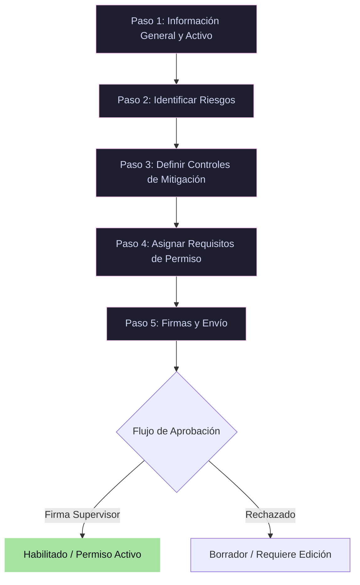

# 🛡️ Wizard de Permisos de Trabajo & AST

El Análisis de Seguridad en el Trabajo (AST) es obligatorio para realizar mantenimientos críticos en la planta. Para simplificar esta tarea, se diseñó un **Wizard Multiaso dinámico** integrado en el módulo de seguridad.

## 🗺️ Diagrama del Flujo del Permiso de Trabajo

## ⚙️ Características Técnicas

1. **Persistencia del Borrador**: Los pasos del formulario se envían y persisten asíncronamente en el modelo `PermisoTrabajo` con el estado `BORRADOR`. Si el técnico en campo pierde la conexión, la información no se pierde.
2. **Catálogos Dinámicos**: Los riesgos y sus controles correspondientes se cargan automáticamente desde los catálogos estandarizados (`Riesgo` y `Control`) en base al tipo de actividad, evitando la digitación manual y errores ortográficos.
3. **Firmas Digitales Cruzadas**: El sistema requiere la firma digital electrónica del técnico ejecutor y la del supervisor responsable. Las firmas se validan mediante perfiles encriptados y se plasman en el documento PDF final guardado en MinIO.
4. **Validación Bypass en Cliente**: Para garantizar la resiliencia en dispositivos móviles, se implementó validación personalizada por paso en JavaScript, evitando conflictos con validaciones nativas de HTML5 en navegadores móviles integrados.

---
🔙 Volver a [[00_Inicio|Inicio]]
